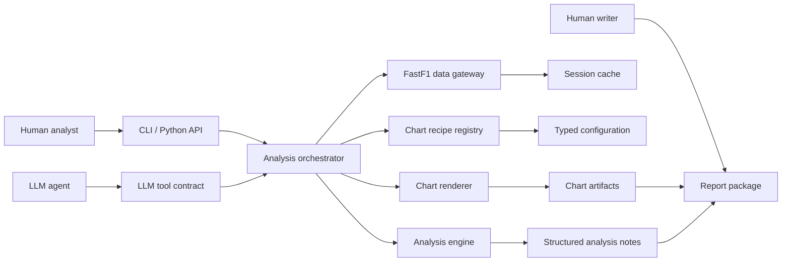
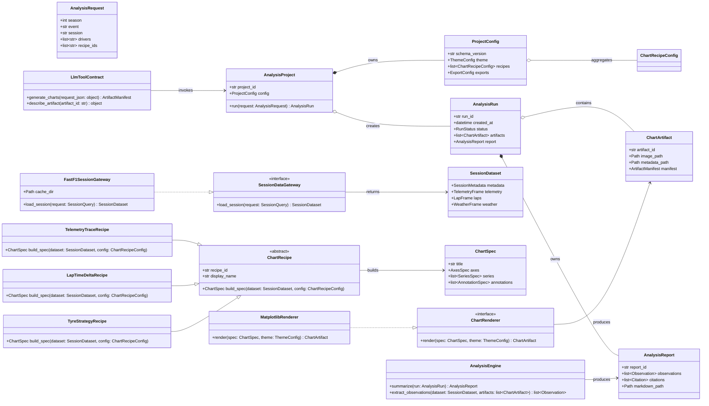
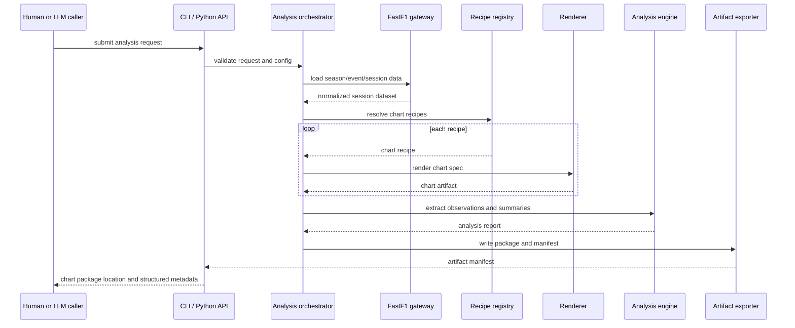

# SPEC-001: F1 Data Analysis Charting Framework

## Summary

This spec defines a Python framework for consistent, configurable, and easy F1
data analysis charts using FastF1-backed session data, reusable chart recipes,
automated analytical annotations, and report-ready artifacts that LLM agents can
use to generate or co-author technical F1 analysis content.

## Context

The previous project shape focused on hand-authored telemetry charts using
FastF1 and Matplotlib. The new project direction is a framework rather than a
collection of one-off scripts. The framework must make chart generation
repeatable for humans and LLM agents, preserve consistent visual identity across
outputs, and expose enough metadata for downstream automated analysis and blog
drafting.

No product specs currently exist in this repository. This document is the first
authoritative requirements baseline for the new project.

## Problem statement

Hand-authored F1 telemetry charts are slow to repeat, difficult to keep
consistent, and hard for LLM agents to use safely because the implicit data,
styling, and analytical choices are embedded in script code. The project needs a
specified framework that separates data ingestion, chart configuration, chart
rendering, analysis extraction, artifact export, and report authoring.

## Goals

- Define the initial architecture and behavioral requirements for the framework.
- Make chart outputs consistent across sessions, chart types, and authors.
- Make chart generation configurable through stable schemas instead of one-off
  script edits.
- Make framework outputs understandable and reusable by LLM agents.
- Support an incremental roadmap with MVP, V1, and V2 priorities.

## Non-goals

- The system does not need to replace FastF1 as the upstream F1 data provider.
- The system does not need to provide live timing or real-time race dashboards.
- The system does not need to include a hosted web application in the MVP.
- The system does not need to generate fully autonomous publish-ready articles
  without human review in the MVP or V1.
- The system does not need to support non-F1 motorsport data in SPEC-001.

## Users or actors

- Human analyst: configures chart recipes, reviews charts, and writes or edits
  analysis.
- Human writer: uses generated chart packs and analysis notes as article input.
- LLM agent: calls the framework through documented interfaces and consumes
  structured artifacts.
- Project maintainer: extends chart recipes, validates outputs, and manages
  releases.
- External data provider: FastF1 and its backing data sources.

## Requirement language and priority model

Mandatory requirements use "must". Optional requirements use "should". Each
requirement statement uses the system or a system component as the grammatical
subject.

Priorities:

- MVP: required for the first usable framework.
- V1: required for the first broad authoring workflow.
- V2: later capability once the framework is stable.

## System overview

## Domain class model

The class diagram is intentionally typed and uses specialization, aggregation,
composition, and directed associations where Mermaid supports them.

## Runtime sequence

## UI or workflow mockups

The MVP does not require a hosted graphical application, but the framework must
define report-facing artifact shapes and future UI expectations. SVG wireframes
are stored as spec assets:

- [Chart configuration workbench](../assets/SPEC-001-chart-config-workbench.svg)
- [Analysis review workspace](../assets/SPEC-001-analysis-review-workspace.svg)
- [Report package output](../assets/SPEC-001-report-package-output.svg)

## Functional requirements

### REQ-010: Session Data Loading

- **Priority:** MVP
- **Statement:** The system must load F1 session data through a FastF1-backed
  gateway for a specified season, event, session type, and driver selection.
- **Rationale:** Chart recipes need a consistent data source before rendering or
  analysis can be repeatable.
- **Acceptance criteria:** A caller can request one historical race, qualifying,
  sprint, or practice session by season, event name, and session code; the
  gateway returns normalized metadata, laps, telemetry, and weather when those
  data are available from FastF1; unavailable optional data are represented as
  explicit missing-data fields rather than silent null behavior.
- **Verification method:** Automated integration test with cached FastF1 fixture
  data.
- **Evidence location:** To be filled during implementation.

### REQ-020: Session Cache

- **Priority:** MVP
- **Statement:** The system must cache upstream session data in a configurable
  local cache directory.
- **Rationale:** Repeatable chart generation needs faster reruns and reduced
  dependence on external network availability.
- **Acceptance criteria:** The cache directory can be set through configuration;
  repeated generation of the same cached session does not require a network
  request when all required cached files exist; cache misses are reported in run
  metadata.
- **Verification method:** Automated integration test using an isolated cache
  directory and mocked network calls.
- **Evidence location:** To be filled during implementation.

### REQ-030: Typed Configuration Schema

- **Priority:** MVP
- **Statement:** The system must define a versioned typed configuration schema
  for project defaults, session requests, chart recipes, themes, export formats,
  and analysis options.
- **Rationale:** Humans and LLM agents need a stable contract that avoids
  editing chart code for routine changes.
- **Acceptance criteria:** A configuration file declares a schema version;
  invalid keys, invalid types, and unsupported enum values produce validation
  errors that include the failing path; a valid minimal configuration can
  generate at least one chart.
- **Verification method:** Automated schema validation tests.
- **Evidence location:** To be filled during implementation.

### REQ-040: Chart Recipe Registry

- **Priority:** MVP
- **Statement:** The system must provide a registry that resolves stable chart
  recipe identifiers to chart recipe implementations.
- **Rationale:** Stable identifiers let humans, scripts, and LLM agents request
  charts without knowing internal class names.
- **Acceptance criteria:** Each registered recipe exposes a stable ID, display
  name, required dataset fields, supported configuration keys, and output
  artifact types; requesting an unknown recipe ID fails with an actionable
  validation error.
- **Verification method:** Automated unit tests for registry resolution and
  error handling.
- **Evidence location:** To be filled during implementation.

### REQ-050: Core Chart Recipes

- **Priority:** MVP
- **Statement:** The system must include core chart recipes for telemetry traces,
  lap time comparison, stint or tyre strategy, and position progression.
- **Rationale:** These chart types cover the first useful set of F1 session
  analysis workflows.
- **Acceptance criteria:** The framework can render at least one valid chart for
  each core recipe from cached fixture data; each recipe declares required data
  fields; each recipe handles missing required fields with a recipe-specific
  validation error.
- **Verification method:** Automated chart smoke tests with fixture datasets.
- **Evidence location:** To be filled during implementation.

### REQ-060: Visual Theme Consistency

- **Priority:** MVP
- **Statement:** The system must apply a centralized visual theme to every chart
  rendered by the framework.
- **Rationale:** Consistent style is required for reusable article graphics and
  recognizable project output.
- **Acceptance criteria:** Theme configuration controls font family, base font
  size, figure size, grid behavior, background color, foreground color, team or
  driver color mapping, line widths, and export DPI; all core chart recipes use
  the same theme object.
- **Verification method:** Automated unit tests for theme propagation plus
  visual baseline inspection for representative charts.
- **Evidence location:** To be filled during implementation.

### REQ-070: Chart Artifact Export

- **Priority:** MVP
- **Statement:** The system must export each generated chart with image output
  and machine-readable metadata.
- **Rationale:** Article workflows and LLM agents need both human-visible images
  and structured context.
- **Acceptance criteria:** Each rendered chart writes at least one PNG file and
  one metadata file; metadata includes recipe ID, source session, selected
  drivers, generated timestamp, configuration hash, data freshness information,
  and warnings; artifact file names are deterministic for identical request
  inputs except where a run ID is intentionally included.
- **Verification method:** Automated file output tests.
- **Evidence location:** To be filled during implementation.

### REQ-080: Batch Chart Generation

- **Priority:** MVP
- **Statement:** The system must generate multiple configured charts in a single
  analysis run.
- **Rationale:** Analysts and agents need a repeatable chart pack rather than a
  single-chart script.
- **Acceptance criteria:** A run can request two or more recipe IDs; the run
  manifest lists every requested recipe, every produced artifact, every skipped
  chart, and every warning or error; a single recipe failure does not delete
  successfully generated artifacts from the same run.
- **Verification method:** Automated integration test with one successful recipe
  and one intentionally invalid recipe.
- **Evidence location:** To be filled during implementation.

### REQ-090: Analysis Observation Extraction

- **Priority:** V1
- **Statement:** The system must extract structured observations from session
  data and generated chart artifacts.
- **Rationale:** Automated or assisted writing needs concise claims linked to
  the data and charts that support them.
- **Acceptance criteria:** Each observation includes a stable observation ID,
  summary text, supporting metric values, source chart artifact IDs, source data
  fields, confidence level, and limitations; generated observations avoid
  unsupported causal claims.
- **Verification method:** Automated tests for deterministic observation
  extraction plus manual review of representative report output.
- **Evidence location:** To be filled during implementation.

### REQ-100: Report Package Generation

- **Priority:** V1
- **Statement:** The system must generate a report package that combines chart
  artifacts, chart metadata, structured observations, and a Markdown analysis
  draft.
- **Rationale:** Writers and LLM agents need one portable output package for
  blog drafting and review.
- **Acceptance criteria:** A completed run produces a package directory with an
  artifact manifest, chart images, chart metadata, observation data, and a
  Markdown draft; the Markdown draft references chart artifact IDs rather than
  embedding untraceable claims.
- **Verification method:** Automated package structure tests and manual review.
- **Evidence location:** To be filled during implementation.

### REQ-110: Python API

- **Priority:** MVP
- **Statement:** The system must expose a Python API that can validate
  configuration, run analysis, and return an artifact manifest.
- **Rationale:** Python is the natural integration surface for analysts,
  notebooks, and LLM coding agents.
- **Acceptance criteria:** A caller can import the package, construct or load a
  configuration, run an analysis request, and receive a typed result object
  without invoking a shell command; public API examples are covered by tests.
- **Verification method:** Automated API tests and documentation example tests.
- **Evidence location:** To be filled during implementation.

### REQ-120: CLI Interface

- **Priority:** MVP
- **Statement:** The system must expose a command-line interface for validating
  configuration and generating chart packages.
- **Rationale:** The CLI provides a simple automation boundary for humans,
  scripts, and agents.
- **Acceptance criteria:** The CLI supports at least a config validation command
  and a chart generation command; the CLI returns a non-zero exit code for
  validation or generation failure; the CLI prints the output package path on
  success.
- **Verification method:** Automated CLI tests.
- **Evidence location:** To be filled during implementation.

### REQ-130: LLM Tool Contract

- **Priority:** V1
- **Statement:** The system must define an LLM-oriented tool contract for chart
  generation and artifact inspection.
- **Rationale:** The ultimate project goal depends on LLM agents safely using
  the framework without guessing internal APIs.
- **Acceptance criteria:** The contract includes JSON input schemas, JSON output
  schemas, error schemas, deterministic artifact references, and examples for
  generating a chart pack and describing a chart artifact; the contract is
  versioned separately from internal implementation classes.
- **Verification method:** Schema validation tests and contract example tests.
- **Evidence location:** To be filled during implementation.

### REQ-140: Human Review Workflow

- **Priority:** V1
- **Statement:** The system should support a human review workflow for accepting,
  editing, or rejecting generated observations before publication.
- **Rationale:** F1 analysis can include interpretation, and publication-quality
  output should preserve human editorial control.
- **Acceptance criteria:** The report package records observation review status
  values; edited observations preserve the original generated observation for
  traceability; rejected observations are excluded from the final article draft
  export.
- **Verification method:** Automated report package tests.
- **Evidence location:** To be filled during implementation.

### REQ-150: Extensible Recipe Plugins

- **Priority:** V2
- **Statement:** The system should support externally defined chart recipe
  plugins without modifying the framework core.
- **Rationale:** Advanced users may need private or experimental chart types
  while keeping core recipes stable.
- **Acceptance criteria:** A plugin can register a recipe ID, schema extension,
  and renderer implementation through a documented extension point; plugin
  errors are isolated from core recipe registration.
- **Verification method:** Automated plugin fixture tests.
- **Evidence location:** To be filled during implementation.

### REQ-160: Interactive Artifact Preview

- **Priority:** V2
- **Statement:** The system should provide an interactive local preview
  experience for browsing generated chart packages.
- **Rationale:** A preview UI can improve analyst review speed after the
  package-based workflow is stable.
- **Acceptance criteria:** The preview displays generated charts, metadata,
  observations, warnings, and package status from a local artifact manifest; the
  preview does not require a hosted backend service.
- **Verification method:** UI smoke tests or manual verification.
- **Evidence location:** To be filled during implementation.

## Constraints

### NFR-010: Supported Runtime

- **Priority:** MVP
- **Statement:** The system must support Python 3.11 or newer.
- **Rationale:** A modern Python baseline enables current typing and dependency
  support while avoiding outdated runtime constraints.
- **Acceptance criteria:** Automated checks run on Python 3.11 or newer; package
  metadata declares the supported Python version; unsupported Python versions
  fail during installation or validation.
- **Verification method:** Automated environment and packaging checks.
- **Evidence location:** To be filled during implementation.

### NFR-020: Primary Plotting Backend

- **Priority:** MVP
- **Statement:** The system must use Matplotlib as the MVP chart rendering
  backend.
- **Rationale:** The existing project history and ecosystem fit favor Matplotlib
  for static article-ready figures.
- **Acceptance criteria:** All MVP core chart recipes render through the
  Matplotlib renderer; renderer-specific code is isolated behind a renderer
  interface.
- **Verification method:** Code inspection and renderer unit tests.
- **Evidence location:** To be filled during implementation.

### NFR-030: Deterministic Outputs

- **Priority:** MVP
- **Statement:** The system must produce deterministic chart metadata and stable
  file names for identical inputs, configuration, framework version, and cached
  source data.
- **Rationale:** Determinism is required for review, testing, and LLM artifact
  references.
- **Acceptance criteria:** Two runs with the same cache, configuration, and
  framework version produce equivalent metadata excluding declared run-specific
  fields; deterministic file names remain unchanged across those two runs.
- **Verification method:** Automated repeatability test.
- **Evidence location:** To be filled during implementation.

### NFR-040: Offline Reproducibility

- **Priority:** MVP
- **Statement:** The system must generate charts from a complete existing cache
  without network access.
- **Rationale:** Analysts need reproducible output even when upstream services
  are unavailable.
- **Acceptance criteria:** A test run with network access disabled succeeds when
  all required data are already cached; the run manifest records offline mode or
  cache-only behavior.
- **Verification method:** Automated integration test with network mocking.
- **Evidence location:** To be filled during implementation.

### NFR-050: File Format Support

- **Priority:** MVP
- **Statement:** The system must support PNG image export and JSON metadata
  export in the MVP.
- **Rationale:** PNG and JSON are sufficient for article graphics and agent
  consumption in the initial release.
- **Acceptance criteria:** Every successful chart artifact includes PNG and JSON
  files; unsupported export formats fail validation before rendering begins.
- **Verification method:** Automated output format tests.
- **Evidence location:** To be filled during implementation.

### NFR-060: Documentation Scope

- **Priority:** MVP
- **Statement:** The system must document public configuration keys, public API
  entry points, CLI commands, core recipe IDs, and artifact manifest fields.
- **Rationale:** The framework cannot be reliably used by humans or LLM agents
  without explicit contracts.
- **Acceptance criteria:** Documentation contains at least one minimal end-to-end
  example for the Python API and CLI; documentation does not introduce
  requirements outside specs.
- **Verification method:** Documentation inspection and example tests where
  feasible.
- **Evidence location:** To be filled during implementation.

### NFR-070: Dependency Boundary

- **Priority:** MVP
- **Statement:** The system must isolate direct FastF1 calls inside the data
  gateway layer.
- **Rationale:** A narrow boundary makes testing, caching, and future data
  provider changes safer.
- **Acceptance criteria:** Core chart recipes consume normalized framework data
  objects rather than calling FastF1 directly; tests can provide a fake data
  gateway.
- **Verification method:** Code inspection and unit tests with fake gateways.
- **Evidence location:** To be filled during implementation.

## Performance requirements

### NFR-110: Cached Session Load Time

- **Priority:** MVP
- **Statement:** The system must load a cached single-session dataset in a
  maximum of 10 seconds on a developer laptop with local SSD storage.
- **Rationale:** Cached analysis reruns should feel interactive enough for
  iterative chart work.
- **Acceptance criteria:** A benchmark using a representative cached race
  session completes data loading within the maximum 10-second threshold.
- **Verification method:** Automated or scripted benchmark.
- **Evidence location:** To be filled during implementation.

### NFR-120: Core Chart Render Time

- **Priority:** MVP
- **Statement:** The system must render a single core chart in a maximum of 5
  seconds after the normalized session dataset is loaded.
- **Rationale:** Chart packs should remain usable in iterative analytical
  workflows.
- **Acceptance criteria:** A benchmark renders each MVP core chart recipe within
  the maximum 5-second threshold using representative fixture data.
- **Verification method:** Automated or scripted benchmark.
- **Evidence location:** To be filled during implementation.

### NFR-130: Batch Generation Time

- **Priority:** V1
- **Statement:** The system should generate a 10-chart package from cached data
  in a maximum of 60 seconds.
- **Rationale:** Report preparation should not become a long-running manual
  bottleneck.
- **Acceptance criteria:** A benchmark with 10 configured charts completes
  package generation within the maximum 60-second threshold after the cache is
  populated.
- **Verification method:** Scripted benchmark.
- **Evidence location:** To be filled during implementation.

### NFR-140: Artifact Size

- **Priority:** V1
- **Statement:** The system should keep each default PNG chart artifact within
  the interval 100 KB to 2 MB.
- **Rationale:** Article workflows need images with useful quality while keeping
  packages practical to store and share.
- **Acceptance criteria:** Default PNG outputs for representative charts fall
  within the 100 KB minimum and 2 MB maximum interval unless the configuration
  explicitly requests a larger export.
- **Verification method:** Automated artifact size check.
- **Evidence location:** To be filled during implementation.

## Non-functional requirements

The normative non-functional requirements are listed in the Constraints and
Performance requirements sections above. This section exists to preserve the
repository template structure and validator expectations.

## Security and privacy considerations

### SEC-010: Local Data Handling

- **Priority:** MVP
- **Statement:** The system must store generated artifacts and cached data in
  user-configured local directories by default.
- **Rationale:** Local-first storage limits accidental publication of generated
  analysis outputs.
- **Acceptance criteria:** The default implementation does not upload cache
  files, chart images, metadata, or report drafts to external services; any
  future upload behavior requires explicit configuration.
- **Verification method:** Code inspection and integration tests for default
  storage behavior.
- **Evidence location:** To be filled during implementation.

### SEC-020: LLM Input Boundaries

- **Priority:** V1
- **Statement:** The system must expose only declared artifact metadata and
  generated analysis fields through the LLM tool contract.
- **Rationale:** Agent integrations should avoid leaking local paths or
  unrelated environment data.
- **Acceptance criteria:** Tool responses exclude environment variables,
  unrelated filesystem paths, and raw cache internals; artifact paths are
  limited to package-relative references unless an explicit local path mode is
  configured.
- **Verification method:** Contract tests.
- **Evidence location:** To be filled during implementation.

## Data model impact

### DATA-010: Session Dataset Model

- **Priority:** MVP
- **Statement:** The system must define a normalized session dataset model that
  separates metadata, laps, telemetry, weather, and source provenance.
- **Rationale:** Chart recipes need a stable internal data contract independent
  of FastF1 object details.
- **Acceptance criteria:** The dataset model includes session identity, driver
  identity, lap-level data, telemetry time series, optional weather data, source
  provenance, and missing-data indicators; chart recipes consume this model.
- **Verification method:** Data model unit tests and recipe fixture tests.
- **Evidence location:** To be filled during implementation.

### DATA-020: Artifact Manifest Model

- **Priority:** MVP
- **Statement:** The system must define an artifact manifest model for every
  analysis run.
- **Rationale:** Humans, scripts, and LLM agents need a single index of outputs
  and warnings.
- **Acceptance criteria:** The manifest includes run ID, framework version,
  configuration hash, session identity, requested recipes, generated artifacts,
  skipped artifacts, warnings, errors, and relative file paths.
- **Verification method:** Manifest schema tests.
- **Evidence location:** To be filled during implementation.

### DATA-030: Observation Model

- **Priority:** V1
- **Statement:** The system must define a structured observation model for
  generated analysis statements.
- **Rationale:** Report generation requires claims that can be traced back to
  data and chart evidence.
- **Acceptance criteria:** Each observation includes ID, text, priority,
  confidence, evidence links, metric values, limitations, and review status.
- **Verification method:** Observation schema tests.
- **Evidence location:** To be filled during implementation.

## API impact

### API-010: Public Python Entry Points

- **Priority:** MVP
- **Statement:** The system must expose stable public Python entry points for
  loading configuration, validating configuration, running analysis, and reading
  artifact manifests.
- **Rationale:** A stable public surface lets agents and notebooks use the
  framework without depending on internal modules.
- **Acceptance criteria:** Public entry points are documented; internal modules
  are not required for minimal use; breaking changes to public entry points
  require a future spec amendment or new spec.
- **Verification method:** API tests and documentation inspection.
- **Evidence location:** To be filled during implementation.

### API-020: CLI Contract

- **Priority:** MVP
- **Statement:** The system must define CLI commands with stable names,
  arguments, exit codes, and output behavior.
- **Rationale:** Automation needs predictable command behavior.
- **Acceptance criteria:** CLI help documents command arguments; success and
  failure exit codes are tested; machine-readable output mode is available for
  agent callers.
- **Verification method:** CLI contract tests.
- **Evidence location:** To be filled during implementation.

### API-030: LLM Contract Versioning

- **Priority:** V1
- **Statement:** The system must version the LLM tool contract independently
  from internal package modules.
- **Rationale:** LLM integrations need compatibility guarantees even when
  internal implementation changes.
- **Acceptance criteria:** Tool requests include or imply a contract version;
  unsupported contract versions fail with a structured compatibility error.
- **Verification method:** Contract compatibility tests.
- **Evidence location:** To be filled during implementation.

## UI or UX impact

### UX-010: Configuration Workbench Shape

- **Priority:** V2
- **Statement:** The system should support a future configuration workbench
  workflow that exposes session selection, driver selection, recipe selection,
  theme controls, validation status, and preview output.
- **Rationale:** The framework should avoid architecture choices that block a
  future visual workflow.
- **Acceptance criteria:** The configuration and manifest models contain enough
  structured information to populate the wireframe in
  `docs/specs/assets/SPEC-001-chart-config-workbench.svg`.
- **Verification method:** Design inspection against data and configuration
  models.
- **Evidence location:** To be filled during implementation.

### UX-020: Analysis Review Shape

- **Priority:** V1
- **Statement:** The system should structure generated observations so a review
  workspace can display claims, evidence, confidence, limitations, and editorial
  status.
- **Rationale:** Human co-authoring depends on reviewing generated analysis
  before publication.
- **Acceptance criteria:** The observation and report package models can
  represent all visible fields in
  `docs/specs/assets/SPEC-001-analysis-review-workspace.svg`.
- **Verification method:** Design inspection against observation model.
- **Evidence location:** To be filled during implementation.

### UX-030: Report Package Shape

- **Priority:** V1
- **Statement:** The system must organize report package outputs so humans and
  agents can quickly identify charts, metadata, warnings, observations, and the
  Markdown draft.
- **Rationale:** Report output becomes the handoff point between analysis and
  article writing.
- **Acceptance criteria:** The package structure can represent all visible
  sections in `docs/specs/assets/SPEC-001-report-package-output.svg`; generated
  package paths are documented.
- **Verification method:** Package structure tests and manual inspection.
- **Evidence location:** To be filled during implementation.

## Configuration impact

The framework introduces a versioned configuration file. The expected MVP
configuration domains are project defaults, data cache, session request, driver
selection, recipe list, theme, export formats, and output directory. Future
configuration domains may include observation extraction, report templates,
plugin loading, and interactive preview settings.

## Error handling

The system must prefer validation errors before rendering begins when
configuration is invalid, recipes are unknown, required fields are absent, or
export formats are unsupported. Runtime errors that happen after generation
starts must be recorded in the run manifest with enough context to identify the
failing recipe, data dependency, and output path.

## Edge cases

- A requested session exists but one driver has no classified laps.
- FastF1 provides laps but no telemetry for a selected driver.
- Weather data are unavailable for a historical session.
- Two drivers share similar display names or abbreviations across seasons.
- A recipe is valid but produces no meaningful series after filtering.
- A cache directory is empty, read-only, or corrupted.
- An output directory already contains a previous package with the same
  deterministic name.
- A chart generation run partially succeeds.
- LLM callers provide extra fields, missing fields, or unsupported contract
  versions.

## Acceptance criteria

- The spec defines MVP, V1, and V2 priorities for framework capabilities.
- The spec defines verifiable requirements with stable IDs incremented by 10.
- The spec includes Mermaid UML or architecture diagrams and SVG wireframes.
- The spec keeps requirements in the authoritative spec document rather than
  derived documentation.
- The spec passes repository governance, spec, and drift validation scripts.
- The spec remains in Draft until human review and approval.

## Verification matrix

| Requirement ID | Acceptance criterion | Verification method | Test / command / manual check | Evidence location | PR reference |
| -------------- | -------------------- | ------------------- | ----------------------------- | ----------------- | ------------ |
| REQ-010 | FastF1-backed session requests return normalized available data and explicit missing-data fields. | Automated integration test | TBD | To be filled during implementation | TBD |
| REQ-020 | Configured local cache supports cache-hit reruns without network calls. | Automated integration test | TBD | To be filled during implementation | TBD |
| REQ-030 | Versioned config validates keys, types, enums, and minimal valid runs. | Automated schema validation tests | TBD | To be filled during implementation | TBD |
| REQ-040 | Registry resolves known IDs and rejects unknown IDs actionably. | Automated unit tests | TBD | To be filled during implementation | TBD |
| REQ-050 | Core recipes render from fixtures and report missing required fields. | Automated chart smoke tests | TBD | To be filled during implementation | TBD |
| REQ-060 | Central theme controls are applied to all core recipes. | Unit tests and visual baseline inspection | TBD | To be filled during implementation | TBD |
| REQ-070 | Each chart writes PNG and metadata with required manifest fields. | Automated file output tests | TBD | To be filled during implementation | TBD |
| REQ-080 | Batch runs record produced, skipped, warning, and error states. | Automated integration test | TBD | To be filled during implementation | TBD |
| REQ-090 | Observations include evidence, metrics, confidence, and limitations. | Automated tests and manual review | TBD | To be filled during implementation | TBD |
| REQ-100 | Report package includes manifest, images, metadata, observations, and Markdown draft. | Automated package tests and manual review | TBD | To be filled during implementation | TBD |
| REQ-110 | Python callers can validate config, run analysis, and read manifests. | Automated API tests | TBD | To be filled during implementation | TBD |
| REQ-120 | CLI validates config, generates packages, and returns correct exit codes. | Automated CLI tests | TBD | To be filled during implementation | TBD |
| REQ-130 | LLM contract schemas and examples validate. | Schema and contract example tests | TBD | To be filled during implementation | TBD |
| REQ-140 | Review statuses preserve generated and edited observations. | Automated report package tests | TBD | To be filled during implementation | TBD |
| REQ-150 | Plugin fixture registers a recipe without core modification. | Automated plugin fixture tests | TBD | To be filled during implementation | TBD |
| REQ-160 | Local preview can display package manifest content. | UI smoke tests or manual verification | TBD | To be filled during implementation | TBD |
| NFR-010 | Python 3.11 or newer is declared and enforced. | Automated environment checks | TBD | To be filled during implementation | TBD |
| NFR-020 | MVP charts use Matplotlib behind a renderer interface. | Code inspection and unit tests | TBD | To be filled during implementation | TBD |
| NFR-030 | Identical deterministic inputs produce equivalent metadata and stable names. | Automated repeatability test | TBD | To be filled during implementation | TBD |
| NFR-040 | Complete cached sessions render without network access. | Automated integration test | TBD | To be filled during implementation | TBD |
| NFR-050 | PNG and JSON exports are produced for successful chart artifacts. | Automated output tests | TBD | To be filled during implementation | TBD |
| NFR-060 | Public configuration, API, CLI, recipes, and manifest fields are documented. | Documentation inspection | TBD | To be filled during implementation | TBD |
| NFR-070 | FastF1 calls are isolated inside the gateway layer. | Code inspection and fake gateway tests | TBD | To be filled during implementation | TBD |
| NFR-110 | Cached session loading completes in a maximum of 10 seconds. | Scripted benchmark | TBD | To be filled during implementation | TBD |
| NFR-120 | Each core chart renders in a maximum of 5 seconds after data load. | Scripted benchmark | TBD | To be filled during implementation | TBD |
| NFR-130 | A 10-chart package generates in a maximum of 60 seconds from cached data. | Scripted benchmark | TBD | To be filled during implementation | TBD |
| NFR-140 | Default PNG chart size stays within 100 KB to 2 MB. | Automated size check | TBD | To be filled during implementation | TBD |
| SEC-010 | Default storage remains local and does not upload outputs. | Code inspection and integration tests | TBD | To be filled during implementation | TBD |
| SEC-020 | LLM responses exclude unrelated paths, environment data, and cache internals. | Contract tests | TBD | To be filled during implementation | TBD |
| DATA-010 | Dataset model represents metadata, laps, telemetry, weather, provenance, and missing data. | Data model tests | TBD | To be filled during implementation | TBD |
| DATA-020 | Manifest model represents run state, artifacts, warnings, errors, and paths. | Manifest schema tests | TBD | To be filled during implementation | TBD |
| DATA-030 | Observation model represents traceable claims and review status. | Observation schema tests | TBD | To be filled during implementation | TBD |
| API-010 | Public Python entry points cover config, validation, runs, and manifests. | API tests | TBD | To be filled during implementation | TBD |
| API-020 | CLI command names, arguments, exit codes, and machine output are stable. | CLI contract tests | TBD | To be filled during implementation | TBD |
| API-030 | Unsupported LLM contract versions fail with structured compatibility errors. | Contract compatibility tests | TBD | To be filled during implementation | TBD |
| UX-010 | Config and manifest models can populate the config workbench wireframe. | Design inspection | TBD | To be filled during implementation | TBD |
| UX-020 | Observation model can populate the analysis review wireframe. | Design inspection | TBD | To be filled during implementation | TBD |
| UX-030 | Report package structure can populate the package output wireframe. | Package tests and manual inspection | TBD | To be filled during implementation | TBD |

## Test plan

The MVP implementation should add unit tests for configuration validation,
recipe registry behavior, theme propagation, artifact manifest generation, and
error handling. Integration tests should use cached or fixture FastF1 data to
avoid unstable network dependencies. CLI tests should validate exit codes and
machine-readable output. Benchmarks should be scripted separately from fast unit
tests so performance thresholds can be measured consistently.

## Rollback plan

Because SPEC-001 is currently a draft specification, rollback means removing or
superseding the draft before approval. After implementation begins, rollback
should disable new public entry points, remove generated package outputs, and
return documentation and traceability tables to the last approved state through
the normal repository review process.

## Open questions

- [ ] Which race weekend should become the canonical fixture session for MVP
      tests and documentation examples?
- [ ] Should the first public package name use `f1-analysis-framework`,
      `f1-telemetry-charts`, or another distribution name?
- [ ] Which visual identity should be used for the default theme?
- [ ] Should V1 report drafts target a specific blog platform format, or only
      portable Markdown?

## Human decisions required

- [ ] Approve or amend the MVP, V1, and V2 priority split.
- [ ] Choose the canonical fixture session for repeatable examples.
- [ ] Choose the package and import name before implementation.
- [ ] Approve this spec before any product implementation starts.

## Conflict check

No existing product specs were found. This spec does not supersede or conflict
with another spec at draft time. The repository documentation authority states
that requirements belong in specs, so this document is the authoritative source
for the requirements it introduces.

## Traceability table

| Requirement ID | Design / component | Implementation (file/function) | Test | Status |
| -------------- | ------------------ | ------------------------------ | ---- | ------ |
| REQ-010 | Data gateway | TBD | TBD | Draft |
| REQ-020 | Cache management | TBD | TBD | Draft |
| REQ-030 | Configuration schema | TBD | TBD | Draft |
| REQ-040 | Recipe registry | TBD | TBD | Draft |
| REQ-050 | Core recipes | TBD | TBD | Draft |
| REQ-060 | Theme system | TBD | TBD | Draft |
| REQ-070 | Artifact export | TBD | TBD | Draft |
| REQ-080 | Analysis orchestrator | TBD | TBD | Draft |
| REQ-090 | Analysis engine | TBD | TBD | Draft |
| REQ-100 | Report package exporter | TBD | TBD | Draft |
| REQ-110 | Python API | TBD | TBD | Draft |
| REQ-120 | CLI | TBD | TBD | Draft |
| REQ-130 | LLM tool contract | TBD | TBD | Draft |
| REQ-140 | Review workflow | TBD | TBD | Draft |
| REQ-150 | Plugin extension point | TBD | TBD | Draft |
| REQ-160 | Local preview | TBD | TBD | Draft |
| NFR-010 | Runtime support | TBD | TBD | Draft |
| NFR-020 | Renderer backend | TBD | TBD | Draft |
| NFR-030 | Determinism | TBD | TBD | Draft |
| NFR-040 | Offline reproducibility | TBD | TBD | Draft |
| NFR-050 | Export formats | TBD | TBD | Draft |
| NFR-060 | Documentation | TBD | TBD | Draft |
| NFR-070 | Dependency boundary | TBD | TBD | Draft |
| NFR-110 | Data load performance | TBD | TBD | Draft |
| NFR-120 | Render performance | TBD | TBD | Draft |
| NFR-130 | Batch performance | TBD | TBD | Draft |
| NFR-140 | Artifact size | TBD | TBD | Draft |
| SEC-010 | Local storage | TBD | TBD | Draft |
| SEC-020 | LLM data boundary | TBD | TBD | Draft |
| DATA-010 | Dataset model | TBD | TBD | Draft |
| DATA-020 | Manifest model | TBD | TBD | Draft |
| DATA-030 | Observation model | TBD | TBD | Draft |
| API-010 | Python API | TBD | TBD | Draft |
| API-020 | CLI contract | TBD | TBD | Draft |
| API-030 | LLM contract versioning | TBD | TBD | Draft |
| UX-010 | Config workbench | TBD | TBD | Draft |
| UX-020 | Analysis review | TBD | TBD | Draft |
| UX-030 | Report package output | TBD | TBD | Draft |

## Implementation notes

No implementation has started. This spec intentionally defines the product
surface first so later code changes can stay scoped to approved requirements.

## Spec amendments

> Required for any behavioral change after the spec is Approved.

No amendments yet.

## Review checklist

- [x] spec_id is unique and follows the SPEC-XXX format.
- [x] Every requirement has an ID, statement, rationale, acceptance criteria,
      verification method, and evidence location.
- [x] Non-goals are listed.
- [ ] Open questions are resolved or explicitly deferred.
- [x] Verification matrix covers every requirement.
- [x] Conflict check completed.
- [ ] Human approval recorded before status set to Approved.
