# SPEC-001: F1 Data Analysis Charting Framework

## Summary

This spec defines a Python framework for consistent, configurable, and easy F1
data analysis charts using FastF1-backed session data, reusable chart recipes,
automated analytical annotations, and report-ready artifacts that LLM agents can
use to generate or co-author technical F1 analysis content.

## Context

The previous project shape focused on hand-authored telemetry charts using
FastF1 and Matplotlib. The new project direction is a framework rather than a
collection of one-off scripts. The framework must make chart generation
repeatable for humans and LLM agents, preserve consistent visual identity across
outputs, and expose enough metadata for downstream automated analysis and blog
drafting.

No product specs currently exist in this repository. This document is the first
authoritative requirements baseline for the new project.

## Problem statement

Hand-authored F1 telemetry charts are slow to repeat, difficult to keep
consistent, and hard for LLM agents to use safely because the implicit data,
styling, and analytical choices are embedded in script code. The project needs a
specified framework that separates data ingestion, chart configuration, chart
rendering, analysis extraction, artifact export, and report authoring.

## Goals

- Define the initial architecture and behavioral requirements for the framework.
- Make chart outputs consistent across sessions, chart types, and authors.
- Make chart generation configurable through stable schemas instead of one-off
  script edits.
- Make framework outputs understandable and reusable by LLM agents.
- Support an incremental roadmap with MVP, V1, and V2 priorities.

## Non-goals

- The system does not need to replace FastF1 as the upstream F1 data provider.
- The system does not need to provide live timing or real-time race dashboards.
- The system does not need to include a hosted web application in the MVP.
- The system does not need to generate fully autonomous publish-ready articles
  without human review in the MVP or V1.
- The system does not need to target a platform-specific blog format in V1;
  portable Markdown is the V1 report draft target.
- The system does not need to support non-F1 motorsport data in SPEC-001.

## Users or actors

- Human analyst: configures chart recipes, reviews charts, and writes or edits
  analysis.
- Human writer: uses generated chart packs and analysis notes as article input.
- LLM agent: calls the framework through documented interfaces and consumes
  structured artifacts.
- Project maintainer: extends chart recipes, validates outputs, and manages
  releases.
- External data provider: FastF1 and its backing data sources.

## Requirement language and priority model

Mandatory requirements use "must". Optional requirements use "should". Each
requirement statement uses the system or a system component as the grammatical
subject.

Priorities:

- MVP: required for the first usable framework.
- V1: required for the first broad authoring workflow.
- V2: later capability once the framework is stable.

## System overview

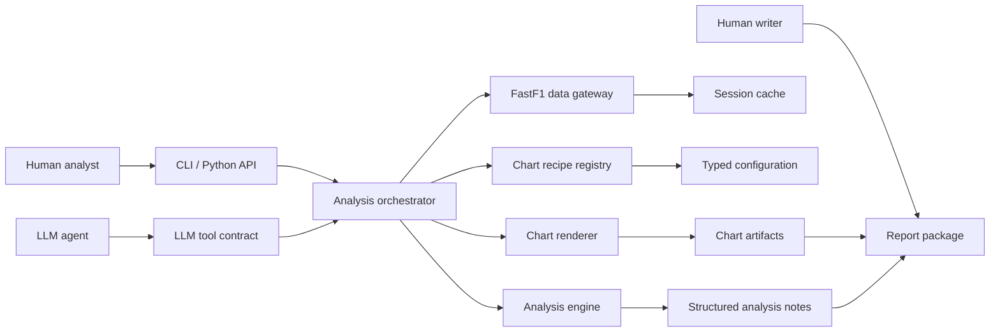
```mermaid
flowchart LR
    Analyst["Human analyst"] --> CLI["CLI / Python API"]
    Writer["Human writer"] --> ReportPack["Report package"]
    Agent["LLM agent"] --> ToolContract["LLM tool contract"]
    CLI --> Orchestrator["Analysis orchestrator"]
    ToolContract --> Orchestrator
    Orchestrator --> DataGateway["FastF1 data gateway"]
    Orchestrator --> RecipeRegistry["Chart recipe registry"]
    Orchestrator --> Renderer["Chart renderer"]
    Orchestrator --> Analyzer["Analysis engine"]
    DataGateway --> Cache["Session cache"]
    RecipeRegistry --> Config["Typed configuration"]
    Renderer --> Artifacts["Chart artifacts"]
    Analyzer --> Notes["Structured analysis notes"]
    Artifacts --> ReportPack
    Notes --> ReportPack
```

## Domain class model

The class diagram is intentionally typed and uses specialization, aggregation,
composition, and directed associations where Mermaid supports them.

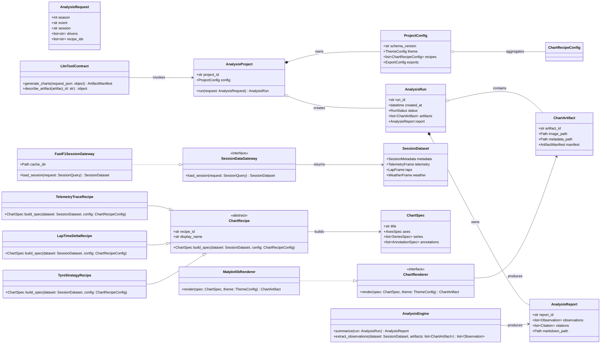
```mermaid
classDiagram
    direction LR

    class AnalysisProject {
        +str project_id
        +ProjectConfig config
        +run(request: AnalysisRequest) AnalysisRun
    }

    class ProjectConfig {
        +str schema_version
        +ThemeConfig theme
        +list~ChartRecipeConfig~ recipes
        +ExportConfig exports
    }

    class AnalysisRequest {
        +int season
        +str event
        +str session
        +list~str~ drivers
        +list~str~ recipe_ids
    }

    class AnalysisRun {
        +str run_id
        +datetime created_at
        +RunStatus status
        +list~ChartArtifact~ artifacts
        +AnalysisReport report
    }

    class SessionDataGateway {
        <<interface>>
        +load_session(request: SessionQuery) SessionDataset
    }

    class FastF1SessionGateway {
        +Path cache_dir
        +load_session(request: SessionQuery) SessionDataset
    }

    class SessionDataset {
        +SessionMetadata metadata
        +TelemetryFrame telemetry
        +LapFrame laps
        +WeatherFrame weather
    }

    class ChartRecipe {
        <<abstract>>
        +str recipe_id
        +str display_name
        +ChartSpec build_spec(dataset: SessionDataset, config: ChartRecipeConfig)
    }

    class TelemetryTraceRecipe {
        +ChartSpec build_spec(dataset: SessionDataset, config: ChartRecipeConfig)
    }

    class LapTimeDeltaRecipe {
        +ChartSpec build_spec(dataset: SessionDataset, config: ChartRecipeConfig)
    }

    class TyreStrategyRecipe {
        +ChartSpec build_spec(dataset: SessionDataset, config: ChartRecipeConfig)
    }

    class ChartSpec {
        +str title
        +AxesSpec axes
        +list~SeriesSpec~ series
        +list~AnnotationSpec~ annotations
    }

    class ChartRenderer {
        <<interface>>
        +render(spec: ChartSpec, theme: ThemeConfig) ChartArtifact
    }

    class MatplotlibRenderer {
        +render(spec: ChartSpec, theme: ThemeConfig) ChartArtifact
    }

    class ChartArtifact {
        +str artifact_id
        +Path image_path
        +Path metadata_path
        +ArtifactManifest manifest
    }

    class AnalysisEngine {
        +summarize(run: AnalysisRun) AnalysisReport
        +extract_observations(dataset: SessionDataset, artifacts: list~ChartArtifact~) list~Observation~
    }

    class AnalysisReport {
        +str report_id
        +list~Observation~ observations
        +list~Citation~ citations
        +Path markdown_path
    }

    class LlmToolContract {
        +generate_charts(request_json: object) ArtifactManifest
        +describe_artifact(artifact_id: str) object
    }

    AnalysisProject *-- ProjectConfig : owns
    AnalysisProject o-- AnalysisRun : creates
    AnalysisRun o-- ChartArtifact : contains
    AnalysisRun *-- AnalysisReport : owns
    ProjectConfig o-- ChartRecipeConfig : aggregates
    FastF1SessionGateway ..|> SessionDataGateway
    MatplotlibRenderer ..|> ChartRenderer
    TelemetryTraceRecipe --|> ChartRecipe
    LapTimeDeltaRecipe --|> ChartRecipe
    TyreStrategyRecipe --|> ChartRecipe
    SessionDataGateway --> SessionDataset : returns
    ChartRecipe --> ChartSpec : builds
    ChartRenderer --> ChartArtifact : produces
    AnalysisEngine --> AnalysisReport : produces
    LlmToolContract --> AnalysisProject : invokes
```

## Runtime sequence

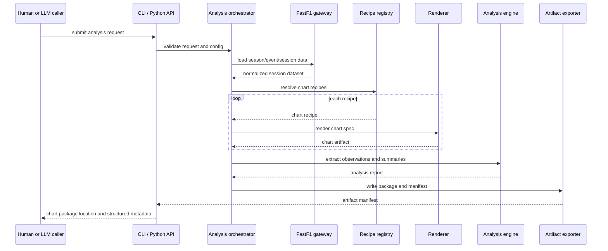
```mermaid
sequenceDiagram
    participant Caller as Human or LLM caller
    participant API as CLI / Python API
    participant Orchestrator as Analysis orchestrator
    participant Gateway as FastF1 gateway
    participant Registry as Recipe registry
    participant Renderer as Renderer
    participant Analyzer as Analysis engine
    participant Exporter as Artifact exporter

    Caller->>API: submit analysis request
    API->>Orchestrator: validate request and config
    Orchestrator->>Gateway: load season/event/session data
    Gateway-->>Orchestrator: normalized session dataset
    Orchestrator->>Registry: resolve chart recipes
    loop each recipe
        Registry-->>Orchestrator: chart recipe
        Orchestrator->>Renderer: render chart spec
        Renderer-->>Orchestrator: chart artifact
    end
    Orchestrator->>Analyzer: extract observations and summaries
    Analyzer-->>Orchestrator: analysis report
    Orchestrator->>Exporter: write package and manifest
    Exporter-->>API: artifact manifest
    API-->>Caller: chart package location and structured metadata
```

## UI or workflow mockups

The MVP does not require a hosted graphical application, but the framework must
define report-facing artifact shapes and future UI expectations. SVG wireframes
are stored as spec assets:

- [Chart configuration workbench](../assets/SPEC-001-chart-config-workbench.svg)
- [Analysis review workspace](../assets/SPEC-001-analysis-review-workspace.svg)
- [Report package output](../assets/SPEC-001-report-package-output.svg)
- [UC-010 CLI configuration validation](../assets/SPEC-001-UC-010-cli-config-validation.svg)
- [UC-020 Python notebook run](../assets/SPEC-001-UC-020-python-notebook-run.svg)
- [UC-030 Batch chart package generation](../assets/SPEC-001-UC-030-batch-chart-package.svg)
- [UC-040 Recipe development and debugging](../assets/SPEC-001-UC-040-recipe-debugging.svg)
- [UC-050 Observation extraction](../assets/SPEC-001-UC-050-observation-extraction.svg)
- [UC-060 Markdown report drafting](../assets/SPEC-001-UC-060-markdown-draft.svg)
- [UC-070 Human observation review](../assets/SPEC-001-UC-070-human-review.svg)
- [UC-080 LLM tool invocation](../assets/SPEC-001-UC-080-llm-tool-invocation.svg)
- [UC-090 Plugin registration](../assets/SPEC-001-UC-090-plugin-registration.svg)
- [UC-100 Local package preview](../assets/SPEC-001-UC-100-local-preview.svg)

## Use case model

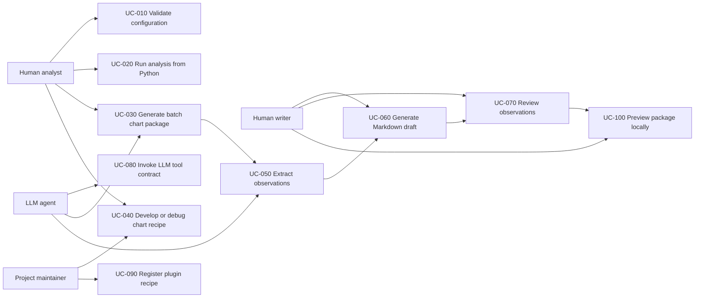
```mermaid
flowchart LR
    Analyst["Human analyst"]
    Writer["Human writer"]
    Agent["LLM agent"]
    Maintainer["Project maintainer"]

    UC010["UC-010 Validate configuration"]
    UC020["UC-020 Run analysis from Python"]
    UC030["UC-030 Generate batch chart package"]
    UC040["UC-040 Develop or debug chart recipe"]
    UC050["UC-050 Extract observations"]
    UC060["UC-060 Generate Markdown draft"]
    UC070["UC-070 Review observations"]
    UC080["UC-080 Invoke LLM tool contract"]
    UC090["UC-090 Register plugin recipe"]
    UC100["UC-100 Preview package locally"]

    Analyst --> UC010
    Analyst --> UC020
    Analyst --> UC030
    Analyst --> UC040
    Writer --> UC060
    Writer --> UC070
    Writer --> UC100
    Agent --> UC080
    Agent --> UC030
    Agent --> UC050
    Maintainer --> UC040
    Maintainer --> UC090

    UC030 --> UC050
    UC050 --> UC060
    UC060 --> UC070
    UC070 --> UC100
```

## Use case analysis

### UC-010: Validate Configuration

- **Priority:** MVP
- **Primary actor:** Human analyst or LLM agent.
- **Supporting components:** CLI, configuration loader, schema validator,
  recipe registry.
- **Trigger:** A caller submits a configuration file for validation before a
  chart run.
- **Preconditions:** The configuration file exists and is readable.
- **Main flow:**
  1. The system must parse the configuration file.
  2. The system must validate the schema version and supported keys.
  3. The system must validate session identity, driver selection, recipe IDs,
     theme settings, export settings, and output directory.
  4. The system must resolve recipe IDs through the registry.
  5. The system must return a success result with normalized configuration
     values when validation passes.
- **Alternate flows:** The system must return path-specific validation errors
  when parsing, schema validation, recipe resolution, or output directory checks
  fail.
- **Postconditions:** No chart artifacts are created by validation-only mode.
- **Primary interface mockup:** `SPEC-001-UC-010-cli-config-validation.svg`.
- **Related requirements:** REQ-030, REQ-040, REQ-120, API-020.

### UC-020: Run Analysis From Python

- **Priority:** MVP
- **Primary actor:** Human analyst.
- **Supporting components:** Python API, configuration model, orchestrator,
  data gateway, renderer, exporter.
- **Trigger:** A notebook or Python script calls the public API with a validated
  configuration or configuration path.
- **Preconditions:** The package is importable and the caller has a valid
  configuration.
- **Main flow:**
  1. The system must load or accept typed configuration.
  2. The system must create an analysis request.
  3. The system must execute the same validation path used by the CLI.
  4. The system must run the analysis orchestrator.
  5. The system must return a typed result with run status, manifest location,
     artifacts, warnings, and errors.
- **Alternate flows:** The system must raise documented framework exceptions or
  return documented error result objects for validation and runtime failures.
- **Postconditions:** Generated artifacts and metadata are written to the output
  package when the run succeeds or partially succeeds.
- **Primary interface mockup:** `SPEC-001-UC-020-python-notebook-run.svg`.
- **Related requirements:** REQ-010, REQ-030, REQ-070, REQ-110, API-010.

### UC-030: Generate Batch Chart Package

- **Priority:** MVP
- **Primary actor:** Human analyst or LLM agent.
- **Supporting components:** CLI or Python API, orchestrator, cache, recipe
  registry, renderer, artifact exporter.
- **Trigger:** A caller requests two or more chart recipes for one session.
- **Preconditions:** The configuration is valid and at least one requested chart
  recipe can be resolved.
- **Main flow:**
  1. The system must create a run record in `pending` state.
  2. The system must load cached data or populate the cache when allowed.
  3. The system must evaluate each requested recipe independently.
  4. The system must render successful chart specs.
  5. The system must write chart images, chart metadata, and a run manifest.
  6. The system must report successful, skipped, warning, and failed recipe
     outcomes in the manifest.
- **Alternate flows:** The system must preserve successful artifacts when one
  recipe fails after the run starts.
- **Postconditions:** The package directory contains a manifest that can be
  consumed by humans, scripts, and LLM agents.
- **Primary interface mockup:** `SPEC-001-UC-030-batch-chart-package.svg`.
- **Related requirements:** REQ-020, REQ-050, REQ-060, REQ-070, REQ-080,
  DATA-020.

### UC-040: Develop Or Debug Chart Recipe

- **Priority:** MVP for core recipes; V2 for external plugins.
- **Primary actor:** Project maintainer or advanced analyst.
- **Supporting components:** Recipe registry, normalized dataset model, chart
  spec model, renderer, fixture tests.
- **Trigger:** A maintainer creates or modifies a chart recipe.
- **Preconditions:** Representative fixture data exist for the intended recipe.
- **Main flow:**
  1. The system must let the recipe declare its stable ID, required dataset
     fields, supported config keys, and output artifact type.
  2. The system must validate recipe configuration before rendering.
  3. The system must build a renderer-independent chart spec from normalized
     session data.
  4. The system must render the chart spec through the configured renderer.
  5. The system must expose recipe warnings and missing-data errors in the run
     manifest.
- **Alternate flows:** The system should allow plugin recipes to register
  through a documented extension point after V2 is implemented.
- **Postconditions:** A recipe can be tested against fixtures without direct
  FastF1 calls.
- **Primary interface mockup:** `SPEC-001-UC-040-recipe-debugging.svg`.
- **Related requirements:** REQ-040, REQ-050, REQ-150, NFR-020, NFR-070.

### UC-050: Extract Observations

- **Priority:** V1
- **Primary actor:** Human analyst or LLM agent.
- **Supporting components:** Analysis engine, chart metadata, artifact manifest,
  observation model.
- **Trigger:** A chart package is available and observation extraction is
  enabled.
- **Preconditions:** The run has at least one generated chart artifact and
  machine-readable chart metadata.
- **Main flow:**
  1. The system must inspect chart metadata and normalized session metrics.
  2. The system must compute supported observations for configured observation
     families.
  3. The system must attach metric values, evidence links, confidence, and
     limitations to each observation.
  4. The system must avoid causal statements unless the configured observation
     rule explicitly supports them.
  5. The system must write observations to the report package.
- **Alternate flows:** The system must record an observation limitation when
  available data are insufficient for a stronger claim.
- **Postconditions:** Observation data are traceable to chart artifacts and
  source fields.
- **Primary interface mockup:** `SPEC-001-UC-050-observation-extraction.svg`.
- **Related requirements:** REQ-090, DATA-030, UX-020.

### UC-060: Generate Markdown Draft

- **Priority:** V1
- **Primary actor:** Human writer or LLM agent.
- **Supporting components:** Report package exporter, observation model,
  Markdown template, artifact manifest.
- **Trigger:** A caller requests a report package with draft generation enabled.
- **Preconditions:** The package contains chart artifacts and observation data.
- **Main flow:**
  1. The system must select accepted or unreviewed observations according to
     configuration.
  2. The system must assemble a portable Markdown draft.
  3. The system must reference chart artifact IDs and package-relative paths.
  4. The system must include limitations and warnings that affect interpretation.
  5. The system must write the draft into the package directory.
- **Alternate flows:** The system should generate a skeleton draft when no
  observations are available, and that draft should explicitly show that no
  supported observations were generated.
- **Postconditions:** The Markdown draft can be edited by a human without
  requiring framework runtime access.
- **Primary interface mockup:** `SPEC-001-UC-060-markdown-draft.svg`.
- **Related requirements:** REQ-100, UX-030.

### UC-070: Review Observations

- **Priority:** V1
- **Primary actor:** Human analyst or human writer.
- **Supporting components:** Observation model, report package, review metadata,
  optional local preview.
- **Trigger:** A human reviews generated observations before publication.
- **Preconditions:** Observation data exist in a report package.
- **Main flow:**
  1. The system must preserve each generated observation in its original form.
  2. The system must allow an observation to be marked as accepted, edited,
     rejected, or unreviewed.
  3. The system must store edited text separately from original generated text.
  4. The system must exclude rejected observations from final draft export.
  5. The system must keep evidence links intact for accepted and edited
     observations.
- **Alternate flows:** The system should support review metadata edits through
  package files before a dedicated UI exists.
- **Postconditions:** Reviewed observations remain traceable and can drive a
  revised Markdown draft.
- **Primary interface mockup:** `SPEC-001-UC-070-human-review.svg`.
- **Related requirements:** REQ-140, DATA-030, UX-020.

### UC-080: Invoke LLM Tool Contract

- **Priority:** V1
- **Primary actor:** LLM agent.
- **Supporting components:** Tool contract adapter, schema validator,
  orchestrator, artifact inspector.
- **Trigger:** An LLM agent submits a JSON request for chart generation or
  artifact inspection.
- **Preconditions:** The tool contract version is supported.
- **Main flow:**
  1. The system must validate the request against the contract schema.
  2. The system must reject unsupported contract versions with a structured
     compatibility error.
  3. The system must invoke the same orchestration path used by Python and CLI
     callers.
  4. The system must return package-relative artifact references and structured
     warnings.
  5. The system must provide artifact description responses without exposing
     unrelated local environment data.
- **Alternate flows:** The system must return structured errors for missing
  fields, unsupported recipes, unavailable artifacts, and failed runs.
- **Postconditions:** The agent receives enough structured context to cite or
  inspect outputs without guessing local internals.
- **Primary interface mockup:** `SPEC-001-UC-080-llm-tool-invocation.svg`.
- **Related requirements:** REQ-130, API-030, SEC-020.

### UC-090: Register Plugin Recipe

- **Priority:** V2
- **Primary actor:** Project maintainer or advanced analyst.
- **Supporting components:** Plugin loader, recipe registry, schema extension
  mechanism, test fixtures.
- **Trigger:** A caller enables an external recipe plugin.
- **Preconditions:** The plugin package is installed or available on a configured
  local path.
- **Main flow:**
  1. The system should discover plugin entry points or configured plugin paths.
  2. The system should validate plugin recipe metadata before registration.
  3. The system should register plugin recipe IDs without overriding core recipe
     IDs.
  4. The system should isolate plugin failures from core recipe registration.
  5. The system should include plugin identity and version in artifact metadata.
- **Alternate flows:** The system should reject duplicate recipe IDs with an
  actionable validation error.
- **Postconditions:** Plugin recipes can participate in batch generation through
  the same recipe registry interface as core recipes.
- **Primary interface mockup:** `SPEC-001-UC-090-plugin-registration.svg`.
- **Related requirements:** REQ-150.

### UC-100: Preview Package Locally

- **Priority:** V2
- **Primary actor:** Human analyst or human writer.
- **Supporting components:** Local preview reader, artifact manifest, chart
  images, observation data, warnings.
- **Trigger:** A human opens a generated package in a local preview experience.
- **Preconditions:** A package manifest exists and references local package
  files.
- **Main flow:**
  1. The system should load the package manifest from a local directory.
  2. The system should display chart thumbnails, metadata, observations,
     warnings, and draft status.
  3. The system should show missing package files as recoverable package
     integrity warnings.
  4. The system should avoid requiring a hosted backend service.
- **Alternate flows:** The system should degrade to manifest-only viewing when
  chart image files are missing.
- **Postconditions:** A human can inspect package completeness and analysis
  status before publication.
- **Primary interface mockup:** `SPEC-001-UC-100-local-preview.svg`.
- **Related requirements:** REQ-160, UX-030.

## State flow

### Configuration State

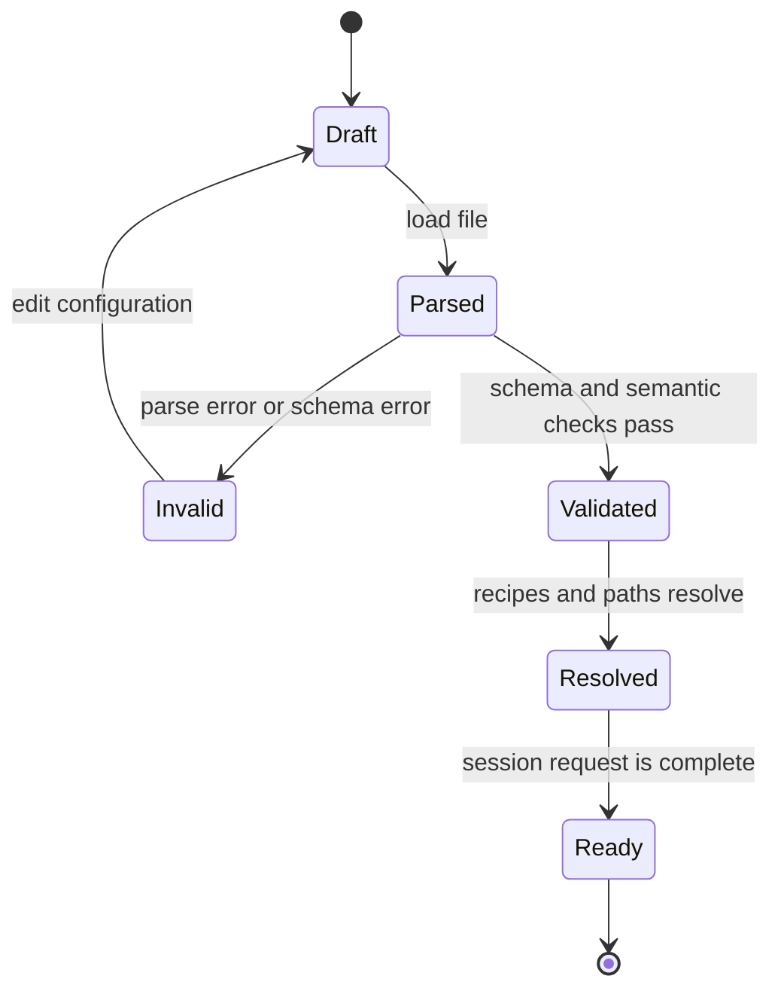
```mermaid
stateDiagram-v2
    [*] --> Draft
    Draft --> Parsed: load file
    Parsed --> Invalid: parse error or schema error
    Parsed --> Validated: schema and semantic checks pass
    Validated --> Resolved: recipes and paths resolve
    Resolved --> Ready: session request is complete
    Invalid --> Draft: edit configuration
    Ready --> [*]
```

### Analysis Run State

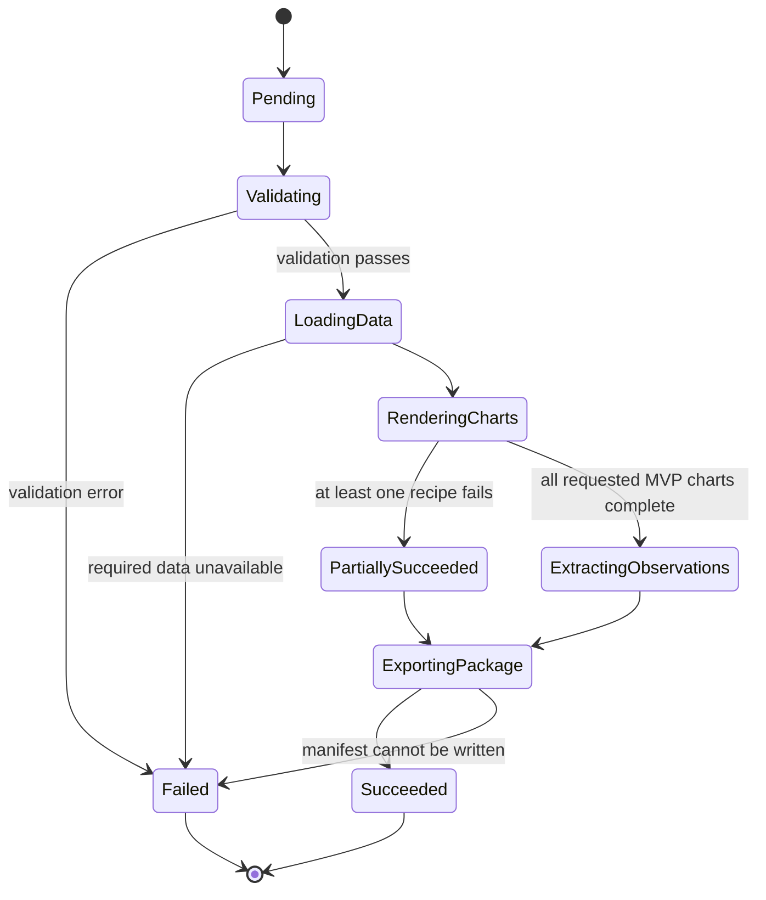
```mermaid
stateDiagram-v2
    [*] --> Pending
    Pending --> Validating
    Validating --> Failed: validation error
    Validating --> LoadingData: validation passes
    LoadingData --> Failed: required data unavailable
    LoadingData --> RenderingCharts
    RenderingCharts --> PartiallySucceeded: at least one recipe fails
    RenderingCharts --> ExtractingObservations: all requested MVP charts complete
    PartiallySucceeded --> ExportingPackage
    ExtractingObservations --> ExportingPackage
    ExportingPackage --> Succeeded
    ExportingPackage --> Failed: manifest cannot be written
    Succeeded --> [*]
    Failed --> [*]
```

### Chart Artifact State

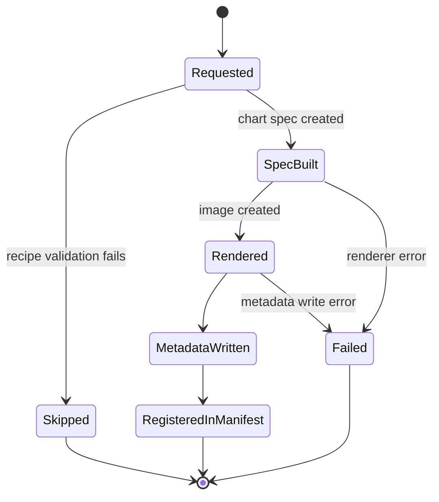
```mermaid
stateDiagram-v2
    [*] --> Requested
    Requested --> Skipped: recipe validation fails
    Requested --> SpecBuilt: chart spec created
    SpecBuilt --> Rendered: image created
    Rendered --> MetadataWritten
    MetadataWritten --> RegisteredInManifest
    SpecBuilt --> Failed: renderer error
    Rendered --> Failed: metadata write error
    RegisteredInManifest --> [*]
    Skipped --> [*]
    Failed --> [*]
```

### Observation State

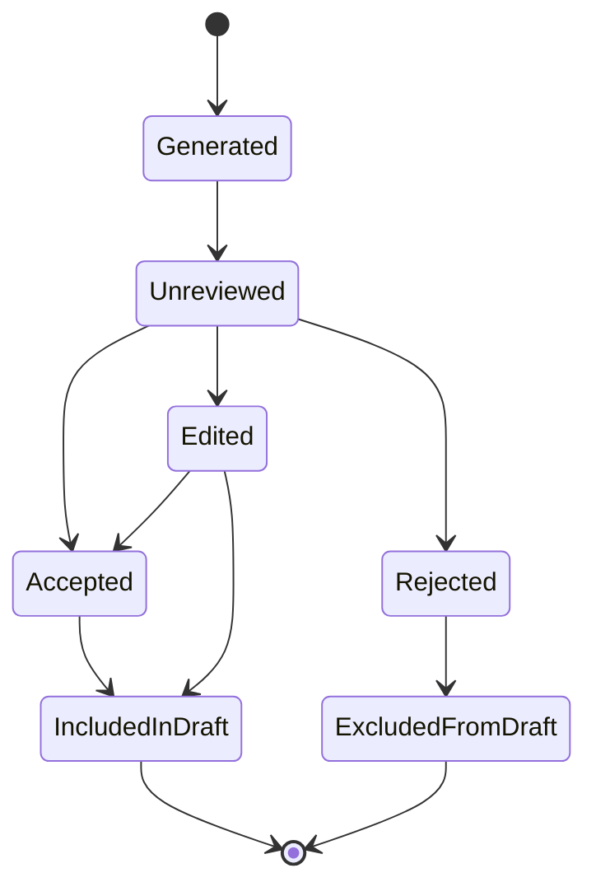
```mermaid
stateDiagram-v2
    [*] --> Generated
    Generated --> Unreviewed
    Unreviewed --> Accepted
    Unreviewed --> Edited
    Unreviewed --> Rejected
    Edited --> Accepted
    Accepted --> IncludedInDraft
    Edited --> IncludedInDraft
    Rejected --> ExcludedFromDraft
    IncludedInDraft --> [*]
    ExcludedFromDraft --> [*]
```

### Report Package State

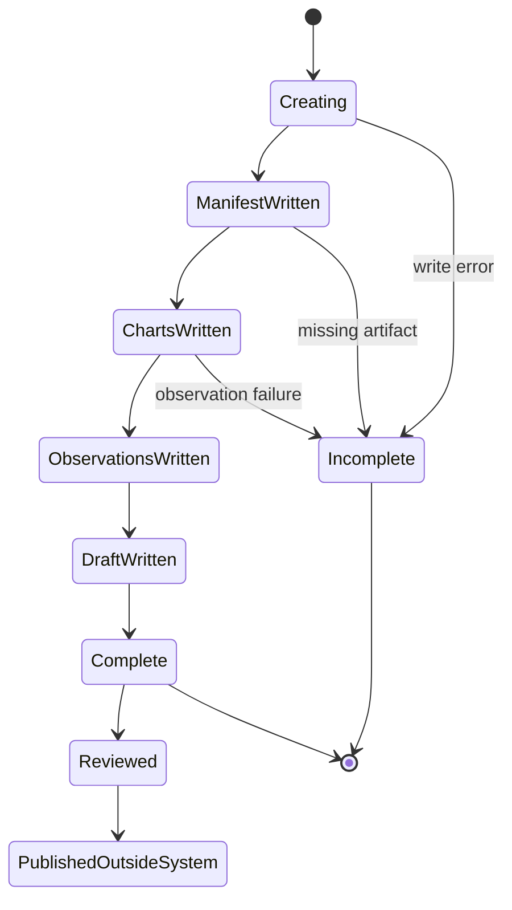
```mermaid
stateDiagram-v2
    [*] --> Creating
    Creating --> ManifestWritten
    ManifestWritten --> ChartsWritten
    ChartsWritten --> ObservationsWritten
    ObservationsWritten --> DraftWritten
    DraftWritten --> Complete
    Creating --> Incomplete: write error
    ManifestWritten --> Incomplete: missing artifact
    ChartsWritten --> Incomplete: observation failure
    Complete --> Reviewed
    Reviewed --> PublishedOutsideSystem
    Complete --> [*]
    Incomplete --> [*]
```

## Feature activity flows

### ACT-010: Configuration Validation Activity

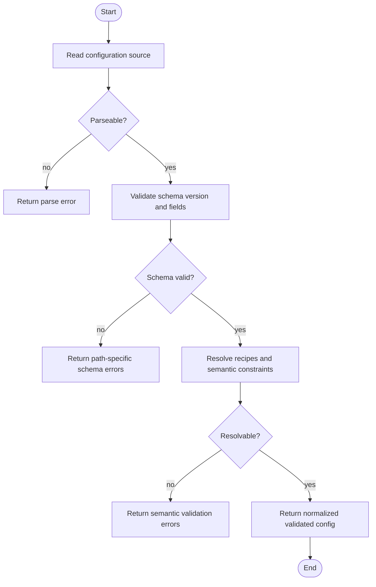
```mermaid
flowchart TD
    A([Start]) --> B[Read configuration source]
    B --> C{Parseable?}
    C -- no --> Z[Return parse error]
    C -- yes --> D[Validate schema version and fields]
    D --> E{Schema valid?}
    E -- no --> Y[Return path-specific schema errors]
    E -- yes --> F[Resolve recipes and semantic constraints]
    F --> G{Resolvable?}
    G -- no --> X[Return semantic validation errors]
    G -- yes --> H[Return normalized validated config]
    H --> I([End])
```

### ACT-020: Data Loading And Cache Activity

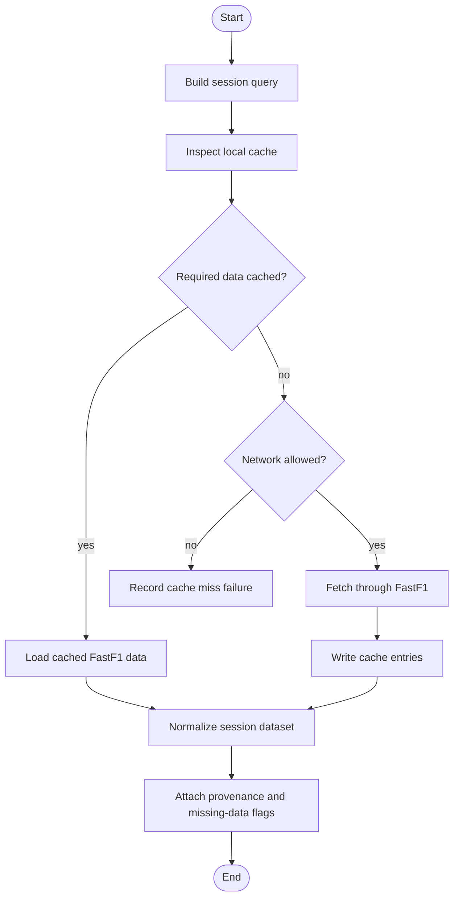
```mermaid
flowchart TD
    A([Start]) --> B[Build session query]
    B --> C[Inspect local cache]
    C --> D{Required data cached?}
    D -- yes --> E[Load cached FastF1 data]
    D -- no --> F{Network allowed?}
    F -- no --> Z[Record cache miss failure]
    F -- yes --> G[Fetch through FastF1]
    G --> H[Write cache entries]
    E --> I[Normalize session dataset]
    H --> I
    I --> J[Attach provenance and missing-data flags]
    J --> K([End])
```

### ACT-030: Recipe Resolution And Chart Spec Activity

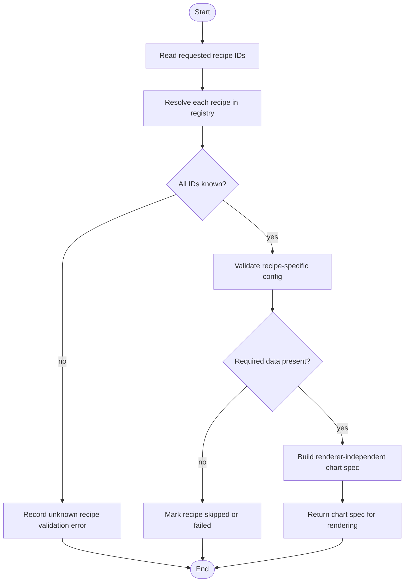
```mermaid
flowchart TD
    A([Start]) --> B[Read requested recipe IDs]
    B --> C[Resolve each recipe in registry]
    C --> D{All IDs known?}
    D -- no --> E[Record unknown recipe validation error]
    D -- yes --> F[Validate recipe-specific config]
    F --> G{Required data present?}
    G -- no --> H[Mark recipe skipped or failed]
    G -- yes --> I[Build renderer-independent chart spec]
    I --> J[Return chart spec for rendering]
    E --> K([End])
    H --> K
    J --> K
```

### ACT-040: Rendering And Artifact Export Activity

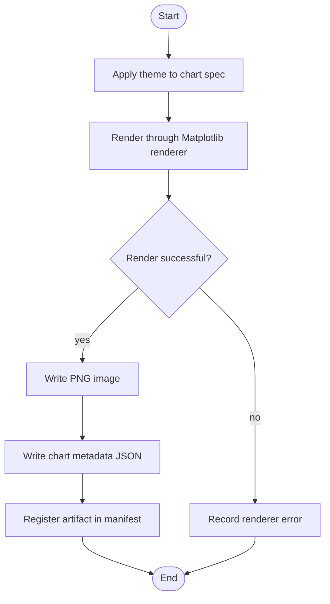
```mermaid
flowchart TD
    A([Start]) --> B[Apply theme to chart spec]
    B --> C[Render through Matplotlib renderer]
    C --> D{Render successful?}
    D -- no --> E[Record renderer error]
    D -- yes --> F[Write PNG image]
    F --> G[Write chart metadata JSON]
    G --> H[Register artifact in manifest]
    H --> I([End])
    E --> I
```

### ACT-050: Batch Generation Activity

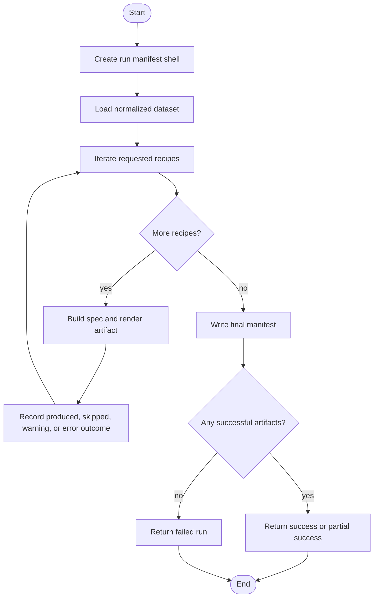
```mermaid
flowchart TD
    A([Start]) --> B[Create run manifest shell]
    B --> C[Load normalized dataset]
    C --> D[Iterate requested recipes]
    D --> E{More recipes?}
    E -- yes --> F[Build spec and render artifact]
    F --> G[Record produced, skipped, warning, or error outcome]
    G --> D
    E -- no --> H[Write final manifest]
    H --> I{Any successful artifacts?}
    I -- yes --> J[Return success or partial success]
    I -- no --> K[Return failed run]
    J --> L([End])
    K --> L
```

### ACT-060: Observation Extraction Activity

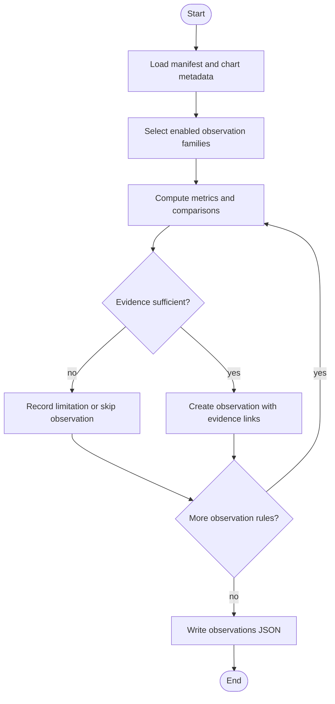
```mermaid
flowchart TD
    A([Start]) --> B[Load manifest and chart metadata]
    B --> C[Select enabled observation families]
    C --> D[Compute metrics and comparisons]
    D --> E{Evidence sufficient?}
    E -- no --> F[Record limitation or skip observation]
    E -- yes --> G[Create observation with evidence links]
    F --> H{More observation rules?}
    G --> H
    H -- yes --> D
    H -- no --> I[Write observations JSON]
    I --> J([End])
```

### ACT-070: Markdown Draft Activity

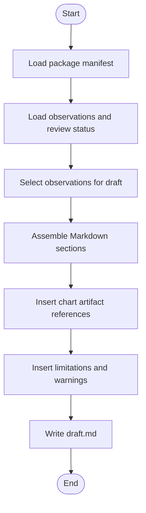
```mermaid
flowchart TD
    A([Start]) --> B[Load package manifest]
    B --> C[Load observations and review status]
    C --> D[Select observations for draft]
    D --> E[Assemble Markdown sections]
    E --> F[Insert chart artifact references]
    F --> G[Insert limitations and warnings]
    G --> H[Write draft.md]
    H --> I([End])
```

### ACT-080: Human Review Activity

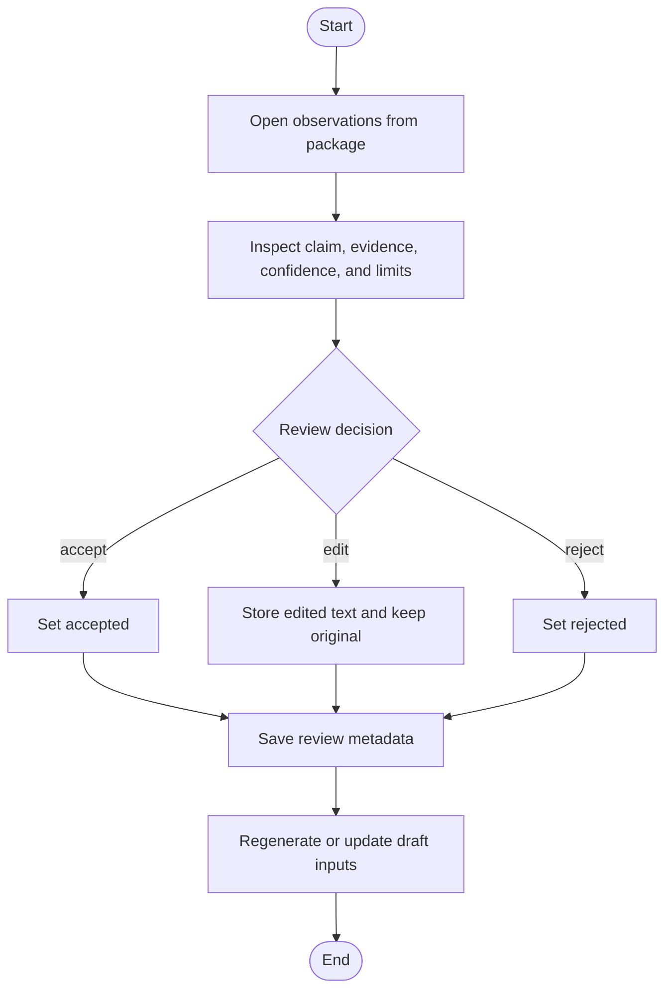
```mermaid
flowchart TD
    A([Start]) --> B[Open observations from package]
    B --> C[Inspect claim, evidence, confidence, and limits]
    C --> D{Review decision}
    D -- accept --> E[Set accepted]
    D -- edit --> F[Store edited text and keep original]
    D -- reject --> G[Set rejected]
    E --> H[Save review metadata]
    F --> H
    G --> H
    H --> I[Regenerate or update draft inputs]
    I --> J([End])
```

### ACT-090: LLM Tool Invocation Activity

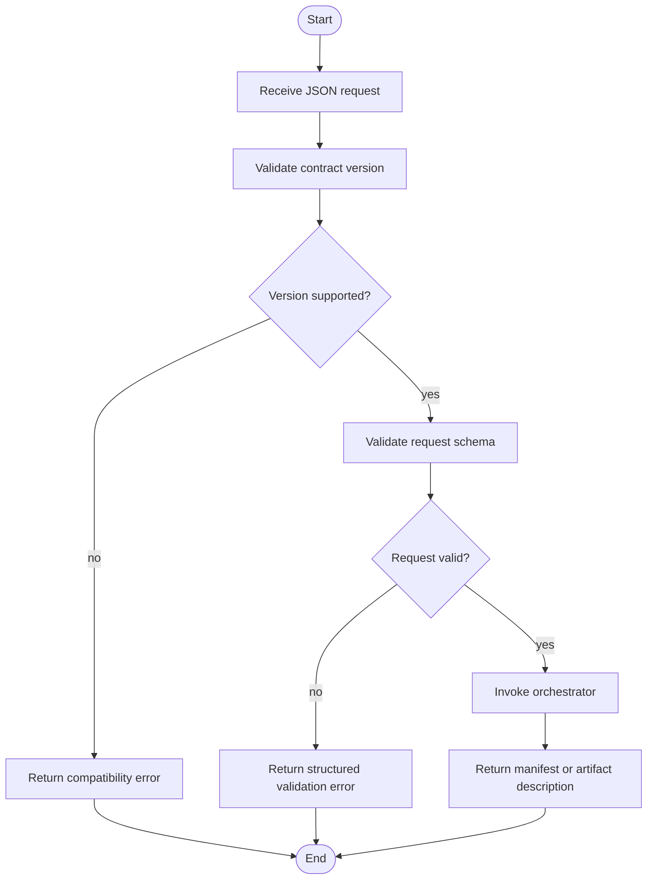
```mermaid
flowchart TD
    A([Start]) --> B[Receive JSON request]
    B --> C[Validate contract version]
    C --> D{Version supported?}
    D -- no --> E[Return compatibility error]
    D -- yes --> F[Validate request schema]
    F --> G{Request valid?}
    G -- no --> H[Return structured validation error]
    G -- yes --> I[Invoke orchestrator]
    I --> J[Return manifest or artifact description]
    E --> K([End])
    H --> K
    J --> K
```

### ACT-100: Plugin Recipe Activity

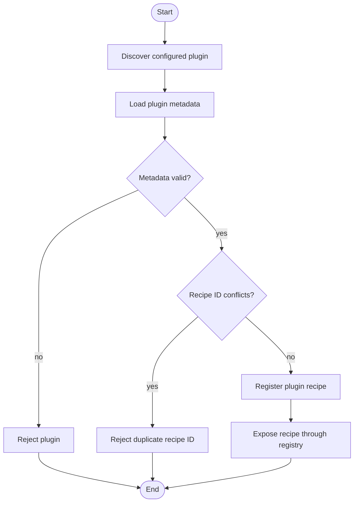
```mermaid
flowchart TD
    A([Start]) --> B[Discover configured plugin]
    B --> C[Load plugin metadata]
    C --> D{Metadata valid?}
    D -- no --> E[Reject plugin]
    D -- yes --> F{Recipe ID conflicts?}
    F -- yes --> G[Reject duplicate recipe ID]
    F -- no --> H[Register plugin recipe]
    H --> I[Expose recipe through registry]
    E --> J([End])
    G --> J
    I --> J
```

### ACT-110: Local Preview Activity

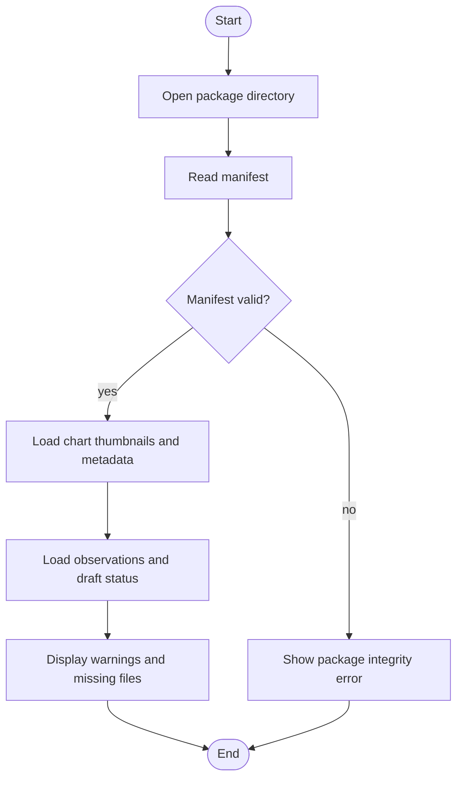
```mermaid
flowchart TD
    A([Start]) --> B[Open package directory]
    B --> C[Read manifest]
    C --> D{Manifest valid?}
    D -- no --> E[Show package integrity error]
    D -- yes --> F[Load chart thumbnails and metadata]
    F --> G[Load observations and draft status]
    G --> H[Display warnings and missing files]
    H --> I([End])
    E --> I
```

## Functional requirements

### REQ-010: Session Data Loading

- **Priority:** MVP
- **Statement:** The system must load F1 session data through a FastF1-backed
  gateway for a specified season, event, session type, and driver selection.
- **Rationale:** Chart recipes need a consistent data source before rendering or
  analysis can be repeatable.
- **Acceptance criteria:** A caller can request one historical race, qualifying,
  sprint, or practice session by season, event name, and session code; the
  gateway returns normalized metadata, laps, telemetry, and weather when those
  data are available from FastF1; unavailable optional data are represented as
  explicit missing-data fields rather than silent null behavior.
- **Verification method:** Automated integration test with cached FastF1 fixture
  data.
- **Evidence location:** To be filled during implementation.

### REQ-020: Session Cache

- **Priority:** MVP
- **Statement:** The system must cache upstream session data in a configurable
  local cache directory.
- **Rationale:** Repeatable chart generation needs faster reruns and reduced
  dependence on external network availability.
- **Acceptance criteria:** The cache directory can be set through configuration;
  repeated generation of the same cached session does not require a network
  request when all required cached files exist; cache misses are reported in run
  metadata.
- **Verification method:** Automated integration test using an isolated cache
  directory and mocked network calls.
- **Evidence location:** To be filled during implementation.

### REQ-030: Typed Configuration Schema

- **Priority:** MVP
- **Statement:** The system must define a versioned typed configuration schema
  for project defaults, session requests, chart recipes, themes, export formats,
  and analysis options.
- **Rationale:** Humans and LLM agents need a stable contract that avoids
  editing chart code for routine changes.
- **Acceptance criteria:** A configuration file declares a schema version;
  invalid keys, invalid types, and unsupported enum values produce validation
  errors that include the failing path; a valid minimal configuration can
  generate at least one chart.
- **Verification method:** Automated schema validation tests.
- **Evidence location:** To be filled during implementation.

### REQ-040: Chart Recipe Registry

- **Priority:** MVP
- **Statement:** The system must provide a registry that resolves stable chart
  recipe identifiers to chart recipe implementations.
- **Rationale:** Stable identifiers let humans, scripts, and LLM agents request
  charts without knowing internal class names.
- **Acceptance criteria:** Each registered recipe exposes a stable ID, display
  name, required dataset fields, supported configuration keys, and output
  artifact types; requesting an unknown recipe ID fails with an actionable
  validation error.
- **Verification method:** Automated unit tests for registry resolution and
  error handling.
- **Evidence location:** To be filled during implementation.

### REQ-050: Core Chart Recipes

- **Priority:** MVP
- **Statement:** The system must include core chart recipes for telemetry traces,
  lap time comparison, stint or tyre strategy, and position progression.
- **Rationale:** These chart types cover the first useful set of F1 session
  analysis workflows.
- **Acceptance criteria:** The framework can render at least one valid chart for
  each core recipe from cached fixture data; each recipe declares required data
  fields; each recipe handles missing required fields with a recipe-specific
  validation error.
- **Verification method:** Automated chart smoke tests with fixture datasets.
- **Evidence location:** To be filled during implementation.

### REQ-060: Visual Theme Consistency

- **Priority:** MVP
- **Statement:** The system must apply a centralized visual theme to every chart
  rendered by the framework.
- **Rationale:** Consistent style is required for reusable article graphics and
  recognizable project output.
- **Acceptance criteria:** Theme configuration controls font family, base font
  size, figure size, grid behavior, background color, foreground color, team or
  driver color mapping, line widths, and export DPI; all core chart recipes use
  the same theme object.
- **Verification method:** Automated unit tests for theme propagation plus
  visual baseline inspection for representative charts.
- **Evidence location:** To be filled during implementation.

### REQ-070: Chart Artifact Export

- **Priority:** MVP
- **Statement:** The system must export each generated chart with image output
  and machine-readable metadata.
- **Rationale:** Article workflows and LLM agents need both human-visible images
  and structured context.
- **Acceptance criteria:** Each rendered chart writes at least one PNG file and
  one metadata file; metadata includes recipe ID, source session, selected
  drivers, generated timestamp, configuration hash, data freshness information,
  and warnings; artifact file names are deterministic for identical request
  inputs except where a run ID is intentionally included.
- **Verification method:** Automated file output tests.
- **Evidence location:** To be filled during implementation.

### REQ-080: Batch Chart Generation

- **Priority:** MVP
- **Statement:** The system must generate multiple configured charts in a single
  analysis run.
- **Rationale:** Analysts and agents need a repeatable chart pack rather than a
  single-chart script.
- **Acceptance criteria:** A run can request two or more recipe IDs; the run
  manifest lists every requested recipe, every produced artifact, every skipped
  chart, and every warning or error; a single recipe failure does not delete
  successfully generated artifacts from the same run.
- **Verification method:** Automated integration test with one successful recipe
  and one intentionally invalid recipe.
- **Evidence location:** To be filled during implementation.

### REQ-090: Analysis Observation Extraction

- **Priority:** V1
- **Statement:** The system must extract structured observations from session
  data and generated chart artifacts.
- **Rationale:** Automated or assisted writing needs concise claims linked to
  the data and charts that support them.
- **Acceptance criteria:** Each observation includes a stable observation ID,
  summary text, supporting metric values, source chart artifact IDs, source data
  fields, confidence level, and limitations; generated observations avoid
  unsupported causal claims.
- **Verification method:** Automated tests for deterministic observation
  extraction plus manual review of representative report output.
- **Evidence location:** To be filled during implementation.

### REQ-100: Report Package Generation

- **Priority:** V1
- **Statement:** The system must generate a report package that combines chart
  artifacts, chart metadata, structured observations, and a Markdown analysis
  draft.
- **Rationale:** Writers and LLM agents need one portable output package for
  blog drafting and review.
- **Acceptance criteria:** A completed run produces a package directory with an
  artifact manifest, chart images, chart metadata, observation data, and a
  portable Markdown draft; the Markdown draft references chart artifact IDs
  rather than embedding untraceable claims; V1 output does not depend on a
  platform-specific blog publishing format.
- **Verification method:** Automated package structure tests and manual review.
- **Evidence location:** To be filled during implementation.

### REQ-110: Python API

- **Priority:** MVP
- **Statement:** The system must expose a Python API that can validate
  configuration, run analysis, and return an artifact manifest.
- **Rationale:** Python is the natural integration surface for analysts,
  notebooks, and LLM coding agents.
- **Acceptance criteria:** A caller can import the package, construct or load a
  configuration, run an analysis request, and receive a typed result object
  without invoking a shell command; public API examples are covered by tests.
- **Verification method:** Automated API tests and documentation example tests.
- **Evidence location:** To be filled during implementation.

### REQ-120: CLI Interface

- **Priority:** MVP
- **Statement:** The system must expose a command-line interface for validating
  configuration and generating chart packages.
- **Rationale:** The CLI provides a simple automation boundary for humans,
  scripts, and agents.
- **Acceptance criteria:** The CLI supports at least a config validation command
  and a chart generation command; the CLI returns a non-zero exit code for
  validation or generation failure; the CLI prints the output package path on
  success.
- **Verification method:** Automated CLI tests.
- **Evidence location:** To be filled during implementation.

### REQ-130: LLM Tool Contract

- **Priority:** V1
- **Statement:** The system must define an LLM-oriented tool contract for chart
  generation and artifact inspection.
- **Rationale:** The ultimate project goal depends on LLM agents safely using
  the framework without guessing internal APIs.
- **Acceptance criteria:** The contract includes JSON input schemas, JSON output
  schemas, error schemas, deterministic artifact references, and examples for
  generating a chart pack and describing a chart artifact; the contract is
  versioned separately from internal implementation classes.
- **Verification method:** Schema validation tests and contract example tests.
- **Evidence location:** To be filled during implementation.

### REQ-140: Human Review Workflow

- **Priority:** V1
- **Statement:** The system should support a human review workflow for accepting,
  editing, or rejecting generated observations before publication.
- **Rationale:** F1 analysis can include interpretation, and publication-quality
  output should preserve human editorial control.
- **Acceptance criteria:** The report package records observation review status
  values; edited observations preserve the original generated observation for
  traceability; rejected observations are excluded from the final article draft
  export.
- **Verification method:** Automated report package tests.
- **Evidence location:** To be filled during implementation.

### REQ-150: Extensible Recipe Plugins

- **Priority:** V2
- **Statement:** The system should support externally defined chart recipe
  plugins without modifying the framework core.
- **Rationale:** Advanced users may need private or experimental chart types
  while keeping core recipes stable.
- **Acceptance criteria:** A plugin can register a recipe ID, schema extension,
  and renderer implementation through a documented extension point; plugin
  errors are isolated from core recipe registration.
- **Verification method:** Automated plugin fixture tests.
- **Evidence location:** To be filled during implementation.

### REQ-160: Interactive Artifact Preview

- **Priority:** V2
- **Statement:** The system should provide an interactive local preview
  experience for browsing generated chart packages.
- **Rationale:** A preview UI can improve analyst review speed after the
  package-based workflow is stable.
- **Acceptance criteria:** The preview displays generated charts, metadata,
  observations, warnings, and package status from a local artifact manifest; the
  preview does not require a hosted backend service.
- **Verification method:** UI smoke tests or manual verification.
- **Evidence location:** To be filled during implementation.

## Constraints

### NFR-010: Supported Runtime

- **Priority:** MVP
- **Statement:** The system must support Python 3.11 or newer.
- **Rationale:** A modern Python baseline enables current typing and dependency
  support while avoiding outdated runtime constraints.
- **Acceptance criteria:** Automated checks run on Python 3.11 or newer; package
  metadata declares the supported Python version; unsupported Python versions
  fail during installation or validation.
- **Verification method:** Automated environment and packaging checks.
- **Evidence location:** To be filled during implementation.

### NFR-020: Primary Plotting Backend

- **Priority:** MVP
- **Statement:** The system must use Matplotlib as the MVP chart rendering
  backend.
- **Rationale:** The existing project history and ecosystem fit favor Matplotlib
  for static article-ready figures.
- **Acceptance criteria:** All MVP core chart recipes render through the
  Matplotlib renderer; renderer-specific code is isolated behind a renderer
  interface.
- **Verification method:** Code inspection and renderer unit tests.
- **Evidence location:** To be filled during implementation.

### NFR-030: Deterministic Outputs

- **Priority:** MVP
- **Statement:** The system must produce deterministic chart metadata and stable
  file names for identical inputs, configuration, framework version, and cached
  source data.
- **Rationale:** Determinism is required for review, testing, and LLM artifact
  references.
- **Acceptance criteria:** Two runs with the same cache, configuration, and
  framework version produce equivalent metadata excluding declared run-specific
  fields; deterministic file names remain unchanged across those two runs.
- **Verification method:** Automated repeatability test.
- **Evidence location:** To be filled during implementation.

### NFR-040: Offline Reproducibility

- **Priority:** MVP
- **Statement:** The system must generate charts from a complete existing cache
  without network access.
- **Rationale:** Analysts need reproducible output even when upstream services
  are unavailable.
- **Acceptance criteria:** A test run with network access disabled succeeds when
  all required data are already cached; the run manifest records offline mode or
  cache-only behavior.
- **Verification method:** Automated integration test with network mocking.
- **Evidence location:** To be filled during implementation.

### NFR-050: File Format Support

- **Priority:** MVP
- **Statement:** The system must support PNG image export and JSON metadata
  export in the MVP.
- **Rationale:** PNG and JSON are sufficient for article graphics and agent
  consumption in the initial release.
- **Acceptance criteria:** Every successful chart artifact includes PNG and JSON
  files; unsupported export formats fail validation before rendering begins.
- **Verification method:** Automated output format tests.
- **Evidence location:** To be filled during implementation.

### NFR-060: Documentation Scope

- **Priority:** MVP
- **Statement:** The system must document public configuration keys, public API
  entry points, CLI commands, core recipe IDs, and artifact manifest fields.
- **Rationale:** The framework cannot be reliably used by humans or LLM agents
  without explicit contracts.
- **Acceptance criteria:** Documentation contains at least one minimal end-to-end
  example for the Python API and CLI; documentation does not introduce
  requirements outside specs.
- **Verification method:** Documentation inspection and example tests where
  feasible.
- **Evidence location:** To be filled during implementation.

### NFR-070: Dependency Boundary

- **Priority:** MVP
- **Statement:** The system must isolate direct FastF1 calls inside the data
  gateway layer.
- **Rationale:** A narrow boundary makes testing, caching, and future data
  provider changes safer.
- **Acceptance criteria:** Core chart recipes consume normalized framework data
  objects rather than calling FastF1 directly; tests can provide a fake data
  gateway.
- **Verification method:** Code inspection and unit tests with fake gateways.
- **Evidence location:** To be filled during implementation.

## Performance requirements

### NFR-110: Cached Session Load Time

- **Priority:** MVP
- **Statement:** The system must load a cached single-session dataset in a
  maximum of 10 seconds on a developer laptop with local SSD storage.
- **Rationale:** Cached analysis reruns should feel interactive enough for
  iterative chart work.
- **Acceptance criteria:** A benchmark using a representative cached race
  session completes data loading within the maximum 10-second threshold.
- **Verification method:** Automated or scripted benchmark.
- **Evidence location:** To be filled during implementation.

### NFR-120: Core Chart Render Time

- **Priority:** MVP
- **Statement:** The system must render a single core chart in a maximum of 5
  seconds after the normalized session dataset is loaded.
- **Rationale:** Chart packs should remain usable in iterative analytical
  workflows.
- **Acceptance criteria:** A benchmark renders each MVP core chart recipe within
  the maximum 5-second threshold using representative fixture data.
- **Verification method:** Automated or scripted benchmark.
- **Evidence location:** To be filled during implementation.

### NFR-130: Batch Generation Time

- **Priority:** V1
- **Statement:** The system should generate a 10-chart package from cached data
  in a maximum of 60 seconds.
- **Rationale:** Report preparation should not become a long-running manual
  bottleneck.
- **Acceptance criteria:** A benchmark with 10 configured charts completes
  package generation within the maximum 60-second threshold after the cache is
  populated.
- **Verification method:** Scripted benchmark.
- **Evidence location:** To be filled during implementation.

### NFR-140: Artifact Size

- **Priority:** V1
- **Statement:** The system should keep each default PNG chart artifact within
  the interval 100 KB to 2 MB.
- **Rationale:** Article workflows need images with useful quality while keeping
  packages practical to store and share.
- **Acceptance criteria:** Default PNG outputs for representative charts fall
  within the 100 KB minimum and 2 MB maximum interval unless the configuration
  explicitly requests a larger export.
- **Verification method:** Automated artifact size check.
- **Evidence location:** To be filled during implementation.

## Non-functional requirements

The normative non-functional requirements are listed in the Constraints and
Performance requirements sections above. This section exists to preserve the
repository template structure and validator expectations.

## Security and privacy considerations

### SEC-010: Local Data Handling

- **Priority:** MVP
- **Statement:** The system must store generated artifacts and cached data in
  user-configured local directories by default.
- **Rationale:** Local-first storage limits accidental publication of generated
  analysis outputs.
- **Acceptance criteria:** The default implementation does not upload cache
  files, chart images, metadata, or report drafts to external services; any
  future upload behavior requires explicit configuration.
- **Verification method:** Code inspection and integration tests for default
  storage behavior.
- **Evidence location:** To be filled during implementation.

### SEC-020: LLM Input Boundaries

- **Priority:** V1
- **Statement:** The system must expose only declared artifact metadata and
  generated analysis fields through the LLM tool contract.
- **Rationale:** Agent integrations should avoid leaking local paths or
  unrelated environment data.
- **Acceptance criteria:** Tool responses exclude environment variables,
  unrelated filesystem paths, and raw cache internals; artifact paths are
  limited to package-relative references unless an explicit local path mode is
  configured.
- **Verification method:** Contract tests.
- **Evidence location:** To be filled during implementation.

## Data model impact

### DATA-010: Session Dataset Model

- **Priority:** MVP
- **Statement:** The system must define a normalized session dataset model that
  separates metadata, laps, telemetry, weather, and source provenance.
- **Rationale:** Chart recipes need a stable internal data contract independent
  of FastF1 object details.
- **Acceptance criteria:** The dataset model includes session identity, driver
  identity, lap-level data, telemetry time series, optional weather data, source
  provenance, and missing-data indicators; chart recipes consume this model.
- **Verification method:** Data model unit tests and recipe fixture tests.
- **Evidence location:** To be filled during implementation.

### DATA-020: Artifact Manifest Model

- **Priority:** MVP
- **Statement:** The system must define an artifact manifest model for every
  analysis run.
- **Rationale:** Humans, scripts, and LLM agents need a single index of outputs
  and warnings.
- **Acceptance criteria:** The manifest includes run ID, framework version,
  configuration hash, session identity, requested recipes, generated artifacts,
  skipped artifacts, warnings, errors, and relative file paths.
- **Verification method:** Manifest schema tests.
- **Evidence location:** To be filled during implementation.

### DATA-030: Observation Model

- **Priority:** V1
- **Statement:** The system must define a structured observation model for
  generated analysis statements.
- **Rationale:** Report generation requires claims that can be traced back to
  data and chart evidence.
- **Acceptance criteria:** Each observation includes ID, text, priority,
  confidence, evidence links, metric values, limitations, and review status.
- **Verification method:** Observation schema tests.
- **Evidence location:** To be filled during implementation.

## API impact

### API-010: Public Python Entry Points

- **Priority:** MVP
- **Statement:** The system must expose stable public Python entry points for
  loading configuration, validating configuration, running analysis, and reading
  artifact manifests.
- **Rationale:** A stable public surface lets agents and notebooks use the
  framework without depending on internal modules.
- **Acceptance criteria:** Public entry points are documented; internal modules
  are not required for minimal use; breaking changes to public entry points
  require a future spec amendment or new spec.
- **Verification method:** API tests and documentation inspection.
- **Evidence location:** To be filled during implementation.

### API-020: CLI Contract

- **Priority:** MVP
- **Statement:** The system must define CLI commands with stable names,
  arguments, exit codes, and output behavior.
- **Rationale:** Automation needs predictable command behavior.
- **Acceptance criteria:** CLI help documents command arguments; success and
  failure exit codes are tested; machine-readable output mode is available for
  agent callers.
- **Verification method:** CLI contract tests.
- **Evidence location:** To be filled during implementation.

### API-030: LLM Contract Versioning

- **Priority:** V1
- **Statement:** The system must version the LLM tool contract independently
  from internal package modules.
- **Rationale:** LLM integrations need compatibility guarantees even when
  internal implementation changes.
- **Acceptance criteria:** Tool requests include or imply a contract version;
  unsupported contract versions fail with a structured compatibility error.
- **Verification method:** Contract compatibility tests.
- **Evidence location:** To be filled during implementation.

## UI or UX impact

### UX-010: Configuration Workbench Shape

- **Priority:** V2
- **Statement:** The system should support a future configuration workbench
  workflow that exposes session selection, driver selection, recipe selection,
  theme controls, validation status, and preview output.
- **Rationale:** The framework should avoid architecture choices that block a
  future visual workflow.
- **Acceptance criteria:** The configuration and manifest models contain enough
  structured information to populate the wireframe in
  `docs/specs/assets/SPEC-001-chart-config-workbench.svg`.
- **Verification method:** Design inspection against data and configuration
  models.
- **Evidence location:** To be filled during implementation.

### UX-020: Analysis Review Shape

- **Priority:** V1
- **Statement:** The system should structure generated observations so a review
  workspace can display claims, evidence, confidence, limitations, and editorial
  status.
- **Rationale:** Human co-authoring depends on reviewing generated analysis
  before publication.
- **Acceptance criteria:** The observation and report package models can
  represent all visible fields in
  `docs/specs/assets/SPEC-001-analysis-review-workspace.svg`.
- **Verification method:** Design inspection against observation model.
- **Evidence location:** To be filled during implementation.

### UX-030: Report Package Shape

- **Priority:** V1
- **Statement:** The system must organize report package outputs so humans and
  agents can quickly identify charts, metadata, warnings, observations, and the
  Markdown draft.
- **Rationale:** Report output becomes the handoff point between analysis and
  article writing.
- **Acceptance criteria:** The package structure can represent all visible
  sections in `docs/specs/assets/SPEC-001-report-package-output.svg`; generated
  package paths are documented.
- **Verification method:** Package structure tests and manual inspection.
- **Evidence location:** To be filled during implementation.

## Configuration impact

The framework introduces a versioned configuration file. The expected MVP
configuration domains are project defaults, data cache, session request, driver
selection, recipe list, theme, export formats, and output directory. Future
configuration domains may include observation extraction, report templates,
plugin loading, and interactive preview settings.

## Error handling

The system must prefer validation errors before rendering begins when
configuration is invalid, recipes are unknown, required fields are absent, or
export formats are unsupported. Runtime errors that happen after generation
starts must be recorded in the run manifest with enough context to identify the
failing recipe, data dependency, and output path.

## Edge cases

- A requested session exists but one driver has no classified laps.
- FastF1 provides laps but no telemetry for a selected driver.
- Weather data are unavailable for a historical session.
- Two drivers share similar display names or abbreviations across seasons.
- A recipe is valid but produces no meaningful series after filtering.
- A cache directory is empty, read-only, or corrupted.
- An output directory already contains a previous package with the same
  deterministic name.
- A chart generation run partially succeeds.
- LLM callers provide extra fields, missing fields, or unsupported contract
  versions.

## Acceptance criteria

- The spec defines MVP, V1, and V2 priorities for framework capabilities.
- The spec defines verifiable requirements with stable IDs incremented by 10.
- The spec includes Mermaid UML or architecture diagrams and SVG wireframes.
- The spec keeps requirements in the authoritative spec document rather than
  derived documentation.
- The spec passes repository governance, spec, and drift validation scripts.
- The spec remains in Approved status with amendments recorded for
  post-approval behavioral or analytical detail changes.

## Verification matrix

| Requirement ID | Acceptance criterion | Verification method | Test / command / manual check | Evidence location | PR reference |
| -------------- | -------------------- | ------------------- | ----------------------------- | ----------------- | ------------ |
| REQ-010 | FastF1-backed session requests return normalized available data and explicit missing-data fields. | Automated integration test | `python -m unittest discover -s tests -p "test_*.py"` | `src/f1_telemetry_charts/data/models.py`; `src/f1_telemetry_charts/data/gateways/fastf1.py`; `tests/test_data_gateway.py`; live FastF1 integration not exercised yet | TBD |
| REQ-020 | Configured local cache supports cache-hit reruns without network calls. | Automated integration test | `python -m unittest discover -s tests -p "test_*.py"` | `src/f1_telemetry_charts/config/models.py`; `src/f1_telemetry_charts/data/gateways/fastf1.py`; cache-hit behavior not exercised against real FastF1 yet | TBD |
| REQ-030 | Versioned config validates keys, types, enums, and minimal valid runs. | Automated schema validation tests | `python -m unittest discover -s tests -p "test_*.py"` | `tests/test_config_validation.py`; Slice 2 partial, analysis options not implemented yet | TBD |
| REQ-040 | Registry resolves known IDs and rejects unknown IDs actionably. | Automated unit tests | `python -m unittest discover -s tests -p "test_*.py"` | `src/f1_telemetry_charts/recipes/registry.py`; `tests/test_config_validation.py` | TBD |
| REQ-050 | Core recipes render from fixtures and report missing required fields. | Automated chart smoke tests | `python -m unittest discover -s tests -p "test_*.py"` | `src/f1_telemetry_charts/recipes/lap_time_delta.py`; `tests/test_lap_time_delta_recipe.py`; remaining core recipes pending | TBD |
| REQ-060 | Central theme controls are applied to all core recipes. | Unit tests and visual baseline inspection | `python -m unittest discover -s tests -p "test_*.py"` | `src/f1_telemetry_charts/charts/renderers/matplotlib.py`; `tests/test_lap_time_delta_recipe.py`; all-core coverage pending | TBD |
| REQ-070 | Each chart writes PNG and metadata with required manifest fields. | Automated file output tests | `python -m unittest discover -s tests -p "test_*.py"` | `src/f1_telemetry_charts/charts/renderers/matplotlib.py`; `src/f1_telemetry_charts/charts/artifacts.py`; first chart metadata only, full manifest pending | TBD |
| REQ-080 | Batch runs record produced, skipped, warning, and error states. | Automated integration test | TBD | To be filled during implementation | TBD |
| REQ-090 | Observations include evidence, metrics, confidence, and limitations. | Automated tests and manual review | TBD | To be filled during implementation | TBD |
| REQ-100 | Report package includes manifest, images, metadata, observations, and Markdown draft. | Automated package tests and manual review | TBD | To be filled during implementation | TBD |
| REQ-110 | Python callers can validate config, run analysis, and read manifests. | Automated API tests | `python -m unittest discover -s tests -p "test_*.py"` | `src/f1_telemetry_charts/__init__.py`; `tests/test_config_validation.py`; validation API only so far | TBD |
| REQ-120 | CLI validates config, generates packages, and returns correct exit codes. | Automated CLI tests | `python -m unittest discover -s tests -p "test_*.py"` | `src/f1_telemetry_charts/cli.py`; `tests/test_cli.py`; config validation command only so far | TBD |
| REQ-130 | LLM contract schemas and examples validate. | Schema and contract example tests | TBD | To be filled during implementation | TBD |
| REQ-140 | Review statuses preserve generated and edited observations. | Automated report package tests | TBD | To be filled during implementation | TBD |
| REQ-150 | Plugin fixture registers a recipe without core modification. | Automated plugin fixture tests | TBD | To be filled during implementation | TBD |
| REQ-160 | Local preview can display package manifest content. | UI smoke tests or manual verification | TBD | To be filled during implementation | TBD |
| NFR-010 | Python 3.11 or newer is declared and enforced. | Automated environment checks | `python -m pip install -e .`; `python -m unittest discover -s tests -p "test_*.py"` | `pyproject.toml`; local editable install passed | TBD |
| NFR-020 | MVP charts use Matplotlib behind a renderer interface. | Code inspection and unit tests | `python -m unittest discover -s tests -p "test_*.py"` | `src/f1_telemetry_charts/charts/renderers/base.py`; `src/f1_telemetry_charts/charts/renderers/matplotlib.py` | TBD |
| NFR-030 | Identical deterministic inputs produce equivalent metadata and stable names. | Automated repeatability test | TBD | To be filled during implementation | TBD |
| NFR-040 | Complete cached sessions render without network access. | Automated integration test | `python -m unittest discover -s tests -p "test_*.py"` | `src/f1_telemetry_charts/data/gateways/fixture.py`; `tests/fixtures/2023_bahrain_race_dataset.json`; rendering pending later slices | TBD |
| NFR-050 | PNG and JSON exports are produced for successful chart artifacts. | Automated output tests | `python -m unittest discover -s tests -p "test_*.py"` | `tests/test_lap_time_delta_recipe.py` | TBD |
| NFR-060 | Public configuration, API, CLI, recipes, and manifest fields are documented. | Documentation inspection | manual inspection; `python -m f1_telemetry_charts --help` | `README.md`; `CONTRIBUTING.md`; `CLAUDE.md`; `docs/usage/configuration.md`; manifest docs pending | TBD |
| NFR-070 | FastF1 calls are isolated inside the gateway layer. | Code inspection and fake gateway tests | `python -m unittest discover -s tests -p "test_*.py"` | `src/f1_telemetry_charts/data/gateways/fastf1.py`; `tests/test_data_gateway.py` | TBD |
| NFR-110 | Cached session loading completes in a maximum of 10 seconds. | Scripted benchmark | TBD | To be filled during implementation | TBD |
| NFR-120 | Each core chart renders in a maximum of 5 seconds after data load. | Scripted benchmark | `python -m unittest discover -s tests -p "test_*.py"` | first renderer smoke test passed; formal benchmark pending | TBD |
| NFR-130 | A 10-chart package generates in a maximum of 60 seconds from cached data. | Scripted benchmark | TBD | To be filled during implementation | TBD |
| NFR-140 | Default PNG chart size stays within 100 KB to 2 MB. | Automated size check | TBD | To be filled during implementation | TBD |
| SEC-010 | Default storage remains local and does not upload outputs. | Code inspection and integration tests | TBD | To be filled during implementation | TBD |
| SEC-020 | LLM responses exclude unrelated paths, environment data, and cache internals. | Contract tests | TBD | To be filled during implementation | TBD |
| DATA-010 | Dataset model represents metadata, laps, telemetry, weather, provenance, and missing data. | Data model tests | `python -m unittest discover -s tests -p "test_*.py"` | `src/f1_telemetry_charts/data/models.py`; `tests/test_data_gateway.py` | TBD |
| DATA-020 | Manifest model represents run state, artifacts, warnings, errors, and paths. | Manifest schema tests | TBD | To be filled during implementation | TBD |
| DATA-030 | Observation model represents traceable claims and review status. | Observation schema tests | TBD | To be filled during implementation | TBD |
| API-010 | Public Python entry points cover config, validation, runs, and manifests. | API tests | `python -m unittest discover -s tests -p "test_*.py"` | `src/f1_telemetry_charts/__init__.py`; config and validation entry points implemented, run and manifest entry points pending | TBD |
| API-020 | CLI command names, arguments, exit codes, and machine output are stable. | CLI contract tests | `python -m unittest discover -s tests -p "test_*.py"`; `python -m f1_telemetry_charts config validate configs/bahrain-race.toml --json` | `src/f1_telemetry_charts/cli.py`; config validation command implemented, generation command pending | TBD |
| API-030 | Unsupported LLM contract versions fail with structured compatibility errors. | Contract compatibility tests | TBD | To be filled during implementation | TBD |
| UX-010 | Config and manifest models can populate the config workbench wireframe. | Design inspection | TBD | To be filled during implementation | TBD |
| UX-020 | Observation model can populate the analysis review wireframe. | Design inspection | TBD | To be filled during implementation | TBD |
| UX-030 | Report package structure can populate the package output wireframe. | Package tests and manual inspection | TBD | To be filled during implementation | TBD |

## Test plan

The MVP implementation should add unit tests for configuration validation,
recipe registry behavior, theme propagation, artifact manifest generation, and
error handling. Integration tests should use cached or fixture FastF1 data to
avoid unstable network dependencies. CLI tests should validate exit codes and
machine-readable output. Benchmarks should be scripted separately from fast unit
tests so performance thresholds can be measured consistently.

## Rollback plan

Because SPEC-001 is approved, rollback of a spec amendment means reverting the
amended sections or superseding the spec through the normal repository review
process. After implementation begins, rollback should disable new public entry
points, remove generated package outputs, and return documentation and
traceability tables to the last approved state through the normal repository
review process.

## Open questions

- [x] Which race weekend should become the canonical fixture session for MVP
      tests and documentation examples?
      - Decision: use the 2023 Bahrain Grand Prix Race as the canonical fixture
        session.
- [x] Should the first public package name use `f1-analysis-framework`,
      `f1-telemetry-charts`, or another distribution name?
      - Decision: use `f1-telemetry-charts` as the distribution name and
        `f1_telemetry_charts` as the import package name.
- [x] Which visual identity should be used for the default theme?
      - Decision: use a restrained technical editorial theme with a white
        background, dark neutral text, subtle grid lines, official or configured
        driver/team colors where available, colorblind-safe fallbacks, and a
        default 16:9 article graphic layout.
- [x] Should V1 report drafts target a specific blog platform format, or only
      portable Markdown?
      - Decision: V1 report drafts target portable Markdown only.

## Human decisions required

- [x] Approve or amend the MVP, V1, and V2 priority split.
      - Decision: priority split approved by human on 2026-07-09.
- [x] Choose the canonical fixture session for repeatable examples.
      - Decision: 2023 Bahrain Grand Prix Race.
- [x] Choose the package and import name before implementation.
      - Decision: distribution `f1-telemetry-charts`, import
        `f1_telemetry_charts`.
- [x] Approve this spec before any product implementation starts.
      - Decision: SPEC-001 approved by human on 2026-07-09 in chat.

## Conflict check

No existing product specs were found. This spec does not supersede or conflict
with another spec at draft time. The repository documentation authority states
that requirements belong in specs, so this document is the authoritative source
for the requirements it introduces.

## Traceability table

| Requirement ID | Design / component | Implementation (file/function) | Test | Status |
| -------------- | ------------------ | ------------------------------ | ---- | ------ |
| REQ-010 | Data gateway | `src/f1_telemetry_charts/data/models.py`; `src/f1_telemetry_charts/data/gateways/base.py`; `src/f1_telemetry_charts/data/gateways/fixture.py`; `src/f1_telemetry_charts/data/gateways/fastf1.py` | `tests/test_data_gateway.py` | In Implementation |
| REQ-020 | Cache management | `src/f1_telemetry_charts/config/models.py`; `src/f1_telemetry_charts/data/gateways/fastf1.py` | pending real cache-hit integration test | In Implementation |
| REQ-030 | Configuration schema | `src/f1_telemetry_charts/config/models.py`; `src/f1_telemetry_charts/config/validation.py`; `src/f1_telemetry_charts/config/loader.py` | `tests/test_config_validation.py` | In Implementation |
| REQ-040 | Recipe registry | `src/f1_telemetry_charts/recipes/registry.py` | `tests/test_config_validation.py` | In Implementation |
| REQ-050 | Core recipes | `src/f1_telemetry_charts/recipes/lap_time_delta.py`; `src/f1_telemetry_charts/recipes/registry.py` | `tests/test_lap_time_delta_recipe.py` | In Implementation |
| REQ-060 | Theme system | `src/f1_telemetry_charts/config/models.py`; `src/f1_telemetry_charts/charts/renderers/matplotlib.py` | `tests/test_lap_time_delta_recipe.py` | In Implementation |
| REQ-070 | Artifact export | `src/f1_telemetry_charts/charts/artifacts.py`; `src/f1_telemetry_charts/charts/renderers/matplotlib.py` | `tests/test_lap_time_delta_recipe.py` | In Implementation |
| REQ-080 | Analysis orchestrator | TBD | TBD | Approved |
| REQ-090 | Analysis engine | TBD | TBD | Approved |
| REQ-100 | Report package exporter | TBD | TBD | Approved |
| REQ-110 | Python API | `src/f1_telemetry_charts/__init__.py` | `tests/test_config_validation.py` | In Implementation |
| REQ-120 | CLI | `src/f1_telemetry_charts/cli.py`; `src/f1_telemetry_charts/__main__.py` | `tests/test_cli.py` | In Implementation |
| REQ-130 | LLM tool contract | TBD | TBD | Approved |
| REQ-140 | Review workflow | TBD | TBD | Approved |
| REQ-150 | Plugin extension point | TBD | TBD | Approved |
| REQ-160 | Local preview | TBD | TBD | Approved |
| NFR-010 | Runtime support | `pyproject.toml`; `.github/workflows/ci.yml` | local editable install; `tests/test_cli.py` | In Implementation |
| NFR-020 | Renderer backend | `src/f1_telemetry_charts/charts/renderers/base.py`; `src/f1_telemetry_charts/charts/renderers/matplotlib.py` | `tests/test_lap_time_delta_recipe.py` | In Implementation |
| NFR-030 | Determinism | TBD | TBD | Approved |
| NFR-040 | Offline reproducibility | `src/f1_telemetry_charts/data/gateways/fixture.py`; `tests/fixtures/2023_bahrain_race_dataset.json` | `tests/test_data_gateway.py` | In Implementation |
| NFR-050 | Export formats | `src/f1_telemetry_charts/charts/artifacts.py`; `src/f1_telemetry_charts/charts/renderers/matplotlib.py` | `tests/test_lap_time_delta_recipe.py` | In Implementation |
| NFR-060 | Documentation | `README.md`; `CONTRIBUTING.md`; `CLAUDE.md`; `docs/usage/configuration.md` | manual inspection; CLI help command | In Implementation |
| NFR-070 | Dependency boundary | `src/f1_telemetry_charts/data/gateways/fastf1.py`; `src/f1_telemetry_charts/data/gateways/base.py` | `tests/test_data_gateway.py` | In Implementation |
| NFR-110 | Data load performance | TBD | TBD | Approved |
| NFR-120 | Render performance | `src/f1_telemetry_charts/charts/renderers/matplotlib.py` | `tests/test_lap_time_delta_recipe.py`; formal benchmark pending | In Implementation |
| NFR-130 | Batch performance | TBD | TBD | Approved |
| NFR-140 | Artifact size | TBD | TBD | Approved |
| SEC-010 | Local storage | TBD | TBD | Approved |
| SEC-020 | LLM data boundary | TBD | TBD | Approved |
| DATA-010 | Dataset model | `src/f1_telemetry_charts/data/models.py` | `tests/test_data_gateway.py` | In Implementation |
| DATA-020 | Manifest model | TBD | TBD | Approved |
| DATA-030 | Observation model | TBD | TBD | Approved |
| API-010 | Python API | `src/f1_telemetry_charts/__init__.py` | `tests/test_config_validation.py` | In Implementation |
| API-020 | CLI contract | `src/f1_telemetry_charts/cli.py` | `tests/test_cli.py` | In Implementation |
| API-030 | LLM contract versioning | TBD | TBD | Approved |
| UX-010 | Config workbench | TBD | TBD | Approved |
| UX-020 | Analysis review | TBD | TBD | Approved |
| UX-030 | Report package output | TBD | TBD | Approved |

## Implementation notes

Implementation has started under SPEC-001. The initial implemented scope covers
Slice 1 project scaffold and a contained part of Slice 2 typed configuration
validation.

Human approval recorded on 2026-07-09. The human approved the priority split,
portable Markdown as the V1 report draft target, and the overall specification;
the agent selected the canonical fixture session, package/import name, and
default visual identity as explicitly delegated.

### Implementation log

#### 2026-07-09 Slice 1 and Slice 2 partial

- Added Python package scaffold for distribution `f1-telemetry-charts` and
  import package `f1_telemetry_charts`.
- Added standard-library `unittest` test runner usage, editable install support,
  and CI unit-test workflow.
- Added public configuration API entry points: `load_config`,
  `validate_config`, `ProjectConfig`, `ValidationIssue`, and
  `ConfigValidationError`.
- Added `argparse` CLI with `config validate` and machine-readable `--json`
  output.
- Added typed Pydantic configuration models for project identity, session,
  driver selection, cache settings, recipe selection, theme, exports, and
  output directory.
- Added recipe registry metadata for the MVP core recipe IDs.
- Added example TOML configuration for the 2023 Bahrain Grand Prix Race.
- Deferred YAML support until the project introduces an explicit YAML parser
  dependency.
- Deferred FastF1 data loading, rendering, artifact manifests, run analysis,
  and package generation to later MVP slices.

#### 2026-07-09 Slice 3

- Added normalized session dataset models for metadata, drivers, laps,
  telemetry samples, weather samples, source provenance, and missing-data
  indicators.
- Added `SessionDataGateway` protocol and `DataGatewayError`.
- Added `FixtureSessionGateway` with a canonical 2023 Bahrain Grand Prix Race
  fixture for deterministic offline tests.
- Added lazy `FastF1SessionGateway` boundary that imports FastF1 only when the
  gateway is used.
- Added data gateway usage documentation.
- Deferred live FastF1 integration verification and full cache-hit assertions to
  later integration work where the dependency and cache fixture strategy are
  available.

#### 2026-07-09 Slice 4

- Added renderer-independent chart spec and series models.
- Added chart artifact model and JSON metadata writer.
- Added renderer protocol and Matplotlib renderer.
- Added first implemented core recipe, `lap_time_delta`, built from normalized
  fixture data.
- Added renderer test that writes PNG and JSON metadata in a temporary output
  directory.
- Added chart usage documentation.
- Deferred full package manifest, deterministic package naming, and batch
  orchestration to Slice 5.

### Implementation plan

The implementation should proceed as small vertical slices that keep public
contracts, verification evidence, and traceability updated after each slice.
Each slice should leave the repository in a runnable state.

#### Slice 1: Project scaffold and developer baseline

- **Priority:** MVP
- **Primary requirements:** NFR-010, API-010, API-020, NFR-060.
- **Scope:** Create the Python package scaffold for distribution
  `f1-telemetry-charts` and import package `f1_telemetry_charts`; add package
  metadata, dependency groups, test runner configuration, formatter/linter
  configuration, and minimal public module boundaries.
- **Expected files:** `pyproject.toml`, `src/f1_telemetry_charts/`,
  `tests/`, `docs/usage/` or equivalent documentation location.
- **Verification:** Package imports under Python 3.11 or newer; unit test
  runner executes; CLI placeholder returns help; governance scripts still pass.
- **Exit criteria:** The package can be installed locally and imported; tests
  can run without requiring FastF1 network access.

#### Slice 2: Typed configuration and validation

- **Priority:** MVP
- **Primary requirements:** REQ-030, REQ-040, REQ-120, API-020, UC-010.
- **Scope:** Implement the versioned configuration model, schema validation,
  semantic validation, path-specific error reporting, recipe ID validation
  hooks, and the CLI validation command.
- **Expected files:** Configuration model module, validation error model,
  CLI command module, config examples, validation tests.
- **Verification:** Valid minimal config passes; invalid schema version,
  unknown keys, invalid enum values, unknown recipe IDs, and bad output paths
  produce deterministic path-specific errors.
- **Exit criteria:** `f1tc config validate <path>` can validate the canonical
  example configuration without creating artifacts.

#### Slice 3: Data gateway boundary and fixture strategy

- **Priority:** MVP
- **Primary requirements:** REQ-010, REQ-020, DATA-010, NFR-040, NFR-070,
  ACT-020.
- **Scope:** Define normalized session dataset models, implement the data
  gateway interface, add a FastF1-backed gateway behind that interface, and add
  a fixture or fake gateway path for repeatable tests based on the 2023 Bahrain
  Grand Prix Race.
- **Expected files:** Dataset models, gateway interface, FastF1 adapter, fixture
  gateway, cache configuration, fixture data documentation.
- **Verification:** Fake gateway tests cover dataset shape; cache-only behavior
  can be tested without network access; FastF1 calls are isolated to the gateway
  layer.
- **Exit criteria:** A validated analysis request can produce a normalized
  session dataset through a fake or cached gateway.

#### Slice 4: Recipe registry and first chart artifact

- **Priority:** MVP
- **Primary requirements:** REQ-040, REQ-050, REQ-060, REQ-070, NFR-020,
  DATA-020, ACT-030, ACT-040.
- **Scope:** Implement the recipe registry, chart spec model, theme model,
  Matplotlib renderer interface, and one first core recipe. The first recipe
  should be `lap_time_delta` because it exercises session laps, driver
  comparison, chart rendering, metadata, and artifact export without requiring
  the full telemetry trace path first.
- **Expected files:** Recipe registry, chart spec classes, theme classes,
  renderer interface, Matplotlib renderer, `lap_time_delta` recipe, artifact
  writer, tests.
- **Verification:** The first chart renders from fixture data; PNG and JSON
  metadata are written; metadata includes recipe ID, session identity, selected
  drivers, warnings, configuration hash, and package-relative paths.
- **Exit criteria:** One CLI or Python run can generate one valid chart artifact
  and manifest entry from fixture data.

#### Slice 5: Batch orchestration and manifest completeness

- **Priority:** MVP
- **Primary requirements:** REQ-080, DATA-020, NFR-030, ACT-050.
- **Scope:** Implement analysis run orchestration, run state handling,
  deterministic output naming, partial success behavior, final manifest writing,
  and typed Python result objects.
- **Expected files:** Orchestrator module, run state model, manifest model,
  output path planner, Python API entry points, integration tests.
- **Verification:** A batch run with one valid and one invalid recipe preserves
  successful artifacts and records failed or skipped recipes; identical fixture
  runs produce equivalent deterministic metadata except declared run-specific
  fields.
- **Exit criteria:** CLI and Python API can generate a package manifest with
  produced, skipped, warning, and error outcomes.

#### Slice 6: Remaining MVP core recipes

- **Priority:** MVP
- **Primary requirements:** REQ-050, REQ-060, REQ-070, NFR-120.
- **Scope:** Implement telemetry trace, tyre strategy or stint chart, and
  position progression recipes using the existing registry, theme, renderer,
  and artifact export path.
- **Expected files:** Core recipe modules and fixture-backed chart tests.
- **Verification:** Each MVP core recipe renders at least one valid chart from
  fixture data, declares required fields, and handles missing required fields
  with recipe-specific errors.
- **Exit criteria:** The configured MVP recipe set can produce a multi-chart
  package from the canonical fixture.

#### Slice 7: Documentation and MVP traceability hardening

- **Priority:** MVP
- **Primary requirements:** NFR-060 and all MVP requirements in the verification
  matrix.
- **Scope:** Write public CLI and Python examples, document configuration keys,
  document core recipe IDs, document manifest fields, update traceability, and
  add benchmark scripts for cached load and chart render thresholds.
- **Expected files:** Usage documentation, example configs, benchmark scripts,
  updated verification matrix, updated traceability table.
- **Verification:** Documentation examples execute or are covered by tests
  where feasible; governance, spec, drift, unit, integration, and benchmark
  commands are recorded in the verification matrix.
- **Exit criteria:** The MVP is demonstrable end-to-end from a clean checkout
  using the canonical fixture path.

#### Slice 8: V1 analysis and report authoring

- **Priority:** V1
- **Primary requirements:** REQ-090, REQ-100, REQ-130, REQ-140, DATA-030,
  API-030, UX-020, UX-030.
- **Scope:** Implement observation extraction, observation review metadata,
  portable Markdown draft generation, and the LLM-oriented JSON contract for
  generation and artifact inspection.
- **Expected files:** Observation model, analysis engine, Markdown exporter,
  review metadata support, LLM contract schemas, contract tests.
- **Verification:** Observations include evidence and limitations; rejected
  observations are excluded from regenerated drafts; unsupported LLM contract
  versions fail with structured compatibility errors.
- **Exit criteria:** A V1 package can support human co-authoring through
  chart artifacts, observations, review status, and portable Markdown.

#### Slice 9: V2 extension and preview capabilities

- **Priority:** V2
- **Primary requirements:** REQ-150, REQ-160, UX-010.
- **Scope:** Implement plugin recipe registration and local package preview
  once the core package and V1 authoring model are stable.
- **Expected files:** Plugin loader, plugin fixture, preview reader or local UI,
  package integrity checks.
- **Verification:** Plugin failures are isolated from core recipes; preview can
  load package manifest content and show missing-file warnings.
- **Exit criteria:** External recipes and local preview can operate without
  changing core recipe code or requiring a hosted service.

### First implementation target

The next coding task should start with Slice 1 and Slice 2 together only if the
combined change remains small. If scaffolding expands beyond basic package,
test, and CLI foundations, Slice 2 should be a separate follow-up. No FastF1
network integration should be introduced before the configuration model and
test runner are stable.

### Implementation risk controls

- Keep FastF1 imports out of recipe modules and public API modules.
- Keep examples runnable from fixture or fake data before adding upstream data
  dependencies.
- Update the verification matrix and traceability table after each implemented
  slice.
- Record any behavioral change to approved requirements as a new amendment.
- Prefer adding one recipe end-to-end before broadening recipe coverage.

## Spec amendments

> Required for any behavioral change after the spec is Approved.

### AMEND-001

- **Date:** 2026-07-09
- **Reason:** Human review found the approved spec insufficiently deep in use
  case analysis, state flow, feature activity diagrams, and per-use-case
  interface mockups.
- **Changed requirements:** REQ-030, REQ-040, REQ-050, REQ-070, REQ-080,
  REQ-090, REQ-100, REQ-110, REQ-120, REQ-130, REQ-140, REQ-150, REQ-160,
  DATA-020, DATA-030, API-010, API-020, API-030, UX-010, UX-020, UX-030.
- **Behavioral impact:** The approved scope is unchanged, but the spec now adds
  implementation-ready use case flows, state models, feature activity diagrams,
  and per-use-case interface mockups that constrain how the approved
  requirements should be interpreted.
- **Test impact:** Future implementation verification should cover use-case
  flows, state transitions, package integrity behavior, and interface data
  availability in addition to requirement-level checks.
- **Human approval reference:** User requested deeper approved-spec detail in
  chat on 2026-07-09.

## Review checklist

- [x] spec_id is unique and follows the SPEC-XXX format.
- [x] Every requirement has an ID, statement, rationale, acceptance criteria,
      verification method, and evidence location.
- [x] Non-goals are listed.
- [x] Open questions are resolved or explicitly deferred.
- [x] Verification matrix covers every requirement.
- [x] Conflict check completed.
- [x] Human approval recorded before status set to Approved.
