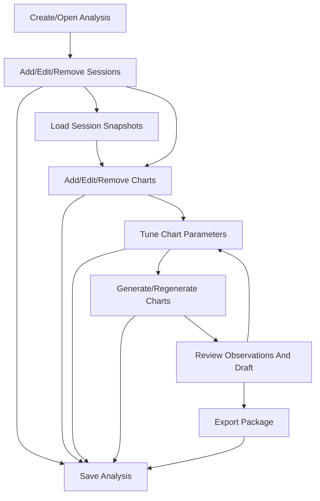

# SPEC-004: V2 Analysis Workbench and Staged Run Pipeline

## Summary

This spec changes the V2 product model from a package-first generation tool to
an Analysis Workbench. A user creates or opens an Analysis, adds one or more
sessions, loads each session once into local dataset snapshots, adds and tunes
charts against those loaded sessions, regenerates selected charts without
reloading session data, reviews outputs, and exports a package. The existing
internal term `recipe` remains for compatibility; the user-facing rename to
`chart template` is recorded but deferred.

## Context

The current implementation runs data loading and chart generation together in
`run_analysis(config)`. That flow validates config, loads a local dataset file
or FastF1 session, runs selected recipes, renders charts, extracts
observations, and writes a package in one coupled operation.

That is acceptable for batch generation, but it is not the right mental model
for an interactive tool. The human owner clarified on 2026-07-21 that users
must be able to fiddle with chart parameters without reloading session data
every time. The owner also clarified that an Analysis should be the top-level
object, containing one or more sessions and charts. Sessions can be added or
removed at any point; adding a session loads its data. Charts can also be added
or removed at any point. The Analysis itself must be saveable and loadable from
a file or directory; loading it should restore or load the corresponding
sessions.

The owner accepted an outline-driven Analysis Workbench UI rather than a
multi-page object split. The UI should feel like working inside one analysis,
not navigating separate administration pages.

## Problem statement

The current package-first flow hides the long-lived object the user actually
works on: the analysis. It also couples session data loading to chart
generation, making chart tuning slow and conceptually confusing. Users and LLM
agents need a stable Analysis object with sessions, chart instances,
parameters, generated artifacts, review state, and export state. They also need
to iterate charts against already-loaded session data.

## Goals

- Introduce `Analysis` as the top-level user object.
- Allow an Analysis to contain one or more sessions.
- Load session data when a session is added or explicitly reloaded.
- Persist loaded session data as local dataset snapshots.
- Allow an Analysis to contain one or more chart instances.
- Allow chart instances to reference one or more sessions, constrained by chart
  template capability.
- Add editable chart parameters for users and LLM agents.
- Regenerate one chart, selected charts, stale charts, or all charts without
  reloading unchanged session data.
- Allow users to save and load an Analysis from a directory or its
  `analysis.json` file.
- Automatically restore or load corresponding sessions when an Analysis is
  loaded.
- Allow users to save and apply parameter presets for a chart template.
- Preserve existing batch generation behavior as a compatibility path.
- Record `chart template` as the preferred future user-facing term while
  deferring the rename.

## Non-goals

- This spec does not perform the full terminology rename from `recipe` to
  `chart template`.
- This spec does not require visual editing of Matplotlib internals.
- This spec does not add hosted/multi-user collaboration.
- This spec does not require a database server.
- This spec does not require live FastF1 reload for every chart generation.
- This spec does not define plugin authoring UI.
- This spec does not require deleting generated files automatically when items
  are removed from active analysis state.

## Users or actors

- Human analyst: creates analyses, manages sessions, tunes charts, and exports
  packages.
- Human writer: reviews observations and Markdown drafts before writing.
- LLM agent: inspects and modifies the Analysis object through structured
  contracts.
- FastAPI backend: saves/loads analyses, manages snapshots, validates
  parameters, and generates charts.
- Workbench frontend: renders the outline-driven Analysis Workbench.
- CLI user: may still run batch generation or use staged analysis commands.
- Plugin recipe author: may expose parameter schemas for plugin recipes.

## Terminology decision

Current implementation and config use `recipe` and `recipe_id`.

Product direction:

- `Chart template` is the preferred future user-facing term.
- Rename is deferred to avoid churn while the Analysis model and parameterized
  templates are still changing.
- SPEC-004 requirements use `recipe` where compatibility matters and mention
  `chart template` only to describe the intended product concept.
- A later spec or amendment may rename UI labels, docs, API view models, and
  internal code once the Analysis Workbench model is stable.

## Target user model

An Analysis contains:

- Analysis metadata: ID, name, notes, created/updated timestamps, save path.
- Sessions: season/event/session/drivers/data-source settings, load state,
  dataset snapshot reference, provenance, and errors.
- Charts: chart instance ID, recipe/template ID, target session IDs,
  parameters, preset reference, generation state, artifact references, and
  provenance.
- Review state: observations, review decisions, draft state, filters.
- Export state: package/export settings and last exported package reference.

The user works inside one Analysis Workbench. The Workbench shows an outline of
the Analysis on the left. Selecting an outline item changes the center editor.
Most editing happens in place. Dialogs are reserved for focused creation,
selection, confirmation, and large image preview.

## Target run model



Stage meanings:

- Create/Open Analysis: create a new analysis directory or open an existing
  analysis directory/`analysis.json`.
- Sessions: add, edit, remove, load, reload, and inspect session data.
- Charts: add chart instances, choose recipe/template, choose target sessions,
  tune parameters, and generate artifacts.
- Review: inspect observations and draft across generated charts.
- Export: write a package from the current Analysis state.

## Analysis directory format

The primary save format is an Analysis directory. Opening either the directory
or its `analysis.json` file must load the same Analysis.

Required layout:

```text
<analysis-slug>/
  analysis.json
  sessions/
    <session-id>/
      snapshot.json
      dataset.json
  charts/
    <chart-instance-id>/
      artifact.png
      metadata.json
  presets/
    <recipe-id>/
      <preset-id>.json
  package/
    manifest.json
    observations.json
    review.json
    draft.md
```

For V2, `snapshot.json` stores snapshot metadata, provenance, paths, hashes,
source details, and framework version. `dataset.json` stores the deterministic
JSON serialization of the normalized session dataset. The JSON payload must use
stable field ordering where practical so hashes and tests remain reproducible.
Parquet/Arrow or other binary table formats are deferred until measured
snapshot size or reload performance justifies adding a runtime dependency.

The Analysis directory must keep metadata, snapshots, chart artifacts, presets,
and exported package files organized under one root.

User-global presets are stored outside the Analysis directory in the local
application data area. The exact platform path is implementation-defined, but
the Analysis model must distinguish Analysis-local presets from user-global
presets.

## Analysis Workbench UI

The UI is outline-driven, not a set of independent object pages.

High-level layout:

```text
+-------------------------------------------------------------+
| Top bar: Analysis name | Open | Save | Save As | Export      |
+-------------------+-----------------------------------------+
| Analysis outline  | Active editor                           |
|                   |                                         |
| My Analysis       | If chart selected:                      |
|   Sessions        |   Chart preview                         |
|     Race          |   Parameters                            |
|     Qualifying    |   Generate / Presets                    |
|   Charts          |                                         |
|     Lap Delta     |                                         |
|     Tyre Strategy |                                         |
|   Review          |                                         |
|   Export          |                                         |
+-------------------+-----------------------------------------+
```

Outline items:

- Analysis root: opens Analysis Overview.
- Sessions group: list of sessions and `Add Session`.
- Session item: opens Session Editor.
- Charts group: list of chart instances and `Add Chart`.
- Chart item: opens Chart Editor.
- Review item: opens Review view.
- Export item: opens Export view.

View definitions:

- Analysis Overview: analysis name, save path, health, session count, chart
  count, stale item count, recent errors, and high-level actions.
- Session Editor: session setup fields, drivers, data source, load state,
  snapshot metadata, load/reload/remove actions.
- Chart Editor: chart preview, target session selector, parameter form, preset
  controls, generation state, generate action, artifact metadata.
- Review View: observations and draft across generated charts with filters by
  session, chart, and review status.
- Export View: package/export settings and included sessions/charts before
  export.

## Functional requirements

### REQ-001: Analysis Object

- **Statement:** The system must define an Analysis object as the top-level
  persistent user workspace.
- **Rationale:** Users work on analyses that contain sessions, charts, review
  state, and exports.
- **Acceptance criteria:** Analysis model includes ID, display name, notes,
  created/updated timestamps, save path, sessions, charts, presets, review
  state reference, export state reference, and health/status summary.
- **Verification method:** Unit tests.
- **Evidence location:** To be filled during implementation.

### REQ-002: Analysis Save And Load

- **Statement:** Users must be able to save and load an Analysis from an
  Analysis directory or its `analysis.json` file.
- **Rationale:** The Analysis is the durable user object.
- **Acceptance criteria:** Save writes the required directory structure; Load
  accepts either directory path or `analysis.json`; invalid/missing files return
  path-specific errors; loading does not require chart regeneration.
- **Verification method:** API/CLI tests.
- **Evidence location:** To be filled during implementation.

### REQ-003: Automatic Session Restore On Load

- **Statement:** Loading an Analysis must restore or load all corresponding
  sessions.
- **Rationale:** Users expect a reopened Analysis to know which session data is
  available.
- **Acceptance criteria:** Sessions with valid snapshots become loaded without
  calling FastF1; sessions without valid snapshots are marked not_loaded or
  failed with recovery actions; session load state is visible in UI/API.
- **Verification method:** API tests with mocked gateway.
- **Evidence location:** To be filled during implementation.

### REQ-004: Add And Remove Sessions Anytime

- **Statement:** Users must be able to add, edit, reload, and remove sessions
  at any point in the Analysis workflow.
- **Rationale:** Analysts may refine analysis scope while tuning charts.
- **Acceptance criteria:** Adding a session creates a session entry and starts
  or offers data loading; editing session setup marks its snapshot and dependent
  charts stale; removing a session warns when dependent charts exist; confirmed
  session removal removes those dependent chart instances from active Analysis
  state.
- **Verification method:** API/UI tests.
- **Evidence location:** To be filled during implementation.

### REQ-005: Session Data Snapshot

- **Statement:** Each loaded session must produce a local normalized dataset
  snapshot.
- **Rationale:** Chart generation must reuse session data without repeated API
  extraction.
- **Acceptance criteria:** Snapshot contains session query, drivers, source
  type, cache mode, created timestamp, framework version, dataset hash,
  provenance, and serialized normalized dataset reference; fixture and FastF1
  local dataset and FastF1 paths both produce snapshots.
- **Verification method:** Unit/integration tests.
- **Evidence location:** To be filled during implementation.

### REQ-006: No Reload During Chart Tuning

- **Statement:** Editing chart parameters and regenerating charts from loaded
  sessions must not reload unchanged session data.
- **Rationale:** This is the core interactive performance requirement.
- **Acceptance criteria:** Regenerating charts uses existing snapshots; tests
  assert data gateways are not called during chart regeneration; stale snapshots
  block or warn before generation.
- **Verification method:** Mocked gateway integration tests.
- **Evidence location:** To be filled during implementation.

### REQ-007: Chart Instance Object

- **Statement:** The system must define chart instances separately from recipe
  definitions.
- **Rationale:** The same recipe/template can be used multiple times with
  different sessions and parameters.
- **Acceptance criteria:** Chart instance includes chart_instance_id, recipe_id,
  display name/title, target session IDs, enabled state, parameters,
  parameter_hash, schema_version, optional preset_id, order, generation state,
  artifact references, and errors.
- **Verification method:** Unit/config tests.
- **Evidence location:** To be filled during implementation.

### REQ-008: Add And Remove Charts Anytime

- **Statement:** Users must be able to add, edit, regenerate, and remove charts
  at any point in the Analysis workflow.
- **Rationale:** Chart composition should be iterative.
- **Acceptance criteria:** Add Chart selects recipe/template and target
  session(s); Remove Chart removes it from active Analysis state with
  confirmation if artifacts exist; editing chart parameters marks only that
  chart stale; generated artifacts are preserved or cleaned only through
  explicit user action.
- **Verification method:** API/UI tests.
- **Evidence location:** To be filled during implementation.

### REQ-009: Recipe Parameter Schema

- **Statement:** Every core recipe must expose a machine-readable parameter
  schema.
- **Rationale:** UI and LLM agents need a shared field contract.
- **Acceptance criteria:** Each core recipe exposes field names, types,
  defaults, labels, constraints, grouping, ordering, and optional enum values;
  schemas are versioned; schemas are returned by API.
- **Verification method:** Unit/API tests.
- **Evidence location:** To be filled during implementation.

### REQ-010: Recipe Parameter Validation

- **Statement:** Recipe parameters must be validated by the backend before
  chart generation.
- **Rationale:** Frontend and LLM validation are not authoritative.
- **Acceptance criteria:** Invalid parameters return path-specific issues;
  unknown fields are rejected unless explicitly allowed; validation happens
  before rendering; errors do not mutate existing artifacts.
- **Verification method:** API tests.
- **Evidence location:** To be filled during implementation.

### REQ-011: Workbench Parameter Editing

- **Statement:** The Analysis Workbench must render editable parameter controls
  for selected chart instances.
- **Rationale:** Users should tune charts without raw JSON.
- **Acceptance criteria:** Chart Editor renders controls from recipe schema;
  common control types include text, number, checkbox, select, multi-select,
  driver selector, lap range, color, and optional fields; field-level errors
  display after validation; raw JSON remains secondary.
- **Verification method:** Frontend/browser tests.
- **Evidence location:** To be filled during implementation.

### REQ-012: LLM Parameter Editing

- **Statement:** The LLM contract must allow agents to inspect and modify
  Analysis sessions, chart instances, and chart parameters.
- **Rationale:** LLM agents are expected users of the framework.
- **Acceptance criteria:** Contract exposes Analysis state, session states,
  chart instances, recipe schemas, current parameters, validation errors, and
  generation results; parameter edits are structured and schema-validated.
- **Verification method:** Contract tests.
- **Evidence location:** To be filled during implementation.

### REQ-013: Generate Selected Charts

- **Statement:** The system must support generating one chart, selected charts,
  stale charts, or all charts from existing session snapshots.
- **Rationale:** Users need tight iteration loops.
- **Acceptance criteria:** API accepts Analysis ID/path and chart selections;
  unchanged charts may be preserved; regenerated artifacts get stable
  traceability to session snapshots and parameter hash; failures for one chart
  do not destroy successful existing charts.
- **Verification method:** API/integration tests.
- **Evidence location:** To be filled during implementation.

### REQ-014: Parameter Presets

- **Statement:** Users must be able to save and reuse a named parameter preset
  for a recipe.
- **Rationale:** Analysts need reusable chart setups across analyses.
- **Acceptance criteria:** Preset includes preset_id, recipe_id, schema_version,
  display name, scope, parameters, created/updated timestamps, and optional
  notes; scope is either Analysis-local or user-global; saving a preset lets the
  user choose the scope with a checkbox; preset can be applied to a compatible
  chart instance; incompatible schema versions produce a warning or
  migration-required error.
- **Verification method:** Unit/API/UI tests.
- **Evidence location:** To be filled during implementation.

### REQ-015: Review And Export From Analysis State

- **Statement:** Review and export must operate on the current Analysis state.
- **Rationale:** Generated packages should be outputs of an Analysis, not the
  primary working object.
- **Acceptance criteria:** Review view can filter observations by session,
  chart, and status; regenerating a chart marks affected observations stale but
  does not automatically overwrite reviewed observation state; observations
  regenerate on explicit Review refresh or during Export; Export view shows
  included sessions/charts; exported package includes provenance linking back to
  Analysis, sessions, snapshots, chart instances, parameters, and presets.
- **Verification method:** API/UI/package tests.
- **Evidence location:** To be filled during implementation.

### REQ-016: Batch Generate Compatibility

- **Statement:** Existing batch generation must continue to work.
- **Rationale:** CLI and LLM users already rely on one-command package
  generation.
- **Acceptance criteria:** Current generate command still validates config,
  loads data, generates selected recipes, and writes a package; internally it
  may create a transient Analysis or execute the staged pipeline; existing
  generation tests pass.
- **Verification method:** Existing CLI/orchestrator tests.
- **Evidence location:** To be filled during implementation.

### REQ-017: Plugin Recipe Parameters

- **Statement:** Plugin recipes may expose parameter schemas using the same
  contract as core recipes.
- **Rationale:** Plugin recipes must be configurable without hardcoded UI.
- **Acceptance criteria:** Valid plugin recipe schemas appear in recipe
  metadata; invalid schemas mark the plugin invalid or the recipe unavailable;
  parameter validation works for plugin recipes through the same backend path.
- **Verification method:** Plugin tests.
- **Evidence location:** To be filled during implementation.

## Non-functional requirements

### NFR-001: Iteration Performance

- **Statement:** Regenerating charts from existing session snapshots must be
  materially faster than full session load plus generation.
- **Rationale:** The feature exists to support interactive tuning.
- **Acceptance criteria:** Local-dataset-backed regeneration avoids gateway load;
  FastF1-backed regeneration avoids FastF1 session load; benchmark evidence is
  captured for representative runs.
- **Verification method:** Benchmark and mocked gateway test.
- **Evidence location:** To be filled during implementation.

### NFR-002: Snapshot Size Control

- **Statement:** Dataset snapshots must avoid uncontrolled disk growth.
- **Rationale:** Telemetry data can be large.
- **Acceptance criteria:** Snapshot files live under the Analysis directory or a
  configured local cache; stored files have documented format and size; cleanup
  strategy is documented; invalid partial snapshots are recoverable.
- **Verification method:** Inspection and integration tests.
- **Evidence location:** To be filled during implementation.

### NFR-003: Backward Compatibility

- **Statement:** Existing configs without Analysis or recipe parameter fields
  must remain valid.
- **Rationale:** Existing tests and user configs should not break abruptly.
- **Acceptance criteria:** Missing parameter objects default from recipe schema;
  existing sample configs continue to pass validation and generation tests.
- **Verification method:** Existing config/generation tests.
- **Evidence location:** To be filled during implementation.

### NFR-004: Deterministic Outputs

- **Statement:** Analysis IDs, session IDs, snapshot IDs, chart instance IDs,
  parameter hashes, and artifact IDs must be deterministic where inputs are
  deterministic.
- **Rationale:** Determinism supports cache reuse, comparison, and LLM
  reproducibility.
- **Acceptance criteria:** Same setup/snapshot/parameters produce stable IDs;
  changed parameters produce changed parameter hash; tests cover stable and
  changed cases.
- **Verification method:** Unit tests.
- **Evidence location:** To be filled during implementation.

## Security and privacy considerations

### SEC-001: Local Analysis Storage

- **Statement:** Analysis files, snapshots, presets, and generated artifacts
  must stay local and must not be uploaded or transmitted outside the loopback
  application.
- **Rationale:** Session data and local paths are user-controlled local assets.
- **Acceptance criteria:** APIs use relative loopback requests only; snapshot
  files are stored under explicit local directories; no external network calls
  occur during snapshot-based chart regeneration.
- **Verification method:** Code inspection and API tests.
- **Evidence location:** To be filled during implementation.

### SEC-002: Plugin Parameter Schemas

- **Statement:** Plugin parameter schemas must be treated as data, not UI code.
- **Rationale:** Plugin code is trusted Python at discovery/execution time, but
  schemas should not inject frontend code.
- **Acceptance criteria:** Schema fields are rendered by local frontend
  components only; schema-provided labels/descriptions are escaped as text;
  unknown control types are rejected or ignored with validation warnings.
- **Verification method:** Plugin/API/frontend tests.
- **Evidence location:** To be filled during implementation.

## Data model impact

### DATA-001: Analysis Model

- **Statement:** Add an Analysis model for the saved workspace.
- **Rationale:** Analysis is the top-level user object.
- **Acceptance criteria:** Model includes metadata, sessions, chart instances,
  presets, review/export references, status, and provenance.
- **Verification method:** Unit tests.
- **Evidence location:** To be filled during implementation.

### DATA-002: Session Model

- **Statement:** Add an Analysis session model.
- **Rationale:** Sessions are independently loadable data units.
- **Acceptance criteria:** Model includes session_id, setup fields, drivers,
  data source, load state, snapshot reference, stale flag, provenance, and
  errors.
- **Verification method:** Unit tests.
- **Evidence location:** To be filled during implementation.

### DATA-003: Dataset Snapshot Model

- **Statement:** Add a dataset snapshot model for persisted normalized session
  data and provenance.
- **Rationale:** Snapshot reuse is the foundation of the staged pipeline.
- **Acceptance criteria:** Model includes snapshot_id, session_id, query,
  drivers, source_type, cache mode, paths/provenance, created_at,
  framework_version, dataset_hash, and deterministic JSON dataset payload
  reference.
- **Verification method:** Unit tests.
- **Evidence location:** To be filled during implementation.

### DATA-004: Recipe Parameter Schema Model

- **Statement:** Add a recipe parameter schema model.
- **Rationale:** UI and LLM editing require a shared field contract.
- **Acceptance criteria:** Schema supports primitive field types, constraints,
  defaults, labels, grouping, ordering, target-session capability, and
  versioning.
- **Verification method:** Unit tests.
- **Evidence location:** To be filled during implementation.

### DATA-005: Chart Instance Model

- **Statement:** Add a chart instance model.
- **Rationale:** Users may use the same recipe multiple times with different
  sessions and parameters.
- **Acceptance criteria:** Instance includes chart_instance_id, recipe_id,
  enabled, target_session_ids, title/name, parameters, parameter_hash,
  schema_version, optional preset_id, order, artifact references, stale flag,
  and errors.
- **Verification method:** Config/model tests.
- **Evidence location:** To be filled during implementation.

### DATA-006: Parameter Preset Model

- **Statement:** Add a parameter preset model for saved recipe settings.
- **Rationale:** Users need reusable parameter sets.
- **Acceptance criteria:** Presets can be listed, saved, overwritten, applied,
  and deleted through local APIs; APIs can target Analysis-local or user-global
  preset storage; incompatible presets are not silently applied.
- **Verification method:** API tests.
- **Evidence location:** To be filled during implementation.

## API impact

### API-001: Analysis API

- **Statement:** Add APIs to create, open, save, save-as, and inspect an
  Analysis.
- **Rationale:** The frontend and LLM contract need to manage the durable
  Analysis object.
- **Acceptance criteria:** APIs accept directory or `analysis.json` path where
  applicable; responses include Analysis state, health, stale items, and
  path-specific errors.
- **Verification method:** FastAPI tests.
- **Evidence location:** To be filled during implementation.

### API-002: Session API

- **Statement:** Add APIs to add, edit, load, reload, and remove sessions from
  an Analysis.
- **Rationale:** Session lifecycle is independent from chart generation.
- **Acceptance criteria:** Adding or reloading a session creates/updates a
  snapshot; editing marks dependent charts stale; removing a session with
  dependent charts requires an explicit confirmation flag and removes the
  dependent chart instances.
- **Verification method:** FastAPI tests.
- **Evidence location:** To be filled during implementation.

### API-003: Recipe Metadata API

- **Statement:** Add or extend an API endpoint to list recipe metadata and
  parameter schemas.
- **Rationale:** The frontend and LLM contract need schema discovery.
- **Acceptance criteria:** Endpoint includes core and valid plugin recipes,
  schema versions, defaults, required fields, target-session capability,
  source, and availability status.
- **Verification method:** FastAPI/plugin tests.
- **Evidence location:** To be filled during implementation.

### API-004: Chart Instance API

- **Statement:** Add APIs to add, edit, validate, generate, regenerate, and
  remove chart instances.
- **Rationale:** Chart lifecycle is independent and iterative.
- **Acceptance criteria:** APIs support selected chart generation; validation
  returns path-specific issues; generation uses session snapshots and returns
  artifact/provenance updates.
- **Verification method:** FastAPI/integration tests.
- **Evidence location:** To be filled during implementation.

### API-005: Preset API

- **Statement:** Add local APIs to list, save, apply, and delete parameter
  presets.
- **Rationale:** Presets are a first-class user workflow.
- **Acceptance criteria:** APIs are local-only; preset validation uses recipe
  schema; save/list/delete/apply operations accept Analysis-local and
  user-global scopes; destructive delete requires explicit request.
- **Verification method:** FastAPI tests.
- **Evidence location:** To be filled during implementation.

### API-006: Export API

- **Statement:** Add or extend APIs to export a package from the current
  Analysis state.
- **Rationale:** Package output becomes an export, not the primary workspace.
- **Acceptance criteria:** Export can include selected sessions/charts; export
  writes package files and provenance; existing package preview can open the
  exported package.
- **Verification method:** FastAPI/package tests.
- **Evidence location:** To be filled during implementation.

## UI or UX impact

### UX-001: Outline-Driven Analysis Workbench

- **Statement:** The V2 UI must present a single Analysis Workbench selected
  through a left outline.
- **Rationale:** Users work inside one analysis, not separate administration
  pages.
- **Acceptance criteria:** Outline contains Analysis root, Sessions group,
  session items, Charts group, chart items, Review, and Export; selecting an
  item opens the corresponding center editor; editing usually happens in place.
- **Verification method:** Browser/UI tests.
- **Evidence location:** To be filled during implementation.

### UX-002: Session Lifecycle UX

- **Statement:** Users must be able to add, load, reload, edit, and remove
  sessions from the outline-driven UI.
- **Rationale:** Analysis scope changes during work.
- **Acceptance criteria:** Session state is visible in the outline and editor;
  adding a session loads or offers to load data; stale/failed states are visible
  without explanatory UI copy; removing a session with dependent charts opens a
  warning confirmation that identifies the dependent charts before removal.
- **Verification method:** Browser/UI tests.
- **Evidence location:** To be filled during implementation.

### UX-003: Chart Tuning UX

- **Statement:** Users must be able to tune chart parameters and regenerate a
  chart in the Chart Editor without reloading session data.
- **Rationale:** This is the main interactive workflow.
- **Acceptance criteria:** Chart Editor shows preview, target sessions,
  parameter controls, preset controls, stale state, and generate action; saving
  a preset includes a checkbox to save it as user-global instead of
  Analysis-local; chart image opens large preview; generation uses loaded
  snapshots.
- **Verification method:** Browser/API tests.
- **Evidence location:** To be filled during implementation.

### UX-004: Analysis Save/Load UX

- **Statement:** Users must be able to open, save, and save-as an Analysis from
  the top bar.
- **Rationale:** Analysis is the durable workspace.
- **Acceptance criteria:** Save state is visible; loading an Analysis restores
  outline items and session states; invalid paths show actionable errors.
- **Verification method:** Browser/API tests.
- **Evidence location:** To be filled during implementation.

### UX-005: Review And Export UX

- **Statement:** Review and Export must be outline items within the same
  Analysis Workbench.
- **Rationale:** Review/export are stages of the same analysis.
- **Acceptance criteria:** Review filters by session/chart/status; Export shows
  included sessions/charts and package result; package preview remains
  available after export.
- **Verification method:** Browser/API tests.
- **Evidence location:** To be filled during implementation.

### UX-006: LLM-Readable Analysis State

- **Statement:** Analysis state and recipe parameter schemas must be readable by
  LLM agents without inspecting UI internals.
- **Rationale:** LLM agents are expected to modify analyses.
- **Acceptance criteria:** LLM contract responses include Analysis metadata,
  sessions, snapshots, chart instances, schemas, validation results, generated
  artifacts, and export state.
- **Verification method:** Contract tests.
- **Evidence location:** To be filled during implementation.

## Configuration impact

- Existing `recipes` config remains accepted for batch generation.
- Add Analysis directory format with `analysis.json`.
- Add session entries and snapshot references.
- Add chart instance entries and parameters.
- Add optional preset references.
- Add staged pipeline output metadata.
- Preserve current batch config compatibility.

## Error handling

- Analysis load failure leaves no partial active Analysis unless explicitly
  recoverable.
- Session load failure marks only that session failed.
- Missing snapshot blocks dependent chart generation.
- Editing a session marks dependent charts stale.
- Removing a session with dependent charts requires explicit confirmation.
- Invalid chart parameters block only affected chart instances.
- Incompatible preset cannot be applied silently.
- Partial chart generation preserves successful artifacts and records failures.
- Snapshot read corruption returns a clear recovery error.
- Plugin recipe schema errors make that plugin recipe unavailable.

## Edge cases

- Same recipe selected multiple times with different parameters.
- Chart targets multiple sessions.
- Chart template supports only one session but user selects multiple sessions.
- User changes drivers after snapshot creation.
- User changes session setup after charts exist.
- User opens Analysis with missing snapshot files.
- User applies an old preset to a newer schema version.
- FastF1 cache-only mode with missing cached data.
- Local dataset snapshot used with a different session setup.
- Plugin recipe disappears after a preset references it.
- Chart generation succeeds for one chart and fails for another.
- User regenerates a chart after reviewing observations.

## Acceptance criteria

- Analysis is the top-level saved workspace.
- Users can add/remove sessions and charts at any point.
- Adding or loading a session creates/restores a dataset snapshot.
- Users can regenerate charts from loaded snapshots without reloading data.
- Core recipes expose parameter schemas and default values.
- Workbench renders editable chart parameter controls.
- Users can save/apply parameter presets.
- Existing batch generation remains compatible.
- Package exports record Analysis, session, snapshot, chart instance, parameter,
  and preset provenance.
- LLM contract can inspect and modify Analysis state.

## Verification matrix

| Requirement ID | Acceptance criterion | Verification method | Test / command / manual check | Evidence location | PR reference |
| -------------- | -------------------- | ------------------- | ----------------------------- | ----------------- | ------------ |
| REQ-001 | Analysis object exists. | Unit tests | `python -m unittest tests.test_analysis_workspace` | `src/f1_telemetry_charts/analysis/workspace.py`; `tests/test_analysis_workspace.py` | TBD |
| REQ-002 | Analysis can save/load from directory or file. | API tests | `python -m unittest tests.test_analysis_workspace` | `AnalysisService.create/open/save`; `/api/analysis/create`; `/api/analysis/open` | TBD |
| REQ-003 | Loading restores sessions and snapshots. | API tests | `python -m unittest tests.test_analysis_workspace` | `AnalysisService.open`; `DatasetSnapshot`; deterministic `dataset.json` | TBD |
| REQ-004 | Sessions can be changed anytime. | API/UI tests | `python -m unittest tests.test_analysis_workspace`; `pnpm --dir frontend build` | `/api/analysis/sessions`; `frontend/src/pages/AnalysisWorkbenchPage.tsx` | TBD |
| REQ-005 | Session snapshots are created. | Unit/integration tests | `python -m unittest tests.test_analysis_workspace` | `AnalysisService.load_session`; `sessions/<id>/snapshot.json`; `sessions/<id>/dataset.json` | TBD |
| REQ-006 | Chart tuning avoids data reload. | Integration tests | `python -m unittest tests.test_analysis_workspace`; `python scripts/benchmark_analysis_regeneration.py` | `AnalysisService.generate_charts`; snapshot-backed test with broken local dataset source after load | TBD |
| REQ-007 | Chart instance model exists. | Unit/config tests | `python -m unittest tests.test_analysis_workspace` | `ChartInstance` in `analysis/workspace.py` | TBD |
| REQ-008 | Charts can be changed anytime. | API/UI tests | `python -m unittest tests.test_analysis_workspace`; `pnpm --dir frontend build` | `/api/analysis/charts`; `AnalysisWorkbenchPage.tsx` | TBD |
| REQ-009 | Core recipes expose parameter schemas. | Unit/API tests | `python -m unittest tests.test_analysis_workspace` | `RecipeParameterSchema`; `/api/analysis/recipes` | TBD |
| REQ-010 | Backend validates recipe parameters. | API tests | `python -m unittest tests.test_analysis_workspace` | `_validate_parameters`; unknown-parameter API test | TBD |
| REQ-011 | Workbench renders parameter controls. | Frontend build | `pnpm --dir frontend build` | `AnalysisWorkbenchPage.tsx`; `ParameterControl` | TBD |
| REQ-012 | LLM contract supports parameter editing. | Contract tests | `python -m unittest tests.test_llm_contract` | `inspect_analysis`; `update_analysis_chart_parameters` | TBD |
| REQ-013 | Selected charts can be generated independently. | API/integration tests | `python -m unittest tests.test_analysis_workspace` | `AnalysisService.generate_charts`; `/api/analysis/charts/generate` | TBD |
| REQ-014 | Parameter presets can be saved and applied. | API/UI tests | `python -m unittest tests.test_analysis_workspace`; `pnpm --dir frontend build` | `ParameterPreset`; `/api/analysis/presets`; Workbench preset controls | TBD |
| REQ-015 | Review/export use Analysis state. | API/package tests | `python -m unittest tests.test_analysis_workspace` | `AnalysisService.refresh_observations`; `export_package`; `package/manifest.json` | TBD |
| REQ-016 | Batch generate remains compatible. | Existing tests | `python -m unittest discover -s tests -p "test_*.py"` | `run_analysis`; existing config/orchestrator/preview tests | TBD |
| REQ-017 | Plugin recipe parameters use shared schema contract. | Plugin/API tests | `python -m unittest tests.test_plugins tests.test_analysis_workspace` | registry metadata plus `recipe_parameter_schema` fallback | TBD |
| NFR-001 | Regeneration is faster and avoids extraction. | Tests/benchmark | `python -m unittest tests.test_analysis_workspace`; `python scripts/benchmark_analysis_regeneration.py` | snapshot-backed regeneration measured 0.7789 seconds on 2026-07-21 | TBD |
| NFR-002 | Snapshot storage is controlled and recoverable. | Inspection/tests | `python -m unittest tests.test_analysis_workspace` | deterministic JSON `snapshot.json` and `dataset.json` under Analysis root | TBD |
| NFR-003 | Existing configs remain valid. | Existing tests | `python -m unittest discover -s tests -p "test_*.py"` | `ChartRecipeConfig` remains backward compatible | TBD |
| NFR-004 | IDs and hashes are deterministic. | Unit tests | `python -m unittest tests.test_analysis_workspace` | `_hash_payload`; snapshot and parameter hashes | TBD |
| SEC-001 | Analysis data stays local. | Inspection/API tests | `python -m unittest tests.test_analysis_workspace` | local `AnalysisService`; FastAPI local endpoints | TBD |
| SEC-002 | Plugin schemas are rendered as data. | Plugin/frontend tests | `python -m unittest tests.test_plugins`; `pnpm --dir frontend build` | recipe schema JSON; frontend schema-driven controls | TBD |
| DATA-001 | Analysis model exists. | Unit tests | `python -m unittest tests.test_analysis_workspace` | `AnalysisWorkspace` | TBD |
| DATA-002 | Session model exists. | Unit tests | `python -m unittest tests.test_analysis_workspace` | `AnalysisSession` | TBD |
| DATA-003 | Dataset snapshot model exists. | Unit tests | `python -m unittest tests.test_analysis_workspace` | `DatasetSnapshot` | TBD |
| DATA-004 | Recipe parameter schema model exists. | Unit tests | `python -m unittest tests.test_analysis_workspace` | `RecipeParameterSchema`; `ParameterField` | TBD |
| DATA-005 | Chart instance model exists. | Config/model tests | `python -m unittest tests.test_analysis_workspace` | `ChartInstance` | TBD |
| DATA-006 | Parameter preset model exists. | API tests | `python -m unittest tests.test_analysis_workspace` | `ParameterPreset`; local/global scopes | TBD |
| API-001 | Analysis API exists. | FastAPI tests | `python -m unittest tests.test_analysis_workspace` | `/api/analysis/*` | TBD |
| API-002 | Session API exists. | FastAPI tests | `python -m unittest tests.test_analysis_workspace` | `/api/analysis/sessions/*` | TBD |
| API-003 | Recipe metadata/schema API exists. | FastAPI tests | `python -m unittest tests.test_analysis_workspace` | `/api/analysis/recipes` | TBD |
| API-004 | Chart instance API exists. | FastAPI tests | `python -m unittest tests.test_analysis_workspace` | `/api/analysis/charts/*` | TBD |
| API-005 | Preset API exists. | FastAPI tests | `python -m unittest tests.test_analysis_workspace` | `/api/analysis/presets` | TBD |
| API-006 | Export API exists. | FastAPI tests | `python -m unittest tests.test_analysis_workspace` | `/api/analysis/export`; `/api/analysis/review/refresh` | TBD |
| UX-001 | Outline-driven Workbench exists. | Frontend build and responsive browser evidence | `pnpm --dir frontend build`; browser check on 2026-08-03 | `AnalysisWorkbenchPage.tsx`; `docs/reports/SPEC-003-UX-007-responsive-evidence.md` | TBD |
| UX-002 | Session lifecycle UX exists. | Frontend build, API tests, and browser interaction | `pnpm --dir frontend build`; Analysis API tests; Chromium session editor/add/remove-warning check on 2026-08-04 | `SessionDraftEditor`; `SessionEditor`; closeout evidence report | TBD |
| UX-003 | Chart tuning UX exists. | Frontend/API tests | `pnpm --dir frontend build`; `python -m unittest tests.test_analysis_workspace` | `ChartEditor`; `ParameterControl`; Analysis chart APIs | TBD |
| UX-004 | Analysis save/load UX exists. | Frontend/API tests | `pnpm --dir frontend build`; `python -m unittest tests.test_analysis_workspace` | Analysis top bar actions; create/open APIs | TBD |
| UX-005 | Review/export UX exists. | Frontend/API tests and browser interaction | `pnpm --dir frontend build`; `python -m unittest tests.test_analysis_workspace`; Chromium Review/Export check on 2026-08-04 | `ReviewEditor`; `ExportEditor`; export APIs; closeout evidence report | TBD |
| UX-006 | LLM-readable Analysis state exists. | Contract tests | `python -m unittest tests.test_llm_contract` | `inspect_analysis`; `update_analysis_chart_parameters` | TBD |

## Test plan

- Unit tests for Analysis, session, snapshot, chart instance, parameter schema,
  deterministic hash, and preset models.
- API tests for Analysis save/load, session lifecycle, recipe metadata,
  parameter validation, chart generation, presets, and export.
- Mocked gateway tests proving chart regeneration does not call data loading.
- Existing generate/preview/plugin/workbench tests for compatibility.
- Browser tests for outline-driven Workbench flow and parameter/preset
  interactions.
- Benchmark comparing snapshot-based chart regeneration to full extraction and
  generation.
- LLM contract tests for Analysis inspection and modification.

## Rollback plan

- Keep existing batch `generate` path available until Analysis Workbench is
  proven.
- If Analysis APIs fail late, disable Analysis UI actions and keep SPEC-002
  generate/preview behavior.
- Preserve backward-compatible config parsing.
- Do not delete existing generated packages, Analysis directories, or snapshots
  during rollback.

## Open questions

- [x] Decide exact snapshot serialization format. Answer: use `snapshot.json`
      metadata plus deterministic `dataset.json` normalized dataset payload for
      V2; defer Parquet/Arrow or other binary table formats until measured
      snapshot size or reload performance justifies a new runtime dependency.
- [x] Decide whether parameter presets are Analysis-local, user-local, or both.
      Answer: both; saving a preset lets the user choose Analysis-local or
      user-global with a checkbox.
- [x] Decide whether observations regenerate automatically after selected chart
      regeneration or only on explicit Review refresh/export. Answer: mark
      affected observations stale automatically and regenerate only on explicit
      Review refresh or export.
- [x] Decide whether removing a session should remove dependent chart instances
      by default or mark them orphaned. Answer: remove dependent chart
      instances after warning and explicit confirmation.

## Human decisions required

- [x] Record that `chart template` is the preferred future user-facing term,
      but defer rename. Answer: approved in chat on 2026-07-21.
- [x] Use Analysis as the top-level object containing sessions and charts.
      Answer: approved in chat on 2026-07-21.
- [x] Use an outline-driven Analysis Workbench UI instead of separate
      top-level object pages. Answer: approved in chat on 2026-07-21.
- [x] Add/remove sessions and charts at any point in the process. Answer:
      approved in chat on 2026-07-21.
- [x] Save/load Analysis from file or directory and restore/load corresponding
      sessions. Answer: approved in chat on 2026-07-21.
- [x] Support both Analysis-local and user-global parameter presets, selected
      when saving with a checkbox. Answer: approved in chat on 2026-07-21.
- [x] Remove dependent chart instances when removing a session, but warn before
      confirming session removal. Answer: approved in chat on 2026-07-21.
- [x] Use deterministic JSON session snapshots for V2 and defer Parquet/Arrow
      until justified by measurements. Answer: approved in chat on 2026-07-21.
- [x] Mark observations stale after chart regeneration and regenerate them only
      on explicit Review refresh or export. Answer: approved in chat on
      2026-07-21.
- [x] Approve or revise SPEC-004 before implementation starts. Answer:
      approved in chat on 2026-07-21.

## Conflict check

SPEC-004 depends on SPEC-001, SPEC-002, and SPEC-003. It changes the intended
implementation model for V2 run generation but does not supersede existing
batch generation behavior. It does not require changing the current `recipe`
terminology immediately. If implementation changes SPEC-002 APIs, SPEC-002 must
receive a compatible amendment or SPEC-004 must define replacement APIs clearly.

## Traceability table

| Requirement ID | Design / component | Implementation (file/function) | Test | Status |
| -------------- | ------------------ | ------------------------------ | ---- | ------ |
| REQ-001 | Analysis object | `src/f1_telemetry_charts/analysis/workspace.py` | `tests/test_analysis_workspace.py` | Implemented |
| REQ-002 | Analysis save/load | `AnalysisService.create/open/save`; `/api/analysis/create`; `/api/analysis/open` | `tests/test_analysis_workspace.py` | Implemented |
| REQ-003 | Session restore on load | `AnalysisService.open`; `DatasetSnapshot` | `tests/test_analysis_workspace.py` | Implemented |
| REQ-004 | Session lifecycle | `AnalysisService.add_session/load_session/remove_session`; `AnalysisWorkbenchPage.tsx` | `tests/test_analysis_workspace.py`; frontend build | Implemented |
| REQ-005 | Session snapshot | `_write_snapshot`; `_read_snapshot_dataset` | `tests/test_analysis_workspace.py` | Implemented |
| REQ-006 | No reload during tuning | `AnalysisService.generate_charts` | `tests/test_analysis_workspace.py`; `scripts/benchmark_analysis_regeneration.py` | Implemented |
| REQ-007 | Chart instance object | `ChartInstance` | `tests/test_analysis_workspace.py` | Implemented |
| REQ-008 | Chart lifecycle | `AnalysisService.add_chart/update_chart/remove_chart`; chart API endpoints | `tests/test_analysis_workspace.py`; frontend build | Implemented |
| REQ-009 | Recipe parameter schema | `RecipeParameterSchema`; `recipe_parameter_schema` | `tests/test_analysis_workspace.py` | Implemented |
| REQ-010 | Parameter validation | `_validate_parameters`; API error handling | `tests/test_analysis_workspace.py` | Implemented |
| REQ-011 | Workbench parameter editing | `AnalysisWorkbenchPage.tsx`; `ParameterControl` | frontend build | Implemented |
| REQ-012 | LLM parameter editing | `inspect_analysis`; `update_analysis_chart_parameters` | `tests/test_llm_contract.py` | Implemented |
| REQ-013 | Selected chart generation | `/api/analysis/charts/generate`; `AnalysisService.generate_charts` | `tests/test_analysis_workspace.py` | Implemented |
| REQ-014 | Parameter presets | `ParameterPreset`; `AnalysisService.save_preset`; preset UI controls | `tests/test_analysis_workspace.py`; frontend build | Implemented |
| REQ-015 | Review and export | `refresh_observations`; `export_package`; Review/Export UI | `tests/test_analysis_workspace.py`; frontend build | Implemented |
| REQ-016 | Batch compatibility | `run_analysis`; `ChartRecipeConfig` backward-compatible fields | full unittest discovery | Implemented |
| REQ-017 | Plugin recipe parameters | registry metadata plus schema fallback | `tests/test_plugins.py`; `tests/test_analysis_workspace.py` | Implemented |
| NFR-001 | Iteration performance | snapshot-backed chart generation | `tests/test_analysis_workspace.py`; `scripts/benchmark_analysis_regeneration.py` | Implemented |
| NFR-002 | Snapshot size control | deterministic JSON files under Analysis root | `tests/test_analysis_workspace.py` | Implemented |
| NFR-003 | Backward compatibility | existing config/generate path preserved | full unittest discovery | Implemented |
| NFR-004 | Deterministic outputs | `_hash_payload`; snapshot/parameter hashes | `tests/test_analysis_workspace.py` | Implemented |
| SEC-001 | Local Analysis storage | local filesystem service/API only | `tests/test_analysis_workspace.py` | Implemented |
| SEC-002 | Plugin schema safety | schema data rendered by frontend controls | `tests/test_plugins.py`; frontend build | Implemented |
| DATA-001 | Analysis model | `AnalysisWorkspace` | `tests/test_analysis_workspace.py` | Implemented |
| DATA-002 | Session model | `AnalysisSession` | `tests/test_analysis_workspace.py` | Implemented |
| DATA-003 | Dataset snapshot model | `DatasetSnapshot` | `tests/test_analysis_workspace.py` | Implemented |
| DATA-004 | Recipe parameter schema model | `RecipeParameterSchema`; `ParameterField` | `tests/test_analysis_workspace.py` | Implemented |
| DATA-005 | Chart instance model | `ChartInstance` | `tests/test_analysis_workspace.py` | Implemented |
| DATA-006 | Parameter preset model | `ParameterPreset` | `tests/test_analysis_workspace.py` | Implemented |
| API-001 | Analysis API | `/api/analysis/create/open/save` | `tests/test_analysis_workspace.py` | Implemented |
| API-002 | Session API | `/api/analysis/sessions/*` | `tests/test_analysis_workspace.py` | Implemented |
| API-003 | Recipe metadata API | `/api/analysis/recipes` | `tests/test_analysis_workspace.py` | Implemented |
| API-004 | Chart instance API | `/api/analysis/charts/*` | `tests/test_analysis_workspace.py` | Implemented |
| API-005 | Preset API | `/api/analysis/presets` | `tests/test_analysis_workspace.py` | Implemented |
| API-006 | Export API | `/api/analysis/export`; `/api/analysis/review/refresh` | `tests/test_analysis_workspace.py` | Implemented |
| UX-001 | Outline-driven Workbench | `AnalysisWorkbenchPage.tsx` | frontend build; responsive browser evidence | Implemented and responsive-verified |
| UX-002 | Session lifecycle UX | `SessionDraftEditor`; `SessionEditor` | frontend build; Analysis API tests; Chromium loaded/add/remove-warning interaction | Implemented and verified |
| UX-003 | Chart tuning UX | `ChartEditor`; `ParameterControl`; Analysis asset lightbox | frontend build; API tests | Implemented |
| UX-004 | Analysis save/load UX | Analysis top bar controls | frontend build; API tests | Implemented |
| UX-005 | Review/export UX | `ReviewEditor`; `ExportEditor` | frontend build; API tests; Chromium save/cancel and Export inspection | Implemented and verified |
| UX-006 | LLM-readable state | LLM Analysis helpers | `tests/test_llm_contract.py` | Implemented |

## Implementation notes

Implementation has started.

- `run_analysis(config)` remains the existing batch generation path.
- The primary UI is the Analysis Workbench. Exported package inspection is
  embedded in the Export editor; package preview is not a peer top-level app
  page.
- Analysis directory is the primary save format; opening `analysis.json`
  resolves to the same Analysis root.
- V2 snapshots use deterministic JSON: `snapshot.json` metadata and
  `dataset.json` normalized dataset payload.
- Recipe parameter schemas are simple local models. Core and plugin recipes
  receive a default schema contract; custom plugin-declared parameter schemas
  remain future hardening work.
- Workbench UI uses the outline-driven Analysis page in
  `frontend/src/pages/AnalysisWorkbenchPage.tsx`.
- Responsive browser verification passed on 2026-08-03 through the shared
  SPEC-003 UX-007 evidence. Review and Export interaction verification passed
  on 2026-08-04 and is recorded in
  `docs/reports/SPEC-002-003-004-closeout-evidence.md`. The same evidence run
  verified loaded-session state, editable add-session inputs, load/remove
  controls, and the dependent-chart removal confirmation.

## Spec amendments

> Required for any behavioral change after the spec is Approved.

### AMEND-001

- **Date:**
- **Reason:**
- **Changed requirements:**
- **Behavioral impact:**
- **Test impact:**
- **Human approval reference:**

## Review checklist

- [x] spec_id is unique and follows the SPEC-XXX format.
- [x] Every requirement has an ID, statement, rationale, acceptance criteria,
      verification method, and evidence location.
- [x] Non-goals are listed.
- [x] Open questions are resolved or explicitly deferred.
- [x] Verification matrix covers every requirement.
- [x] Conflict check completed.
- [x] Human approval recorded before status set to Approved.
