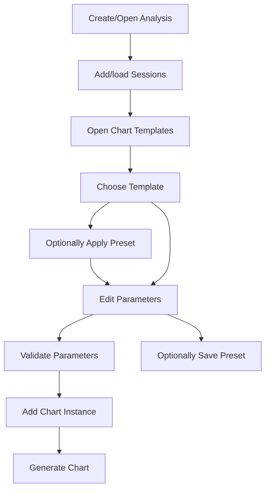

# SPEC-005: V2 Chart Templates and Parameter Presets

## Summary

This spec turns the current developer-facing `recipe` concept into the
user-facing **Chart template** workflow. Users choose a chart template, edit its
validated parameters through UI controls, optionally apply or save parameter
presets, generate chart instances against already-loaded Analysis sessions, and
allow LLM agents to suggest templates and parameter changes without generating
or editing code. Built-in recipes and validated trusted plugin recipes remain
the technical source of templates.

## Context

`SPEC-001` introduced chart recipes as the Python extension point for generating
artifacts. `SPEC-002` introduced trusted local plugin registration and local
preview APIs. `SPEC-003` defined the Tailwind/Radix UI system. `SPEC-004`
introduced the Analysis Workbench, chart instances, editable parameters,
deterministic session snapshots, local/global parameter presets, and explicitly
recorded that `chart template` is the preferred future user-facing term while
deferring the rename.

After using the SPEC-004 implementation, the human owner identified chart
recipes as the next main product bottleneck. The current model still exposes too
much implementation language and does not yet make templates and presets feel
like a primary workflow. In chat on 2026-07-22, the owner made these decisions:

- Use **Chart template** as the user-facing term.
- Users edit template parameters only in SPEC-005.
- A preset is a saved parameter set for one chart template.
- The LLM may suggest templates and modify parameters, but must not generate
  code.
- Template sources are built-in templates plus validated trusted local plugins.
- No pre-generation template preview is required in SPEC-005.
- Preset save uses a `Save globally` checkbox.

## Problem statement

The app now has the right Analysis-first workflow, but chart creation is still
bottlenecked by recipe terminology, weak template selection, incomplete preset
semantics, and unclear LLM-safe boundaries. Users need to treat charts as
instances of named templates with clear parameters and reusable presets. The
system needs to preserve the Python recipe/plugin architecture while hiding
developer-facing details from normal UI flows.

## Goals

- Make **Chart template** the user-facing term across the Analysis Workbench.
- Keep `recipe` and `recipe_id` as internal/API compatibility terms where
  needed.
- Define a template catalog that combines built-in templates and validated
  trusted plugin templates.
- Define parameter-only template editing through structured UI controls.
- Require the existing built-in chart templates to become parameterized in the
  same SPEC-005 implementation pass.
- Define parameter presets as reusable saved parameter sets for one template.
- Support Analysis-local and user-global presets, selected by a `Save globally`
  checkbox.
- Allow presets to be applied, saved, renamed, replaced, and deleted.
- Allow the LLM contract to inspect templates, suggest templates, and propose
  parameter changes without authoring code.
- Preserve backend validation as authoritative for all template parameters and
  presets.
- Avoid pre-generation chart preview in SPEC-005.

## Non-goals

- This spec does not allow users to author new chart logic in the UI.
- This spec does not allow the LLM to generate or modify Python template code.
- This spec does not add a visual Matplotlib layout editor.
- This spec does not add a low-cost image preview before generation.
- This spec does not require importing portable no-code template files.
- This spec does not sandbox plugin execution beyond the trusted local plugin
  model defined in SPEC-002.
- This spec does not remove internal `recipe_id` compatibility from persisted
  files or Python APIs.
- This spec does not redesign the whole Analysis Workbench beyond the template
  and preset workflow.

## Users or actors

- Human analyst: selects chart templates, edits parameters, saves presets, and
  generates charts.
- Human writer: benefits from consistent charts and reusable parameter choices
  that lead to reviewable observations.
- LLM agent: inspects available templates and proposes parameter changes through
  structured contracts.
- Plugin template author: writes trusted local Python recipes with parameter
  metadata.
- FastAPI backend: validates template metadata, parameter values, presets, and
  chart instance updates.
- Analysis Workbench frontend: renders template catalog, parameter controls,
  presets, and chart generation actions.

## Terminology

- **Chart template:** User-facing chart definition that can generate one kind of
  chart when provided loaded session data and validated parameters.
- **Recipe:** Internal Python implementation of a chart template. Existing code,
  plugin APIs, and persisted compatibility fields may keep this term.
- **Chart instance:** A chart added to an Analysis from a chart template with
  selected sessions and concrete parameters.
- **Template parameter:** A typed setting exposed by a chart template, such as
  title, drivers, lap range, color, comparison mode, or threshold.
- **Preset:** A named saved parameter set for one chart template. A preset does
  not store session data, generated artifacts, or review output.
- **Analysis preset:** A preset saved inside one Analysis directory.
- **Global preset:** A preset saved in the user-level preset store and available
  to compatible future Analyses.

## Target workflow

There is no separate preview step before generation. Users evaluate output by
generating or regenerating the chart against loaded Analysis snapshots.

## Built-in template parameterization scope

SPEC-005 implementation must update the current built-in chart templates so
they are genuinely parameterized. A template is not considered compliant if it
only exposes `title` while all chart behavior remains fixed.

All built-in templates must support these common parameters:

| Parameter | Type | Applies to | Required | Behavior |
| --------- | ---- | ---------- | -------- | -------- |
| `title` | text | all built-ins | no | Overrides the generated chart title. |
| `drivers` | driver_selector | all built-ins | no | Restricts the chart to selected drivers from the target session; default is all drivers in the session. |
| `lap_range` | lap_range | lap-based and telemetry templates | no | Restricts records to inclusive start/end lap numbers; unset means all available laps. |
| `series_colors` | color map | all built-ins | no | Optionally overrides per-driver or per-series colors while preserving theme defaults when unset. |

Minimum template-specific parameters:

| Chart template | Existing internal recipe ID | Required SPEC-005 parameters |
| -------------- | --------------------------- | ---------------------------- |
| Telemetry trace | `telemetry_trace` | `metric` select: `speed_kph`, `throttle_percent`, `brake`, `gear`; `distance_range_m` optional numeric range; common parameters. |
| Lap time delta | `lap_time_delta` | `baseline_mode` select: `fastest_selected_per_lap`, `reference_driver`; `reference_driver` driver selector used when baseline mode is `reference_driver`; `include_pit_laps` checkbox; common parameters. |
| Tyre strategy | `tyre_strategy` | `compounds` multi-select from available compounds; `show_pit_markers` checkbox; common parameters. |
| Position progression | `position_progression` | `invert_position_axis` checkbox default true; `include_pit_laps` checkbox; common parameters. |

Parameter behavior must affect the generated `ChartSpec`, rendered artifact, and
artifact metadata. If a dataset lacks the field required by a selected
parameter, the backend must return a parameter/template validation error or a
chart generation error tied to the specific field.

## Functional requirements

### REQ-001: Chart template user-facing terminology

- **Statement:** The Analysis Workbench UI must use `Chart template` or
  `Template` for the user-facing chart source concept and must not expose
  `recipe` as the primary label in normal chart creation or editing flows.
- **Rationale:** Users understand templates as reusable chart definitions;
  `recipe` is developer-facing and has already caused confusion.
- **Acceptance criteria:** Add Chart and Chart Editor surfaces label the source
  selector as `Chart template` or `Template`; plugin/admin detail views may show
  internal recipe IDs when useful; persisted fields may remain `recipe_id`.
- **Verification method:** Automated frontend text inspection and manual UI
  check.
- **Evidence location:** To be filled during implementation.

### REQ-002: Internal recipe compatibility

- **Statement:** Existing Python recipe classes, plugin registration, config
  fields, manifests, and API compatibility fields may keep `recipe` and
  `recipe_id`, but API responses used by the frontend must also expose
  user-facing template labels.
- **Rationale:** The rename must improve UX without breaking existing package,
  plugin, CLI, and LLM compatibility.
- **Acceptance criteria:** Existing tests for recipes/plugins continue to pass;
  template catalog payloads include stable IDs and display names; no migration
  is required for existing generated packages.
- **Verification method:** Automated unit/integration tests.
- **Evidence location:** To be filled during implementation.

### REQ-003: Template catalog

- **Statement:** The backend must provide a chart template catalog containing
  built-in templates and templates from validated trusted local plugins.
- **Rationale:** Users need one place to select available templates regardless
  of implementation source.
- **Acceptance criteria:** The catalog includes template ID, display name,
  source type, source label, description when available, supported session count,
  required dataset fields, output artifact types, parameter schema version, and
  availability status.
- **Verification method:** Automated API tests.
- **Evidence location:** To be filled during implementation.

### REQ-004: Built-in template availability

- **Statement:** Built-in templates must always appear in the catalog unless
  their registration fails, and a built-in registration failure must be reported
  as a health/error state instead of silently hiding the template.
- **Rationale:** Built-in charts are the baseline product capability.
- **Acceptance criteria:** A normal Analysis shows all built-in chart templates;
  an injected registration failure is visible in catalog diagnostics.
- **Verification method:** Automated unit/API tests.
- **Evidence location:** To be filled during implementation.

### REQ-005: Plugin template gating

- **Statement:** Plugin-provided templates must appear in the user template
  catalog only after plugin validation succeeds under the SPEC-002 trusted local
  plugin model.
- **Rationale:** Plugin templates are trusted local Python code and must be
  explicitly validated before being used.
- **Acceptance criteria:** Invalid plugin templates are visible only in plugin
  diagnostics, not selectable in Add Chart; valid plugin templates are
  selectable and include source attribution.
- **Verification method:** Automated plugin API tests and manual UI check.
- **Evidence location:** To be filled during implementation.

### REQ-006: Parameter-only editing

- **Statement:** Users must be able to edit only exposed template parameters in
  SPEC-005; they must not edit template Python code, rendering functions, or raw
  JSON to create a chart.
- **Rationale:** Parameter editing covers the current product need while keeping
  the implementation safe and bounded.
- **Acceptance criteria:** Add Chart and Chart Editor render controls from the
  parameter schema; no normal workflow requires raw JSON editing; unsupported
  parameter names are rejected by backend validation.
- **Verification method:** Automated frontend/API tests and manual UI check.
- **Evidence location:** To be filled during implementation.

### REQ-007: Parameter control types

- **Statement:** The frontend must render template parameters with typed
  controls for text, number, checkbox, select, multi-select, driver selector,
  lap range, and color when those field types are present in the schema.
- **Rationale:** Users should edit parameters safely without caring about JSON
  syntax.
- **Acceptance criteria:** Every supported field type has a reusable control;
  unsupported field types render a blocking validation error rather than a raw
  JSON fallback.
- **Verification method:** Component tests or manual UI check plus schema test.
- **Evidence location:** To be filled during implementation.

### REQ-008: Backend authoritative validation

- **Statement:** The backend must remain authoritative for template parameter
  validation on chart creation, chart update, preset save, and LLM parameter
  update.
- **Rationale:** Frontend validation improves ergonomics but cannot be trusted
  as the source of correctness.
- **Acceptance criteria:** Invalid parameter names, wrong types, missing
  required values, invalid enum values, and out-of-range numeric values are
  rejected by backend APIs with field-specific errors.
- **Verification method:** Automated API tests.
- **Evidence location:** To be filled during implementation.

### REQ-009: Built-in templates are parametric

- **Statement:** The existing built-in chart templates `telemetry_trace`,
  `lap_time_delta`, `tyre_strategy`, and `position_progression` must expose and
  honor the common and template-specific parameters defined in the Built-in
  template parameterization scope section.
- **Rationale:** SPEC-005 must improve the actual current chart templates, not
  only add a framework for future templates.
- **Acceptance criteria:** Each built-in template exposes a parameter schema
  with more than `title`; parameter changes alter the generated `ChartSpec`,
  rendered artifact data, or artifact metadata as appropriate; automated tests
  prove at least one behavior-changing parameter per built-in template.
- **Verification method:** Automated recipe/schema tests and generated artifact
  metadata assertions.
- **Evidence location:** To be filled during implementation.

### REQ-010: Add chart from template

- **Statement:** Adding a chart must require selecting a chart template, target
  session or sessions compatible with the template, and valid parameters.
- **Rationale:** A chart instance is only meaningful when tied to loaded data and
  concrete parameter values.
- **Acceptance criteria:** Add Chart blocks unavailable templates, incompatible
  sessions, and invalid parameters; successful creation records template ID,
  target session IDs, parameters, parameter hash, generation state, and optional
  preset ID.
- **Verification method:** Automated API/frontend tests.
- **Evidence location:** To be filled during implementation.

### REQ-011: Edit existing chart parameters

- **Statement:** Editing an existing chart's parameters must mark the chart as
  stale and mark review state stale until the chart is regenerated and review is
  refreshed or exported.
- **Rationale:** Parameter changes invalidate generated artifacts and
  observations.
- **Acceptance criteria:** Saving parameter changes updates the chart instance,
  sets generation state to `stale`, sets `observations_stale`, and sets
  Analysis review stale.
- **Verification method:** Automated API tests.
- **Evidence location:** To be filled during implementation.

### REQ-012: Preset apply

- **Statement:** Users must be able to apply an Analysis-local or global preset
  that matches the selected chart template.
- **Rationale:** Presets are the main way to reuse tuning decisions without
  duplicating chart instances.
- **Acceptance criteria:** Applying a preset copies its parameters into the
  editable parameter controls; saving the chart persists the selected
  `preset_id`; applying a preset never changes session data or generated
  artifacts until generation is run.
- **Verification method:** Automated frontend/API tests.
- **Evidence location:** To be filled during implementation.

### REQ-013: Preset save

- **Statement:** Users must be able to save the current parameter values as a
  named preset for the current chart template, with a `Save globally` checkbox
  selecting global versus Analysis-local scope.
- **Rationale:** The owner chose a checkbox UX for local/global preset storage.
- **Acceptance criteria:** Saving with the checkbox off writes an Analysis-local
  preset; saving with the checkbox on writes a global preset; both are visible
  in compatible template preset selectors.
- **Verification method:** Automated API tests and manual UI check.
- **Evidence location:** To be filled during implementation.

### REQ-014: Preset replace and rename

- **Statement:** Users must be able to rename a preset and replace an existing
  preset's parameter values without creating duplicate ambiguous presets.
- **Rationale:** Presets are long-lived user assets and must remain manageable.
- **Acceptance criteria:** The UI exposes preset rename and replace actions;
  backend APIs update `display_name`, `parameters`, and `updated_at`; duplicate
  names within the same template and scope require explicit replacement before
  the existing preset is overwritten.
- **Verification method:** Automated API tests and manual UI check.
- **Evidence location:** To be filled during implementation.

### REQ-015: Preset delete

- **Statement:** Users must be able to delete an Analysis-local or global preset
  after confirmation.
- **Rationale:** Global presets in particular can become clutter if not
  maintainable.
- **Acceptance criteria:** Deleting a preset removes it from future selectors;
  existing chart instances that referenced the preset keep their concrete
  parameters and clear `preset_id`.
- **Verification method:** Automated API tests and manual UI check.
- **Evidence location:** To be filled during implementation.

### REQ-016: No template preview

- **Statement:** SPEC-005 must not introduce a separate pre-generation chart
  preview flow.
- **Rationale:** The owner explicitly selected no preview for this scope, and
  generation against loaded snapshots is the intended feedback loop.
- **Acceptance criteria:** Add Chart and Chart Editor do not show a preview
  pane before generation; users generate or regenerate the chart to inspect the
  output.
- **Verification method:** Manual UI check.
- **Evidence location:** To be filled during implementation.

### REQ-017: LLM template inspection

- **Statement:** The LLM contract must expose a structured way to inspect
  available chart templates, parameter schemas, compatible presets, and current
  chart instances.
- **Rationale:** LLM agents need enough context to suggest useful chart changes
  without scraping UI state or reading raw files.
- **Acceptance criteria:** The LLM inspection payload includes template labels,
  stable IDs, parameter fields, validation constraints, preset summaries, and
  chart instance parameter values.
- **Verification method:** Automated LLM contract tests.
- **Evidence location:** To be filled during implementation.

### REQ-018: LLM parameter proposals

- **Statement:** The LLM contract must allow proposing or applying parameter
  changes to existing chart instances through the same backend validation path
  as the UI.
- **Rationale:** LLM-assisted iteration should be safe and consistent with human
  editing.
- **Acceptance criteria:** LLM parameter updates cannot use unknown parameters,
  cannot bypass required fields, and cannot modify template code or plugin
  paths.
- **Verification method:** Automated LLM contract tests.
- **Evidence location:** To be filled during implementation.

### REQ-019: Template source attribution

- **Statement:** Every selectable chart template must display source
  attribution as built-in or plugin-provided, without making source metadata the
  dominant UI label.
- **Rationale:** Users need to understand where a template came from, especially
  for trusted local plugins.
- **Acceptance criteria:** Template selectors and detail areas show the display
  name first and source second; plugin-provided templates include plugin name or
  path when available.
- **Verification method:** Manual UI check.
- **Evidence location:** To be filled during implementation.

### REQ-020: Template filtering

- **Statement:** Add Chart must filter or disable templates that cannot operate
  on the currently selected sessions.
- **Rationale:** Users should not be allowed to create chart instances that are
  known to be incompatible with selected data.
- **Acceptance criteria:** The UI prevents incompatible selection when possible;
  the backend rejects incompatible chart creation if the frontend fails to
  block it.
- **Verification method:** Automated API tests and manual UI check.
- **Evidence location:** To be filled during implementation.

### REQ-021: Template diagnostics

- **Statement:** Template validation and generation errors must be shown in
  user-facing language tied to the relevant template, field, preset, or chart
  instance.
- **Rationale:** Users need actionable feedback without reading stack traces or
  raw JSON.
- **Acceptance criteria:** Invalid template metadata, invalid parameters,
  missing fields, plugin validation failure, and generation failure each show a
  concise error in the relevant UI region and API response.
- **Verification method:** Automated API tests and manual UI check.
- **Evidence location:** To be filled during implementation.

## Non-functional requirements

### NFR-001: Local-first operation

- **Statement:** Template catalog, parameter editing, preset save/apply, and
  chart generation must work locally without hosted services.
- **Rationale:** The project is local-first and must remain usable with cached
  or local session data.
- **Acceptance criteria:** Built-in template workflows work with fixture/local
  datasets and no network access.
- **Verification method:** Automated fixture-backed tests.
- **Evidence location:** To be filled during implementation.

### NFR-002: Responsive UI

- **Statement:** Template and preset controls must fit desktop and tablet
  layouts without overlapping labels, buttons, images, or panels.
- **Rationale:** SPEC-003 requires the UI to remain scannable and usable across
  common local-browser sizes.
- **Acceptance criteria:** Template selectors, parameter controls, preset
  controls, and error messages wrap or stack cleanly at supported widths.
- **Verification method:** Manual browser visual check or Playwright screenshot
  check.
- **Evidence location:** To be filled during implementation.

### NFR-003: Fast parameter iteration

- **Statement:** Applying presets and saving parameter changes must not reload
  session data.
- **Rationale:** SPEC-004 separated session loading from chart tuning so users
  can iterate quickly.
- **Acceptance criteria:** Preset apply and parameter save update Analysis state
  only; chart regeneration reads existing snapshots when sessions are already
  loaded.
- **Verification method:** Automated API test and regeneration benchmark.
- **Evidence location:** To be filled during implementation.

### NFR-004: Accessibility

- **Statement:** Template selectors, preset selectors, dialogs, menus, and
  parameter controls must be keyboard accessible and labeled.
- **Rationale:** SPEC-003 requires Radix primitives and accessible UI behavior.
- **Acceptance criteria:** Controls are reachable by keyboard, have visible
  labels or accessible names, and do not rely on color alone to communicate
  state.
- **Verification method:** Manual UI check and component inspection.
- **Evidence location:** To be filled during implementation.

## Security and privacy considerations

### SEC-001: No LLM code authoring

- **Statement:** The LLM contract must not provide any operation that creates,
  edits, installs, or enables chart template code.
- **Rationale:** Plugin templates are trusted local Python code and code
  authoring requires a separate safety model.
- **Acceptance criteria:** LLM operations are limited to inspection, template
  suggestion, preset suggestion, and validated parameter updates.
- **Verification method:** LLM contract tests and API inspection.
- **Evidence location:** To be filled during implementation.

### SEC-002: Trusted plugin boundary

- **Statement:** Plugin-provided templates must follow the SPEC-002 trusted
  local plugin boundary and must not be executed unless the user explicitly
  validates/enables the plugin source.
- **Rationale:** Plugin templates can execute local Python code.
- **Acceptance criteria:** Invalid/unvalidated plugin templates cannot be added
  to an Analysis; built-in templates remain available independently.
- **Verification method:** Plugin/API tests.
- **Evidence location:** To be filled during implementation.

### SEC-003: Local path safety

- **Statement:** Global preset storage and Analysis-local preset storage must
  write only to the intended Analysis directory or documented user preset
  directory.
- **Rationale:** Preset save/delete operations modify local files.
- **Acceptance criteria:** Preset APIs reject path traversal and do not accept
  arbitrary write paths from the frontend.
- **Verification method:** Automated path safety tests.
- **Evidence location:** To be filled during implementation.

## Data model impact

### DATA-001: Template catalog payload

- **Statement:** The backend must expose a template catalog payload derived from
  recipe metadata and parameter schemas.
- **Rationale:** The frontend and LLM need a stable user-facing template model.
- **Acceptance criteria:** Catalog entries include `template_id`, compatibility
  `recipe_id`, `display_name`, `description`, `source_type`, `source_label`,
  `required_dataset_fields`, `supported_session_count`, `output_artifact_types`,
  `parameter_schema`, and `availability`.
- **Verification method:** Automated API tests.
- **Evidence location:** To be filled during implementation.

### DATA-002: Parameter schema

- **Statement:** Template parameter schemas must remain versioned and must
  describe field name, label, type, required flag, default, options, numeric
  bounds, grouping, order, and help text if available.
- **Rationale:** Typed schemas are the contract between Python templates,
  frontend controls, presets, and LLM operations.
- **Acceptance criteria:** Parameter schema validation rejects missing names,
  unsupported types, duplicate fields, invalid defaults, and invalid option
  values.
- **Verification method:** Automated unit tests.
- **Evidence location:** To be filled during implementation.

### DATA-003: Preset model

- **Statement:** A preset must store only template identity, schema version,
  display name, scope, concrete parameter values, created/updated timestamps,
  and optional notes.
- **Rationale:** Presets should remain reusable parameter sets, not chart
  instance clones.
- **Acceptance criteria:** Presets do not store session IDs, snapshot IDs,
  artifact paths, observations, or generated package paths.
- **Verification method:** Automated model tests.
- **Evidence location:** To be filled during implementation.

### DATA-004: Preset compatibility

- **Statement:** A preset may be applied only to the same template ID and a
  compatible parameter schema version.
- **Rationale:** Applying stale or unrelated parameters can produce invalid
  charts.
- **Acceptance criteria:** Exact schema version matches are accepted; older
  schema versions are rejected unless an explicit migration is implemented;
  incompatible presets appear disabled or hidden.
- **Verification method:** Automated API/frontend tests.
- **Evidence location:** To be filled during implementation.

### DATA-005: Existing Analysis compatibility

- **Statement:** Existing SPEC-004 Analysis files containing `recipe_id`,
  `parameters`, and `preset_id` must remain loadable.
- **Rationale:** SPEC-005 should not break work already created under SPEC-004.
- **Acceptance criteria:** Loading a SPEC-004 Analysis succeeds and maps chart
  instances to chart template display labels in the UI.
- **Verification method:** Automated fixture/migration test.
- **Evidence location:** To be filled during implementation.

## API impact

### API-001: Template catalog endpoint

- **Statement:** The FastAPI backend must expose an endpoint that returns the
  current chart template catalog for the active Analysis context.
- **Rationale:** Template availability can depend on built-ins, plugin settings,
  and validation state.
- **Acceptance criteria:** The endpoint returns built-in templates without an
  open Analysis and adds validated plugin templates when an Analysis or plugin
  configuration enables them.
- **Verification method:** Automated API tests.
- **Evidence location:** To be filled during implementation.

### API-002: Chart creation/update endpoints

- **Statement:** Chart creation and update endpoints must accept user-facing
  template IDs or compatibility `recipe_id` values, target session IDs,
  parameter values, and optional preset IDs.
- **Rationale:** The API must bridge user-facing terminology and existing
  internal recipe identity.
- **Acceptance criteria:** Existing `recipe_id` clients continue to work;
  frontend may send `template_id`; responses include both stable ID and display
  label.
- **Verification method:** Automated API tests.
- **Evidence location:** To be filled during implementation.

### API-003: Preset CRUD endpoints

- **Statement:** The FastAPI backend must expose create, update/replace,
  rename, list, and delete operations for Analysis-local and global presets.
- **Rationale:** Presets are user assets and need lifecycle management.
- **Acceptance criteria:** APIs validate scope, template ID, schema version,
  parameter values, and path safety; list responses combine compatible Analysis
  and global presets with scope labels.
- **Verification method:** Automated API tests.
- **Evidence location:** To be filled during implementation.

### API-004: LLM contract operations

- **Statement:** The LLM contract must expose template inspection and validated
  parameter update operations without code-authoring operations.
- **Rationale:** LLM-assisted chart tuning should share the same safety and
  validation model as the UI.
- **Acceptance criteria:** Contract tests cover inspection payloads, accepted
  updates, rejected invalid updates, and absence of code-authoring entry points.
- **Verification method:** Automated LLM contract tests.
- **Evidence location:** To be filled during implementation.

## UI or UX impact

### UX-001: Sidebar terminology

- **Statement:** Sidebar chart creation/navigation labels must use `Charts`,
  `Add Chart`, and `Chart template`, not `recipe`.
- **Rationale:** The whole app is the Analysis workspace and chart templates are
  the user concept.
- **Acceptance criteria:** Normal chart flows do not show `Recipe` as a primary
  label; plugin diagnostics may still show recipe IDs as technical metadata.
- **Verification method:** Frontend text inspection and manual UI check.
- **Evidence location:** To be filled during implementation.

### UX-002: Add Chart template selector

- **Statement:** Add Chart must contain a template selector that shows template
  display name, source attribution, and disabled/unavailable state when
  applicable.
- **Rationale:** Users need to choose the right chart template from built-in and
  plugin sources.
- **Acceptance criteria:** The selector is keyboard accessible, always
  searchable, shows source attribution, and prevents unavailable template
  selection.
- **Verification method:** Manual UI check or component test.
- **Evidence location:** To be filled during implementation.

### UX-003: Parameter form

- **Statement:** Add Chart and Chart Editor must render a structured parameter
  form from the selected template schema.
- **Rationale:** Users should tune charts through controls rather than raw JSON.
- **Acceptance criteria:** Parameters appear in stable order, grouped when
  groups are provided, with field labels, current values, validation errors, and
  disabled states when no compatible session is selected.
- **Verification method:** Manual UI check and component/API tests.
- **Evidence location:** To be filled during implementation.

### UX-004: Preset selector

- **Statement:** Add Chart and Chart Editor must show compatible presets for the
  selected chart template and allow applying one preset at a time.
- **Rationale:** Presets accelerate common chart tuning.
- **Acceptance criteria:** The preset selector includes `None`, Analysis-local
  presets, and global presets; incompatible presets are not selectable; applying
  a preset updates form controls.
- **Verification method:** Manual UI check and frontend/API tests.
- **Evidence location:** To be filled during implementation.

### UX-005: Preset save controls

- **Statement:** Chart Editor must allow saving the current parameters as a
  preset with a name field and a `Save globally` checkbox.
- **Rationale:** This is the selected UX for local/global preset choice.
- **Acceptance criteria:** Checkbox off saves to the active Analysis; checkbox
  on saves globally; success and error states are shown through existing
  notifications.
- **Verification method:** Manual UI check and API tests.
- **Evidence location:** To be filled during implementation.

### UX-006: Preset management

- **Statement:** Users must be able to rename, replace, and delete presets from
  the chart template area without opening raw files.
- **Rationale:** Presets are user-managed assets and must not require file
  editing.
- **Acceptance criteria:** Preset actions are reachable from Chart Editor or a
  focused preset management popover/dialog; destructive delete requires
  confirmation.
- **Verification method:** Manual UI check.
- **Evidence location:** To be filled during implementation.

### UX-007: No explanatory filler text

- **Statement:** Template and preset UI must avoid explanatory filler text and
  implementation notes inside the application surface.
- **Rationale:** The owner explicitly requested avoiding UI text that explains
  implementation details or obvious behavior.
- **Acceptance criteria:** Empty states and labels are concise; no UI copy
  explains backend authority, plugin trust, or JSON syntax in normal workflows.
- **Verification method:** Frontend text inspection.
- **Evidence location:** To be filled during implementation.

## Configuration impact

- Existing config fields may keep `recipes` for compatibility.
- Frontend labels should show `Chart templates` where users choose from the
  catalog.
- A later migration may rename config-facing keys, but SPEC-005 does not require
  that migration.
- Global presets must use the documented user preset directory introduced by
  SPEC-004 unless implementation records an approved amendment.

## Error handling

- Invalid template ID: backend returns a field-specific validation error.
- Unavailable plugin template: backend rejects creation/update and UI shows the
  template as unavailable or omits it from selectable results.
- Invalid parameter: backend returns field-specific validation errors including
  field name and expected constraint.
- Preset schema mismatch: backend rejects apply/save/update with a compatibility
  error.
- Duplicate preset name: backend returns a conflict unless the request
  explicitly replaces the existing preset.
- Global preset write failure: backend returns a filesystem error without
  losing current Analysis state.
- Preset delete in use by chart: backend preserves chart parameters and clears
  `preset_id`.

## Edge cases

- No Analysis open: template catalog can still show built-in templates, but
  chart creation is disabled.
- No sessions loaded: Add Chart can select a template but cannot create a chart
  until compatible target sessions exist.
- Template with no parameters: Add Chart still works and shows no parameter
  controls beyond chart/session basics.
- Plugin removed after Analysis load: existing chart instances keep parameters
  but become unavailable until the template source is restored or the chart is
  removed.
- Preset refers to missing template: preset is hidden from incompatible
  selectors and visible only in diagnostics or management if needed.
- Preset has older schema version: preset is disabled or rejected unless an
  explicit migration exists.
- Two preset scopes contain the same display name: UI must distinguish scope.
- Multi-session template selected with one session: UI and backend reject the
  incompatible target count.

## Acceptance criteria

- Chart template is the normal user-facing term in chart creation/editing.
- Built-in and validated plugin templates appear in one catalog.
- Current built-in templates expose and honor behavior-changing parameters in
  the same implementation pass.
- Users can create chart instances by selecting a template, sessions, and
  parameter values.
- Users can edit parameters without raw JSON and regenerate charts without
  reloading session data.
- Users can apply, save, rename/replace, and delete Analysis-local and global
  presets.
- Presets are saved parameter sets for one template, not chart instance clones.
- LLM agents can inspect templates and apply validated parameter changes, but
  cannot create or edit code.
- Backend validation remains authoritative.
- No separate pre-generation chart preview exists in this scope.

## Verification matrix

| Requirement ID | Acceptance criterion | Verification method | Test / command / manual check | Evidence location | PR reference |
| -------------- | -------------------- | ------------------- | ----------------------------- | ----------------- | ------------ |
| REQ-001 | UI uses Chart template terminology in normal chart flows | frontend text inspection, manual check | `pnpm --dir frontend typecheck`; `pnpm --dir frontend build` | `frontend/src/pages/AnalysisWorkbenchPage.tsx` | |
| REQ-002 | Existing recipe/plugin compatibility remains | automated tests | `python -m unittest discover -s tests -p "test_*.py"` | `src/f1_telemetry_charts/analysis/workspace.py`; `tests/test_plugins.py` | |
| REQ-003 | Template catalog contains required fields | API tests | `python -m unittest tests.test_analysis_workspace` | `tests/test_analysis_workspace.py::AnalysisApiTests.test_analysis_api_flow` | |
| REQ-004 | Built-ins are available or visibly failed | unit/API tests | `python -m unittest tests.test_core_recipes` | `tests/test_core_recipes.py::CoreRecipeTests.test_all_mvp_recipe_factories_are_registered` | |
| REQ-005 | Plugin templates require successful validation | plugin/API tests | `python -m unittest discover -s tests -p "test_*.py"` | `src/f1_telemetry_charts/plugins/manager.py`; `tests/test_plugins.py` | |
| REQ-006 | Parameter-only editing, no raw JSON flow | frontend/API tests, manual check | `pnpm --dir frontend typecheck`; `python -m unittest tests.test_analysis_workspace` | `frontend/src/pages/AnalysisWorkbenchPage.tsx`; `src/f1_telemetry_charts/analysis/workspace.py` | |
| REQ-007 | Supported parameter field controls render | component/manual tests | `pnpm --dir frontend typecheck`; `pnpm --dir frontend build` | `frontend/src/pages/AnalysisWorkbenchPage.tsx::ParameterControl` | |
| REQ-008 | Backend rejects invalid parameters authoritatively | API tests | `python -m unittest tests.test_analysis_workspace` | `tests/test_analysis_workspace.py::AnalysisApiTests.test_analysis_api_rejects_unknown_parameters` | |
| REQ-009 | Built-in templates expose and honor behavior-changing parameters | recipe/schema tests, metadata assertions | `python -m unittest tests.test_core_recipes` | `tests/test_core_recipes.py::CoreRecipeTests.test_builtin_template_parameters_change_chart_specs` | |
| REQ-010 | Add Chart validates template/session/parameters | API/frontend tests | `python -m unittest tests.test_analysis_workspace`; `pnpm --dir frontend typecheck` | `src/f1_telemetry_charts/analysis/workspace.py::AnalysisService.add_chart` | |
| REQ-011 | Parameter edits mark chart/review stale | API tests | `python -m unittest tests.test_analysis_workspace tests.test_llm_contract` | `src/f1_telemetry_charts/analysis/workspace.py::AnalysisService.update_chart` | |
| REQ-012 | Applying presets updates parameters and persists selection | frontend/API tests | `python -m unittest tests.test_analysis_workspace`; `pnpm --dir frontend typecheck` | `frontend/src/pages/AnalysisWorkbenchPage.tsx`; `tests/test_analysis_workspace.py` | |
| REQ-013 | Save globally checkbox selects preset scope | API/manual tests | `python -m unittest tests.test_analysis_workspace`; `pnpm --dir frontend typecheck` | `tests/test_analysis_workspace.py::AnalysisApiTests.test_analysis_api_flow` | |
| REQ-014 | Presets can be renamed/replaced | API/manual tests | `python -m unittest tests.test_analysis_workspace` | `src/f1_telemetry_charts/analysis/workspace.py::AnalysisService.update_preset` | |
| REQ-015 | Presets can be deleted with confirmation | API/manual tests | `python -m unittest tests.test_analysis_workspace`; `pnpm --dir frontend typecheck` | `src/f1_telemetry_charts/analysis/workspace.py::AnalysisService.delete_preset` | |
| REQ-016 | No pre-generation preview exists | manual check | `pnpm --dir frontend typecheck`; code inspection | `frontend/src/pages/AnalysisWorkbenchPage.tsx` | |
| REQ-017 | LLM inspection includes templates/schemas/presets | LLM contract tests | `python -m unittest tests.test_llm_contract` | `src/f1_telemetry_charts/llm/contract.py::inspect_analysis` | |
| REQ-018 | LLM parameter updates use backend validation | LLM contract tests | `python -m unittest tests.test_llm_contract` | `src/f1_telemetry_charts/llm/contract.py::update_analysis_chart_parameters` | |
| REQ-019 | Template source attribution is visible | manual UI check | `pnpm --dir frontend typecheck`; `pnpm --dir frontend build` | `frontend/src/pages/AnalysisWorkbenchPage.tsx::ChartDraftEditor` | |
| REQ-020 | Incompatible templates/sessions are blocked | API/manual tests | `python -m unittest tests.test_analysis_workspace` | `src/f1_telemetry_charts/analysis/workspace.py::_validate_target_sessions` | |
| REQ-021 | Template/preset errors are user-facing | API/manual tests | `python -m unittest tests.test_analysis_workspace`; `pnpm --dir frontend typecheck` | `src/f1_telemetry_charts/ui/server.py`; `frontend/src/pages/AnalysisWorkbenchPage.tsx` | |
| NFR-001 | Workflow works locally with fixture data | automated tests | `python -m unittest discover -s tests -p "test_*.py"` | `tests/fixtures/2023_bahrain_race_dataset.json`; `tests/test_analysis_workspace.py` | |
| NFR-002 | UI fits supported responsive layouts | screenshot/manual check | `pnpm --dir frontend build`; code inspection | `frontend/src/pages/AnalysisWorkbenchPage.tsx` | |
| NFR-003 | Parameter/preset changes do not reload sessions | API/benchmark tests | `python -m unittest tests.test_analysis_workspace` | `src/f1_telemetry_charts/analysis/workspace.py::AnalysisService.update_chart` | |
| NFR-004 | Controls are accessible and labeled | manual/component check | `pnpm --dir frontend typecheck`; code inspection | `frontend/src/pages/AnalysisWorkbenchPage.tsx::ParameterControl` | |
| SEC-001 | LLM cannot author code | LLM/API inspection | `python -m unittest tests.test_llm_contract`; code inspection | `src/f1_telemetry_charts/llm/contract.py` | |
| SEC-002 | Plugin templates follow trusted plugin boundary | plugin/API tests | `python -m unittest discover -s tests -p "test_*.py"` | `src/f1_telemetry_charts/plugins/manager.py` | |
| SEC-003 | Preset storage is path safe | automated tests | `python -m unittest tests.test_analysis_workspace` | `src/f1_telemetry_charts/analysis/workspace.py::_write_global_preset`; patched temp global root in tests | |
| DATA-001 | Catalog payload exposes template model | API tests | `python -m unittest tests.test_analysis_workspace` | `src/f1_telemetry_charts/analysis/workspace.py::_metadata_payload` | |
| DATA-002 | Parameter schemas are validated | unit tests | `python -m unittest tests.test_core_recipes tests.test_analysis_workspace` | `src/f1_telemetry_charts/analysis/workspace.py::recipe_parameter_schema` | |
| DATA-003 | Presets contain only parameter-set data | model tests | `python -m unittest tests.test_analysis_workspace` | `src/f1_telemetry_charts/analysis/workspace.py::ParameterPreset` | |
| DATA-004 | Preset compatibility is enforced | API/frontend tests | `python -m unittest tests.test_analysis_workspace` | `src/f1_telemetry_charts/analysis/workspace.py::_validate_preset_reference` | |
| DATA-005 | SPEC-004 Analysis files remain loadable | migration/fixture test | `python -m unittest tests.test_analysis_workspace tests.test_llm_contract` | `src/f1_telemetry_charts/analysis/workspace.py` | |
| API-001 | Template catalog endpoint works by context | API tests | `python -m unittest tests.test_analysis_workspace` | `src/f1_telemetry_charts/ui/server.py::list_analysis_templates` | |
| API-002 | Chart endpoints bridge template/recipe IDs | API tests | `python -m unittest tests.test_analysis_workspace` | `src/f1_telemetry_charts/ui/server.py::AnalysisChartRequest` | |
| API-003 | Preset CRUD endpoints validate lifecycle | API tests | `python -m unittest tests.test_analysis_workspace` | `src/f1_telemetry_charts/ui/server.py` preset endpoints | |
| API-004 | LLM template operations are structured and safe | LLM contract tests | `python -m unittest tests.test_llm_contract` | `src/f1_telemetry_charts/llm/contract.py` | |
| UX-001 | Sidebar terminology is user-facing | text/manual check | `pnpm --dir frontend typecheck`; code inspection | `frontend/src/pages/AnalysisWorkbenchPage.tsx` | |
| UX-002 | Template selector is usable and attributed | manual/component check | `pnpm --dir frontend typecheck`; `pnpm --dir frontend build` | `frontend/src/pages/AnalysisWorkbenchPage.tsx::ChartDraftEditor` | |
| UX-003 | Parameter form is schema-driven | manual/component check | `pnpm --dir frontend typecheck`; `pnpm --dir frontend build` | `frontend/src/pages/AnalysisWorkbenchPage.tsx::ParameterControl` | |
| UX-004 | Preset selector handles scopes/compatibility | manual/frontend tests | `python -m unittest tests.test_analysis_workspace`; `pnpm --dir frontend typecheck` | `frontend/src/pages/AnalysisWorkbenchPage.tsx` | |
| UX-005 | Save globally checkbox controls scope | manual/API tests | `python -m unittest tests.test_analysis_workspace`; `pnpm --dir frontend typecheck` | `frontend/src/pages/AnalysisWorkbenchPage.tsx::ChartEditor` | |
| UX-006 | Preset management avoids raw files | manual/API tests | `python -m unittest tests.test_analysis_workspace`; `pnpm --dir frontend typecheck` | `frontend/src/pages/AnalysisWorkbenchPage.tsx::ChartEditor` | |
| UX-007 | UI avoids explanatory filler text | text inspection | `pnpm --dir frontend typecheck`; code inspection | `frontend/src/pages/AnalysisWorkbenchPage.tsx` | |

## Test plan

- Unit tests for parameter schema validation and preset compatibility.
- Unit tests for each built-in template proving at least one non-title
  parameter changes the generated chart spec or metadata.
- API tests for template catalog, chart create/update, preset CRUD, plugin
  gating, and path safety.
- Frontend build and type checks for the template/preset UI.
- Targeted UI/manual checks for sidebar terminology, template selector,
  parameter controls, preset controls, and no-preview behavior.
- LLM contract tests for template inspection and validated parameter update.
- Fixture-backed regeneration test proving session snapshots are reused during
  parameter/preset iteration.
- Governance, spec, and drift validation before approval or implementation
  completion.

## Rollback plan

- Revert frontend template terminology and preset management changes to the
  SPEC-004 chart editor behavior.
- Keep persisted `recipe_id` compatibility so generated packages and Analysis
  files remain readable.
- If global preset changes cause issues, disable global preset write/delete APIs
  while preserving Analysis-local presets.
- If plugin catalog changes cause issues, hide plugin templates from Add Chart
  while preserving built-in templates.

## Open questions

- [x] Duplicate preset-name behavior: duplicate names within the same template
  and scope require explicit replacement before overwrite.
- [x] Preset deletion behavior: deleting a preset referenced by charts clears
  those chart `preset_id` values while keeping concrete chart parameters.
- [x] Template selector search: the selector is always searchable.

## Human decisions required

- [x] User-facing term is `Chart template`.
- [x] Users edit template parameters only in SPEC-005.
- [x] Presets are saved parameter sets for one chart template.
- [x] LLM may suggest templates and modify parameters, but must not generate
  code.
- [x] Template sources are built-in templates plus validated trusted local
  plugins.
- [x] No pre-generation template preview is required.
- [x] Preset save uses a `Save globally` checkbox.
- [x] Duplicate preset names use explicit replacement.
- [x] Deleting a preset used by charts clears `preset_id` while keeping chart
  parameters.
- [x] Template selector is always searchable.
- [x] SPEC-005 implementation must update current built-in chart templates to
  be parameterized.
- [x] Human approval is required before implementation starts.

## Conflict check

SPEC-005 depends on SPEC-002, SPEC-003, and SPEC-004 and intentionally refines
their terminology and workflow around chart recipes. It does not conflict with
SPEC-002 because plugins remain trusted local Python code. It does not conflict
with SPEC-003 because it uses the approved Tailwind/Radix frontend approach. It
does not conflict with SPEC-004 because it implements the deferred user-facing
`chart template` terminology while preserving internal `recipe_id`
compatibility.

## Traceability table

| Requirement ID | Design / component | Implementation (file/function) | Test | Status |
| -------------- | ------------------ | ------------------------------ | ---- | ------ |
| REQ-001 | Chart template terminology | `frontend/src/pages/AnalysisWorkbenchPage.tsx` labels Add Chart source as Chart template | Frontend typecheck/build | Implemented |
| REQ-002 | Internal recipe compatibility | `recipe_id` remains persisted; `template_id` accepted by API | Full unittest discovery | Implemented |
| REQ-003 | Template catalog | `_metadata_payload`; `/api/analysis/templates` | `tests/test_analysis_workspace.py` | Implemented |
| REQ-004 | Built-in template availability | `default_recipe_registry`; catalog payload availability status | `tests/test_core_recipes.py` | Implemented |
| REQ-005 | Plugin template gating | Existing `PluginManager.build_registry` only registers valid plugins | Full unittest discovery / plugin tests | Implemented |
| REQ-006 | Parameter-only editing | Schema-driven `ParameterControl`; backend rejects unknown parameters | Typecheck/build; API tests | Implemented |
| REQ-007 | Parameter control types | `ParameterControl` supports text, number, checkbox, select, multi-select, driver selector, ranges, color maps | Typecheck/build | Implemented |
| REQ-008 | Backend validation | `_validate_parameters` covers all schema field types | `tests/test_analysis_workspace.py` | Implemented |
| REQ-009 | Built-in templates are parametric | Four recipe modules and shared `recipes/parameters.py` | `tests/test_core_recipes.py` | Implemented |
| REQ-010 | Add chart from template | `AnalysisService.add_chart`; `AnalysisChartRequest.template_id` | `tests/test_analysis_workspace.py` | Implemented |
| REQ-011 | Edit chart parameters | `AnalysisService.update_chart` marks stale/review stale | Existing workspace and LLM tests | Implemented |
| REQ-012 | Preset apply | Add Chart and Chart Editor copy preset parameters and persist `preset_id` | API tests; typecheck | Implemented |
| REQ-013 | Preset save | `save_preset`; Save globally checkbox | API tests; typecheck | Implemented |
| REQ-014 | Preset replace and rename | `update_preset`; replace-existing conflict handling | API tests | Implemented |
| REQ-015 | Preset delete | `delete_preset` clears chart `preset_id` | API tests | Implemented |
| REQ-016 | No template preview | Add Chart has parameter form only; generated artifact remains in Chart Editor | Code inspection; build | Implemented |
| REQ-017 | LLM template inspection | `inspect_analysis` returns templates, schemas, presets, chart instances | `tests/test_llm_contract.py` | Implemented |
| REQ-018 | LLM parameter proposals | `update_analysis_chart_parameters` uses `AnalysisService.update_chart` validation | `tests/test_llm_contract.py` | Implemented |
| REQ-019 | Template source attribution | Catalog `source_label`; selector displays source label | Typecheck/build | Implemented |
| REQ-020 | Template filtering | `_validate_target_sessions` blocks unloaded/missing required fields | Workspace/API tests | Implemented |
| REQ-021 | Template diagnostics | API errors surface via existing toast path; catalog has diagnostics field | API tests; typecheck | Implemented |
| NFR-001 | Local-first operation | Fixture-backed Analysis flow | Full unittest discovery | Implemented |
| NFR-002 | Responsive UI | Existing responsive grids retained for template/preset surfaces | Frontend build | Implemented |
| NFR-003 | Fast parameter iteration | Parameter/preset changes update Analysis JSON without reloading snapshots | Workspace tests/code inspection | Implemented |
| NFR-004 | Accessibility | Reusable labeled controls and Radix select/checkbox primitives | Typecheck/build | Implemented |
| SEC-001 | No LLM code authoring | LLM contract exposes inspect/update only for Analysis templates | LLM tests/code inspection | Implemented |
| SEC-002 | Trusted plugin boundary | Plugin registry remains SPEC-002 trusted validation path | Plugin tests in full discovery | Implemented |
| SEC-003 | Local path safety | Global presets written under preset root; asset path checks unchanged | API tests with patched temp root | Implemented |
| DATA-001 | Template catalog payload | `_metadata_payload` exposes template model fields | API tests | Implemented |
| DATA-002 | Parameter schema | `recipe_parameter_schema` built-in fields and validation | Core recipe tests | Implemented |
| DATA-003 | Preset model | `ParameterPreset` stores template identity, schema, scope, parameters only | API tests | Implemented |
| DATA-004 | Preset compatibility | `_validate_preset_reference` enforces template/schema match | API tests | Implemented |
| DATA-005 | Existing Analysis compatibility | `recipe_id`, `parameters`, `preset_id` fields retained | Full unittest discovery | Implemented |
| API-001 | Template catalog endpoint | `GET /api/analysis/templates` and compatibility `/recipes` | API tests | Implemented |
| API-002 | Chart creation/update endpoints | `template_id` or `recipe_id` accepted for create; update remains instance-based | API tests | Implemented |
| API-003 | Preset CRUD endpoints | POST/PUT/DELETE `/api/analysis/presets` | API tests | Implemented |
| API-004 | LLM contract operations | Template aliases in `inspect_analysis`; validated update path | LLM tests | Implemented |
| UX-001 | Sidebar terminology | Sidebar uses Charts/Add Chart; source selector uses Chart template | Code inspection/build | Implemented |
| UX-002 | Add Chart template selector | Selector shows display name and source label | Typecheck/build | Implemented |
| UX-003 | Parameter form | Add Chart and Chart Editor render schema fields | Typecheck/build | Implemented |
| UX-004 | Preset selector | Selectors include None and scope labels | Typecheck/build/API tests | Implemented |
| UX-005 | Preset save controls | Chart Editor has Save globally checkbox and Save Preset action | Typecheck/build/API tests | Implemented |
| UX-006 | Preset management | Chart Editor exposes rename, replace, delete; delete confirms | Typecheck/build/API tests | Implemented |
| UX-007 | No explanatory filler text | UI uses concise labels and action names | Code inspection/build | Implemented |

## Implementation notes

- 2026-07-22: Initial draft created from human decisions in chat. The spec keeps
  code-level `recipe` compatibility while making `Chart template` the normal
  user-facing concept.
- 2026-07-22: Resolved remaining preset lifecycle and selector decisions:
  duplicate preset names require explicit replacement, deleting a used preset
  clears chart `preset_id` while keeping concrete parameters, and the template
  selector is always searchable.
- 2026-07-22: Added current built-in template parameterization to SPEC-005
  scope. The implementation pass must update `telemetry_trace`,
  `lap_time_delta`, `tyre_strategy`, and `position_progression` so they expose
  and honor behavior-changing parameters.
- 2026-07-22: Human approval recorded in Codex task conversation; implementation
  started immediately after approval.

## Spec amendments

> Required for any behavioral change after the spec is Approved.

### AMEND-001

- **Date:**
- **Reason:**
- **Changed requirements:**
- **Behavioral impact:**
- **Test impact:**
- **Human approval reference:**

## Review checklist

- [x] spec_id is unique and follows the SPEC-XXX format.
- [x] Every requirement has an ID, statement, rationale, acceptance criteria,
      verification method, and evidence location.
- [x] Non-goals are listed.
- [x] Open questions are resolved or explicitly deferred.
- [x] Verification matrix covers every requirement.
- [x] Conflict check completed.
- [x] Human approval recorded before status set to Approved.
