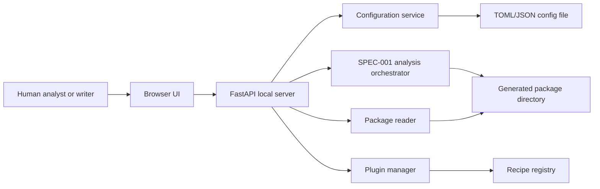

# SPEC-002: V2 Plugin, Preview, and Configuration Workbench

## Summary

This spec defines the V2 extension and local UI layer for F1 Telemetry Charts:
trusted external chart recipe plugins, a local FastAPI-powered package viewer,
and a browser-based configuration workbench for creating, validating, running,
and inspecting analysis packages without hand-editing files for common flows.

## Context

`SPEC-001` established the core framework, including data gateways, chart
recipes, artifact manifests, observation output, Markdown drafts, and a
versioned LLM contract. MVP and V1 implementation now make the package usable
from CLI and Python, but V2 items remain intentionally underspecified in
`SPEC-001`:

- `REQ-150`: external recipe plugin registration.
- `REQ-160`: local interactive package preview.
- `UX-010`: future configuration workbench support.

The human owner approved these high-level V2 decisions in chat on 2026-07-21:

- Write a new dedicated `SPEC-002` draft instead of expanding `SPEC-001`.
- Use a Python FastAPI backend with a React/Vite/TypeScript frontend.
- Support both local plugin paths and Python package entry points.

The human owner later clarified in chat on 2026-07-21 that the frontend is not
limited to vanilla JavaScript, that the UI spec must define each page/component
and interaction clearly, and that Markdown rendering should use an existing
solution.

The human owner approved implementation in chat on 2026-07-21 with the
instruction to commit the prior checkpoint and implement `SPEC-002`.

## Problem statement

The framework can generate chart and report packages, but users must still edit
configuration files manually, inspect package files one by one, and add new
chart recipes by changing core package code. V2 needs a trusted plugin boundary
and a local browser UI that makes generated packages and common configuration
tasks inspectable, repeatable, and safer for humans and LLM-assisted workflows.

## Goals

- Define a trusted plugin model for externally defined chart recipes.
- Define exact package preview behavior for generated chart/report packages.
- Define a browser-based configuration workbench for common analysis setup.
- Define the FastAPI backend, built React frontend, API routes, and local-only
  security model.
- Keep V2 compatible with the existing CLI/package-first architecture.
- Preserve the repository's local-first and no-hosted-service posture.

## Non-goals

- The system does not need multi-user collaboration in V2.
- The system does not need authentication for the local loopback server in V2.
- The system does not need a hosted deployment or cloud storage in V2.
- The system does not need a visual chart editor that changes Matplotlib chart
  internals directly.
- The system does not need no-code plugin authoring in V2; plugins are trusted
  Python code written by maintainers or advanced users.
- The system does not need to sandbox plugin Python execution beyond explicit
  trust, path, and registration controls.
- The system does not need to replace existing CLI or Python APIs.

## Users or actors

- Human analyst: creates configs, runs packages, reviews charts and
  observations.
- Human writer: previews chart packages and Markdown drafts before editing or
  publication.
- Project maintainer: installs, validates, and debugs plugin recipes.
- Advanced analyst: writes local plugin recipes for private experiments.
- LLM agent: may use manifest/report outputs but does not directly control the
  browser UI in V2.
- FastAPI local server: serves local package data and accepts local UI actions.
- Browser frontend: renders the preview and workbench UI.

## System overview



## Technology decisions

- The backend must use FastAPI.
- The backend must bind to loopback by default (`127.0.0.1`) and must not bind
  to a public interface unless explicitly configured.
- The frontend must use React with TypeScript.
- The frontend build tooling must use Vite.
- The FastAPI server must serve the built frontend assets for normal local use.
- The frontend may use a small client-side state library only if it materially
  simplifies package/config/plugin state; otherwise React component state and
  context are sufficient for V2.
- Markdown rendering must use an existing Markdown renderer. The default V2
  choice is `react-markdown` with GitHub-flavored Markdown support via
  `remark-gfm`; raw HTML in Markdown must be disabled or sanitized.
- The UI must use package-relative artifact paths when displaying manifest
  data, with backend endpoints resolving those paths against an explicitly
  opened package directory.
- The local server must be launchable from a CLI command.
- The local server must not require network access for fixture-backed packages.

## UI structure

The V2 UI is a local work application with persistent navigation. It should not
use a landing page. The first loaded screen must be the active workspace, either
the Package Preview page when an initial package is supplied or the
Configuration Workbench page otherwise.

Primary UI shell wireframe:

- [V2 UI shell](../assets/SPEC-002-v2-ui-shell.svg)

### App Shell

The App Shell must contain:

- **Left navigation rail:** Package Preview, Configuration Workbench, Plugins,
  Run History.
- **Top status bar:** active package/config path, validation status, server
  host/port, and last run status.
- **Main work area:** the active page content.
- **Right detail panel:** contextual details for selected chart, observation,
  plugin, or run; hidden or stacked below content on narrow widths.
- **Notification region:** transient success/error messages for save,
  validation, run, review, and regeneration actions.

App Shell interactions:

- Selecting a navigation item changes the active page without restarting the
  local server.
- Browser refresh preserves the current page route and reloads package/config
  state from the backend when possible.
- Server/API errors appear in the notification region and, when field-specific,
  in the relevant page section.

### Package Preview Page

Purpose: inspect one generated package and decide whether it is ready for
writing or review.

Components:

- **PackageOpenPanel:** path input, recent package selector, Open button,
  package-open errors.
- **PackageSummaryHeader:** run ID, session, status, created timestamp,
  artifact count, observation count, warning count, error count.
- **PackageHealthPanel:** integrity findings grouped by severity and affected
  file.
- **PreviewTabs:** Charts, Observations, Draft, Integrity.
- **ChartGallery:** thumbnail grid/list of chart artifacts.
- **ChartDetailPanel:** selected chart image, artifact ID, recipe ID,
  package-relative paths, metadata, warnings, selected drivers, source session.
- **ObservationReviewPanel:** observation list with filters for status,
  confidence, and family.
- **ObservationDetailPanel:** original text, edited text, evidence artifacts,
  metric values, limitations, source fields, review status controls.
- **DraftPreviewPanel:** rendered Markdown, raw Markdown toggle, regenerate
  button, draft write status.
- **IntegrityFindingsPanel:** all package integrity findings with severity,
  code, message, and path.

Package Preview interactions:

- Opening a valid package loads overview, artifacts, metadata, observations,
  review metadata, draft, and integrity findings.
- Selecting a chart updates `ChartDetailPanel`.
- Selecting an observation updates `ObservationDetailPanel` and highlights
  linked chart evidence where available.
- Changing review status writes `review.json` through the backend.
- Choosing `edited` enables an edited-text field and preserves original text.
- A "needs edit" UI label, if used, is only an action prompt that opens the
  edit workflow; it must not be stored as a review status.
- Regenerating the draft writes `draft.md`, then refreshes the rendered and raw
  Markdown views.
- Missing files remain visible as integrity findings rather than crashing the
  page.

### Configuration Workbench Page

Purpose: create or edit a standard analysis configuration, validate it, run it,
and open the generated package.

Components:

- **ConfigSourcePanel:** load existing config path, save path, new config
  command, dirty-state indicator.
- **ProjectFields:** project ID and output directory.
- **SessionFields:** season, event, session type/name.
- **DriverSelector:** editable driver abbreviation list with add/remove and
  duplicate detection.
- **DataCacheFields:** cache directory, cache mode, fixture path.
- **RecipeSelector:** core and valid plugin recipe toggles, recipe order, title
  override fields.
- **ThemeEditor:** figure width/height, DPI, background color, foreground color,
  grid toggle.
- **ExportSettings:** export formats and output expectations.
- **ValidationPanel:** path-specific validation errors and warnings from the
  backend.
- **RunPanel:** Validate, Save, Run Analysis, Open Generated Package actions.

Configuration Workbench interactions:

- Editing any field marks the draft dirty.
- Validate runs the backend config validation path and maps issues to fields.
- Save is enabled only when the draft serializes to a supported config format;
  invalid drafts can remain unsaved in browser state.
- Run Analysis is enabled only when validation passes.
- A successful run shows output directory, manifest path, report paths, and an
  Open Package action that navigates to Package Preview.
- A partially successful or failed run still exposes manifest warnings/errors
  when a manifest exists.

### Plugins Page

Purpose: inspect trusted plugin sources and available plugin recipes.

Components:

- **PluginSourceControls:** enable plugins toggle, entry-point discovery toggle,
  local path list, Add Path, Remove Path, Validate Plugins.
- **PluginStatusTable:** plugin ID, display name, version, provider, source
  type, source location, status, warning count, error count.
- **PluginRecipeTable:** recipe IDs, required dataset fields, supported config
  keys, output artifact type, conflict status.
- **PluginDetailPanel:** metadata details, import target, validation errors,
  warnings, and recipe factory status.

Plugins Page interactions:

- Plugins are disabled by default.
- Adding a local path updates the current config draft but does not load plugin
  code until validation/discovery is explicitly requested.
- Entry-point discovery runs only when explicitly enabled.
- Invalid plugins remain visible with errors and cannot be selected in the
  Workbench.
- Duplicate recipe IDs identify both the conflicting plugin/core source and the
  duplicate recipe ID.

### Run History Page

Purpose: provide quick access to recently generated or opened local packages.

Components:

- **RunHistoryTable:** package path, run ID, session, status, created timestamp,
  artifact count, observation count.
- **RunDetailPanel:** selected package summary, warnings, errors, report paths,
  Open Package action.
- **ClearHistoryAction:** clears only the local UI history, not generated
  package files.

Run History interactions:

- Successful workbench runs are added to history.
- Packages opened manually are added to history.
- Selecting a row updates details; Open Package navigates to Package Preview.
- Missing history paths show a recoverable warning.

## Functional requirements

### REQ-001: Local UI Server Launch

- **Statement:** The system must provide a CLI command that starts the FastAPI
  local UI server and prints the local URL.
- **Rationale:** Users need a predictable way to launch the viewer/workbench
  without knowing FastAPI internals.
- **Acceptance criteria:** The command starts a loopback server, serves the
  static UI, prints the bound URL, and exits with a nonzero status if startup
  fails.
- **Verification method:** CLI integration test and manual smoke test.
- **Evidence location:** To be filled during implementation.

### REQ-002: Package Opening

- **Statement:** The system must let the UI open a local generated package
  directory containing `manifest.json`.
- **Rationale:** Package preview starts from the package directory, not from
  individual files.
- **Acceptance criteria:** A user can select or enter a package directory; the
  backend validates that `manifest.json` exists; valid packages load into the
  preview; invalid directories show actionable errors.
- **Verification method:** Backend API tests and UI smoke test.
- **Evidence location:** To be filled during implementation.

### REQ-003: Package Integrity Check

- **Statement:** The system must check package-relative manifest references for
  expected chart images, metadata, observations, review metadata, and Markdown
  draft files.
- **Rationale:** Users need to know whether a package is complete before using
  it for writing or publication.
- **Acceptance criteria:** Missing files are reported as recoverable integrity
  warnings; malformed JSON files are reported as errors; existing referenced
  files are marked present.
- **Verification method:** Backend package reader tests with complete and
  intentionally damaged fixture packages.
- **Evidence location:** To be filled during implementation.

### REQ-004: Package Preview Page

- **Statement:** The Package Preview page must provide package opening,
  package overview, charts, observations, draft, and integrity tabs.
- **Rationale:** Users need immediate package-level orientation before opening
  individual charts or reviewing observations.
- **Acceptance criteria:** The page includes `PackageOpenPanel`,
  `PackageSummaryHeader`, `PackageHealthPanel`, `PreviewTabs`,
  `ChartGallery`, `ChartDetailPanel`, `ObservationReviewPanel`,
  `ObservationDetailPanel`, `DraftPreviewPanel`, and
  `IntegrityFindingsPanel`; the first preview screen displays run status,
  session identity, created timestamp, requested recipes, artifact count,
  observation count, warning count, and error count from the package view model.
- **Verification method:** UI smoke test and snapshot or DOM assertion.
- **Evidence location:** To be filled during implementation.

### REQ-005: Chart Gallery

- **Statement:** The preview UI must display generated chart artifacts as a
  gallery with thumbnail, recipe ID, artifact ID, image path, metadata path, and
  per-artifact metadata.
- **Rationale:** Users should inspect visual outputs without manually opening
  each PNG and JSON file.
- **Acceptance criteria:** Selecting a chart shows a larger image, core metadata,
  warnings, selected drivers, renderer, and source session fields; missing image
  files show an integrity warning instead of a broken UI.
- **Verification method:** UI smoke test using a fixture package.
- **Evidence location:** To be filled during implementation.

### REQ-006: Observation Review Panel

- **Statement:** The preview UI must display observations with text, evidence,
  metric values, confidence, limitations, review status, and edited text when
  present.
- **Rationale:** V1 report authoring depends on human review of generated
  analysis claims.
- **Acceptance criteria:** Observations can be filtered by review status and
  confidence; selecting an observation shows linked chart artifacts and source
  fields; missing evidence artifacts show warnings.
- **Verification method:** Backend API tests and UI smoke test.
- **Evidence location:** To be filled during implementation.

### REQ-007: Observation Review Editing

- **Statement:** The UI must allow a user to mark observations as accepted,
  edited, rejected, or unreviewed and persist those changes to `review.json`.
- **Rationale:** Human editorial decisions must survive outside the browser
  session.
- **Acceptance criteria:** Review changes are written to `review.json`; edited
  text is stored separately from original generated text; rejected observations
  are excluded from regenerated Markdown drafts.
- **Verification method:** Backend write tests and UI interaction test.
- **Evidence location:** To be filled during implementation.

### REQ-008: Markdown Draft Preview

- **Statement:** The preview UI must display `draft.md` as readable Markdown
  using `react-markdown` with `remark-gfm`, and must expose the raw source text.
- **Rationale:** Writers need to review package output without opening a
  separate editor for first-pass inspection.
- **Acceptance criteria:** The UI shows rendered draft content, raw Markdown,
  package-relative chart references, and warnings if `draft.md` is missing; raw
  HTML embedded in Markdown is disabled or sanitized.
- **Verification method:** UI smoke test.
- **Evidence location:** To be filled during implementation.

### REQ-009: Markdown Draft Regeneration

- **Statement:** The UI must provide a command to regenerate `draft.md` from the
  current observations and review metadata.
- **Rationale:** Review edits should feed back into the portable draft.
- **Acceptance criteria:** Regeneration preserves original observations, applies
  edited text, excludes rejected observations, writes `draft.md`, and reports
  success or failure in the UI.
- **Verification method:** Backend write test and UI interaction test.
- **Evidence location:** To be filled during implementation.

### REQ-010: Configuration Workbench

- **Statement:** The UI must provide a configuration workbench for common config
  creation and editing.
- **Rationale:** Users should not need to hand-edit TOML for standard analysis
  runs.
- **Acceptance criteria:** The workbench includes `ConfigSourcePanel`,
  `ProjectFields`, `SessionFields`, `DriverSelector`, `DataCacheFields`,
  `RecipeSelector`, `ThemeEditor`, `ExportSettings`, `ValidationPanel`, and
  `RunPanel`; saving writes a TOML config; validation uses the same backend path
  as the CLI.
- **Verification method:** Backend config API tests and UI smoke test.
- **Evidence location:** To be filled during implementation.

### REQ-011: Workbench Run Command

- **Statement:** The workbench must allow a user to run analysis from a valid
  configuration and then open the generated package in the preview UI.
- **Rationale:** The desired workflow is configure, validate, run, inspect in
  one local UI.
- **Acceptance criteria:** The run command is disabled when validation fails;
  successful runs show output directory and open the package preview; failed or
  partially successful runs show manifest errors and warnings.
- **Verification method:** UI flow test using fixture-backed config.
- **Evidence location:** To be filled during implementation.

### REQ-012: Plugin Discovery From Local Paths

- **Statement:** The system must discover trusted recipe plugins from explicitly
  configured local filesystem paths.
- **Rationale:** Local plugin paths are the fastest path for private recipe
  development and fixture testing.
- **Acceptance criteria:** A config can list one or more plugin directories or
  files; the plugin manager loads only those explicit paths; missing paths,
  malformed metadata, and import failures produce actionable validation errors.
- **Verification method:** Plugin fixture tests.
- **Evidence location:** To be filled during implementation.

### REQ-013: Plugin Discovery From Entry Points

- **Statement:** The system must discover trusted recipe plugins from installed
  Python package entry points.
- **Rationale:** Reusable plugins should be installable without editing local
  path lists.
- **Acceptance criteria:** The plugin manager reads a documented entry-point
  group; valid entry points register recipe factories; invalid entry points are
  isolated and reported without disabling core recipes.
- **Verification method:** Entry-point fixture tests or importlib metadata
  tests.
- **Evidence location:** To be filled during implementation.

### REQ-014: Plugin Metadata Validation

- **Statement:** The system must validate plugin identity, version, recipe IDs,
  supported config keys, required dataset fields, and factory import targets
  before registration.
- **Rationale:** Plugin failures should surface before package generation when
  possible.
- **Acceptance criteria:** Invalid metadata blocks only the affected plugin;
  duplicate recipe IDs are rejected; plugin recipe IDs cannot override core
  recipe IDs; error messages identify plugin ID and failing field.
- **Verification method:** Plugin validation unit tests.
- **Evidence location:** To be filled during implementation.

### REQ-015: Plugin Recipe Execution

- **Statement:** Registered plugin recipes must run through the same recipe,
  renderer, artifact export, manifest, observation, and preview pipeline as core
  recipes.
- **Rationale:** Plugins should be first-class chart recipes once trusted and
  registered.
- **Acceptance criteria:** A fixture plugin recipe can be selected in a config,
  rendered in batch generation, represented in `manifest.json`, shown in the UI,
  and isolated when it fails after generation starts.
- **Verification method:** End-to-end plugin fixture test.
- **Evidence location:** To be filled during implementation.

### REQ-016: Plugin Management UI

- **Statement:** The UI must include a dedicated Plugins page.
- **Rationale:** Users need to understand which plugin recipes are available
  before selecting them.
- **Acceptance criteria:** The page includes `PluginSourceControls`,
  `PluginStatusTable`, `PluginRecipeTable`, and `PluginDetailPanel`; it lists
  core recipes, local path plugins, entry-point plugins, plugin status, plugin
  version, recipe IDs, warnings, and validation errors; disabled or invalid
  plugins cannot be selected for a run.
- **Verification method:** UI smoke test with valid and invalid fixture
  plugins.
- **Evidence location:** To be filled during implementation.

### REQ-017: Run History Page

- **Statement:** The UI must include a Run History page for recently opened and
  generated local packages.
- **Rationale:** Users need quick access to previous local packages during an
  analysis session.
- **Acceptance criteria:** The page includes `RunHistoryTable`,
  `RunDetailPanel`, and `ClearHistoryAction`; successful workbench runs and
  manually opened packages appear in the table; clearing history does not
  delete generated package files.
- **Verification method:** UI smoke test.
- **Evidence location:** To be filled during implementation.

## Non-functional requirements

### NFR-001: Local-Only Operation

- **Statement:** The UI server must operate locally and must not require a
  hosted backend service.
- **Rationale:** The project is local-first and package-oriented.
- **Acceptance criteria:** Fixture-backed preview, config validation, package
  generation, plugin validation, and Markdown regeneration work without network
  access.
- **Verification method:** Offline smoke test.
- **Evidence location:** To be filled during implementation.

### NFR-002: Preview Load Time

- **Statement:** The preview UI should load a representative V1 package in a
  maximum of 3 seconds after the local server receives the package-open request.
- **Rationale:** Review should feel interactive for normal packages.
- **Acceptance criteria:** A benchmark opens the canonical generated package and
  backend package parsing completes within 3 seconds.
- **Verification method:** Scripted backend benchmark.
- **Evidence location:** To be filled during implementation.

### NFR-003: Package Preview Scale

- **Statement:** The preview UI should support at least 20 chart artifacts and
  50 observations in one package without layout breakage.
- **Rationale:** V2 should support larger report packages than the MVP demo.
- **Acceptance criteria:** A synthetic or fixture package with 20 charts and 50
  observations remains navigable; chart thumbnails and observation rows do not
  overlap or overflow at desktop and tablet widths.
- **Verification method:** UI smoke test with responsive screenshots.
- **Evidence location:** To be filled during implementation.

### NFR-004: Dependency Boundary

- **Statement:** FastAPI, React build artifacts, and UI-serving dependencies
  must stay out of recipe, renderer, data gateway, and public core generation
  modules.
- **Rationale:** CLI/package generation should remain usable without importing
  UI server modules.
- **Acceptance criteria:** Import tests verify `f1_telemetry_charts` and core
  generation APIs do not import FastAPI on package import.
- **Verification method:** Import boundary test.
- **Evidence location:** To be filled during implementation.

### NFR-005: Browser Support

- **Statement:** The UI must support current Chromium-based browsers in V2.
- **Rationale:** The local desktop testing environment can reliably verify
  Chromium behavior.
- **Acceptance criteria:** UI smoke tests pass in Chromium; unsupported browser
  behavior is documented rather than silently claimed.
- **Verification method:** Browser smoke test.
- **Evidence location:** To be filled during implementation.

### NFR-006: Frontend Build Reproducibility

- **Statement:** The React/Vite frontend build must be reproducible from checked
  source files and documented commands.
- **Rationale:** UI implementation should not depend on generated files that
  cannot be rebuilt.
- **Acceptance criteria:** Frontend source, package manifest, lockfile, and
  build command are present; the built assets served by FastAPI can be generated
  locally; CI or local validation includes the frontend build.
- **Verification method:** Frontend build test or scripted command.
- **Evidence location:** To be filled during implementation.

## Security and privacy considerations

### SEC-001: Loopback Binding

- **Statement:** The local server must bind to `127.0.0.1` by default.
- **Rationale:** Package data and local paths should not be exposed to a network
  by accident.
- **Acceptance criteria:** Default launch binds to loopback; non-loopback host
  values require explicit CLI/config input; startup logs show the bound host and
  port.
- **Verification method:** CLI/server startup test.
- **Evidence location:** To be filled during implementation.

### SEC-002: Explicit Package Roots

- **Statement:** The backend must only read package files under the explicitly
  opened package directory.
- **Rationale:** Package-relative paths must not become arbitrary filesystem
  reads.
- **Acceptance criteria:** Path traversal attempts are rejected; absolute paths
  from manifests are rejected unless a future approved local-path mode exists;
  missing package files are reported as integrity warnings.
- **Verification method:** Backend security tests.
- **Evidence location:** To be filled during implementation.

### SEC-003: Trusted Plugin Execution

- **Statement:** Plugin Python code must be treated as trusted local code and
  must require explicit user configuration before loading.
- **Rationale:** Python plugins can execute arbitrary code and should never load
  implicitly from untrusted directories.
- **Acceptance criteria:** Plugins are disabled by default; local plugin paths
  must be explicitly listed; entry-point plugins must be explicitly enabled by
  configuration or UI setting; documentation states the trust model.
- **Verification method:** Plugin manager tests and documentation inspection.
- **Evidence location:** To be filled during implementation.

### SEC-004: LLM and UI Data Boundary

- **Statement:** UI API responses must avoid exposing environment variables,
  raw FastF1 cache internals, and unrelated filesystem paths.
- **Rationale:** The V1 LLM contract already limits path exposure; the local UI
  API should maintain the same boundary.
- **Acceptance criteria:** API responses use package-relative paths for package
  contents and explicit user-supplied config/package roots for local selections;
  tests verify no environment variables appear in responses.
- **Verification method:** Backend API tests.
- **Evidence location:** To be filled during implementation.

## Data model impact

### DATA-001: Plugin Metadata Model

- **Statement:** The system must define a typed plugin metadata model.
- **Rationale:** Plugin validation and UI display require structured plugin
  identity and recipe declarations.
- **Acceptance criteria:** The model includes plugin ID, display name, version,
  provider, source type, source location, recipe IDs, supported config keys,
  required dataset fields, and warnings/errors.
- **Verification method:** Data model unit tests.
- **Evidence location:** To be filled during implementation.

### DATA-002: Package View Model

- **Statement:** The backend must expose a package view model for UI rendering.
- **Rationale:** The UI should not reconstruct package state by combining raw
  manifest, observations, and metadata files itself.
- **Acceptance criteria:** The view model includes package root, manifest
  summary, artifacts, integrity findings, observations, review statuses,
  Markdown draft state, warnings, and errors.
- **Verification method:** Backend package reader tests.
- **Evidence location:** To be filled during implementation.

### DATA-003: Workbench Configuration Draft Model

- **Statement:** The UI must use a typed draft model for editable
  configurations before saving to TOML.
- **Rationale:** Workbench validation should show path-specific issues while
  preserving unsaved user input.
- **Acceptance criteria:** The draft model maps to `ProjectConfig`; supports
  validation state per field; preserves invalid user input until corrected; and
  serializes valid configs to TOML or JSON.
- **Verification method:** Config workbench model tests.
- **Evidence location:** To be filled during implementation.

### DATA-004: Package Integrity Finding Model

- **Statement:** The system must define typed package integrity findings.
- **Rationale:** Integrity warnings must be consistent across backend tests and
  UI display.
- **Acceptance criteria:** Each finding includes severity, code, message,
  package-relative path when relevant, and source manifest field when relevant.
- **Verification method:** Data model tests.
- **Evidence location:** To be filled during implementation.

## API impact

### API-001: UI Server CLI

- **Statement:** The package must expose a CLI command for launching the local
  UI server.
- **Rationale:** The V2 UI must be discoverable from the existing command-line
  workflow.
- **Acceptance criteria:** The command supports host, port, optional initial
  package path, optional initial config path, and browser-open flag; default
  host is `127.0.0.1`.
- **Verification method:** CLI tests.
- **Evidence location:** To be filled during implementation.

### API-002: Package Preview API

- **Statement:** The FastAPI backend must expose package preview endpoints.
- **Rationale:** The browser UI needs structured package data and asset access.
- **Acceptance criteria:** Endpoints include package open/read, artifact image
  access, artifact metadata read, observation read, review update, and Markdown
  draft regeneration.
- **Verification method:** FastAPI test client tests.
- **Evidence location:** To be filled during implementation.

### API-003: Configuration Workbench API

- **Statement:** The FastAPI backend must expose configuration workbench
  endpoints.
- **Rationale:** UI config editing must reuse the existing config validation and
  analysis execution paths.
- **Acceptance criteria:** Endpoints include config load, validate, save, recipe
  list, plugin list, and run analysis.
- **Verification method:** FastAPI test client tests.
- **Evidence location:** To be filled during implementation.

### API-004: Plugin Manager API

- **Statement:** The FastAPI backend and Python package must expose plugin
  discovery and validation functions.
- **Rationale:** Plugin behavior must be testable independently from the UI.
- **Acceptance criteria:** Python functions can discover local path plugins,
  discover entry-point plugins, validate metadata, and return registered recipe
  factories or structured errors.
- **Verification method:** Plugin manager unit tests.
- **Evidence location:** To be filled during implementation.

## UI or UX impact

### UX-001: Application Layout

- **Statement:** The browser UI must use a work-focused application layout with
  persistent navigation and dense but readable information surfaces.
- **Rationale:** The tool is an analysis and review workspace, not a marketing
  page.
- **Acceptance criteria:** Primary navigation includes Package Preview,
  Configuration Workbench, Plugins, and Run History; content uses full-width
  work areas, tables/lists where appropriate, compact panels for details, and
  the layout matches the primary shell positions shown in
  `docs/specs/assets/SPEC-002-v2-ui-shell.svg`.
- **Verification method:** UI design inspection and screenshot smoke test.
- **Evidence location:** To be filled during implementation.

### UX-002: Package Preview View

- **Statement:** The Package Preview view must provide package overview, chart
  gallery, observation review, draft preview, and integrity findings.
- **Rationale:** Users need one screen family for package completeness and
  publication readiness.
- **Acceptance criteria:** The view supports opening a package, switching
  between charts/observations/draft/integrity tabs, and clearly showing package
  status without overlapping text or controls.
- **Verification method:** UI smoke test across desktop and tablet viewports.
- **Evidence location:** To be filled during implementation.

### UX-003: Configuration Workbench View

- **Statement:** The Configuration Workbench view must guide users through
  session, drivers, recipes, plugins, theme, outputs, validation, and run
  actions.
- **Rationale:** Standard configuration should be ergonomic without requiring
  manual TOML edits.
- **Acceptance criteria:** The view uses appropriate controls: text inputs for
  paths and IDs, numeric inputs for season/DPI/figure size, checkboxes or
  toggles for recipes/plugins, select controls for cache mode/session type, and
  color inputs for theme colors.
- **Verification method:** UI smoke test and design inspection.
- **Evidence location:** To be filled during implementation.

### UX-004: Plugin Management View

- **Statement:** The Plugins view must make plugin state inspectable and
  actionable.
- **Rationale:** Plugin loading is a trust and reliability boundary.
- **Acceptance criteria:** The view lists source, identity, version, recipe IDs,
  status, errors, and warnings; invalid plugins are visually distinct; controls
  allow adding/removing local plugin paths from the draft configuration.
- **Verification method:** UI smoke test with valid and invalid fixtures.
- **Evidence location:** To be filled during implementation.

### UX-005: Error Presentation

- **Statement:** UI errors must be actionable and tied to the source field,
  file, plugin, or package item when possible.
- **Rationale:** Users should be able to fix configuration, package, and plugin
  issues without reading logs first.
- **Acceptance criteria:** Validation errors appear near the relevant field or
  list item; package integrity findings link to affected artifact paths; plugin
  errors identify plugin source and metadata field.
- **Verification method:** UI smoke test.
- **Evidence location:** To be filled during implementation.

### UX-006: Responsive Behavior

- **Statement:** The UI must remain usable at desktop and tablet widths.
- **Rationale:** Analysts may review outputs on different local devices or
  docked/undocked windows.
- **Acceptance criteria:** At 1440px and 768px widths, navigation, controls,
  chart previews, tables, and detail panels do not overlap or clip critical
  text; detail panels stack below lists when horizontal space is limited.
- **Verification method:** Browser screenshot smoke test.
- **Evidence location:** To be filled during implementation.

### UX-007: Run History View

- **Statement:** The Run History view must show recent package activity without
  implying persistence beyond local UI history.
- **Rationale:** Users need a quick navigation aid while understanding that
  generated package files remain controlled by the filesystem.
- **Acceptance criteria:** The view lists recent generated/opened packages,
  selected package details, and an Open Package action; clearing history removes
  history entries only and does not delete files.
- **Verification method:** UI smoke test.
- **Evidence location:** To be filled during implementation.

## Configuration impact

The V2 configuration model must add plugin and UI settings without breaking
existing valid V1 configs.

Expected new configuration domains:

```toml
[ui]
host = "127.0.0.1"
port = 8765
open_browser = true

[plugins]
enabled = true
local_paths = ["plugins/example_recipe"]
entry_points = true
```

Configuration defaults:

- `ui.host`: `127.0.0.1`.
- `ui.port`: implementation may choose the first available configured/default
  port and must report the actual bound port.
- `ui.open_browser`: false for automated tests, optional true for user launch.
- `plugins.enabled`: false by default unless the user explicitly enables
  plugin loading.
- `plugins.local_paths`: empty by default.
- `plugins.entry_points`: false by default unless explicitly enabled.

## Error handling

- Invalid package directory: show package-open error and keep previous package
  view if one is loaded.
- Missing package files: show integrity warnings, not server crashes.
- Malformed JSON package files: show integrity errors and block dependent UI
  sections while preserving other readable package data.
- Invalid config draft: keep the user's unsaved values and show path-specific
  validation errors.
- Analysis run failure: show run status, output directory if created, manifest
  errors, and recipe-level failures.
- Plugin import failure: mark only the affected plugin invalid and keep core
  recipes available.
- Duplicate plugin recipe ID: reject the plugin recipe and show duplicate source
  details.
- Server startup failure: print an actionable CLI error and exit nonzero.

## Edge cases

- Package path contains spaces.
- Package manifest references files using `..` path traversal.
- Package manifest is valid but chart image is missing.
- Observations exist without matching chart artifacts.
- `review.json` contains an unknown observation ID.
- `draft.md` is missing but observations exist.
- Plugin metadata is valid but factory import fails.
- Plugin recipe raises during rendering after core recipes have succeeded.
- Entry-point plugin and local-path plugin declare the same recipe ID.
- Port is already in use.
- Browser-open flag is requested on a headless environment.
- Frontend build assets are missing when the FastAPI UI server starts.
- `draft.md` contains raw HTML or unsupported Markdown extensions.

## Acceptance criteria

- A user can launch the local FastAPI UI server from the CLI.
- A user can open a generated package and inspect status, charts, metadata,
  observations, review metadata, Markdown draft, and package integrity findings.
- A user can edit observation review status and regenerate the Markdown draft.
- A user can create or edit a common configuration through the workbench,
  validate it, run it, and open the resulting package.
- The system can discover and validate both local path plugins and entry-point
  plugins.
- A fixture plugin can generate a chart without modifying core recipe code.
- Package preview and plugin failures are isolated and actionable.
- Governance, spec validation, drift validation, unit tests, API tests, UI smoke
  tests, and relevant benchmarks pass.

## Verification matrix

| Requirement ID | Acceptance criterion | Verification method | Test / command / manual check | Evidence location | PR reference |
| -------------- | -------------------- | ------------------- | ----------------------------- | ----------------- | ------------ |
| REQ-001 | CLI starts local server and prints URL. | CLI integration test | `python -m unittest tests.test_cli -v` | `src/f1_telemetry_charts/cli.py`; `tests/test_cli.py` | TBD |
| REQ-002 | Valid package opens; invalid directory errors. | API and UI smoke tests | `python -m unittest tests.test_preview -v` | `src/f1_telemetry_charts/preview/reader.py`; `src/f1_telemetry_charts/ui/server.py`; `tests/test_preview.py` | TBD |
| REQ-003 | Package references are checked for integrity. | Backend package tests | `python -m unittest tests.test_preview -v` | `src/f1_telemetry_charts/preview/reader.py`; `tests/test_preview.py` | TBD |
| REQ-004 | Package overview displays run summary. | UI smoke test | `pnpm build`; API tests | `frontend/src/main.tsx`; `src/f1_telemetry_charts/ui/static/`; `tests/test_preview.py` | TBD |
| REQ-005 | Chart gallery displays artifacts and metadata. | UI smoke test | `pnpm build`; API tests | `frontend/src/main.tsx`; `src/f1_telemetry_charts/ui/server.py`; `tests/test_preview.py` | TBD |
| REQ-006 | Observation panel displays review data and evidence. | API and UI smoke tests | `pnpm build`; `python -m unittest tests.test_preview -v` | `frontend/src/main.tsx`; `src/f1_telemetry_charts/ui/server.py`; `tests/test_preview.py` | TBD |
| REQ-007 | Review edits persist and affect draft regeneration. | Backend write and UI interaction tests | `python -m unittest tests.test_preview -v` | `src/f1_telemetry_charts/ui/server.py`; `tests/test_preview.py` | TBD |
| REQ-008 | Markdown preview displays rendered and raw draft. | UI smoke test | `pnpm build` | `frontend/src/main.tsx`; `frontend/package.json` | TBD |
| REQ-009 | Draft regeneration applies review state. | Backend write and UI interaction tests | `python -m unittest tests.test_preview -v` | `src/f1_telemetry_charts/ui/server.py`; `tests/test_preview.py` | TBD |
| REQ-010 | Workbench edits, validates, and saves config. | API and UI smoke tests | `python -m unittest tests.test_workbench_api -v`; `pnpm build` | `src/f1_telemetry_charts/ui/server.py`; `frontend/src/main.tsx`; `tests/test_workbench_api.py` | TBD |
| REQ-011 | Workbench runs valid config and opens package. | UI flow test | `python -m unittest tests.test_workbench_api -v` | `src/f1_telemetry_charts/ui/server.py`; `tests/test_workbench_api.py` | TBD |
| REQ-012 | Local path plugins are discovered and validated. | Plugin fixture tests | `python -m unittest tests.test_plugins -v` | `src/f1_telemetry_charts/plugins/manager.py`; `tests/test_plugins.py` | TBD |
| REQ-013 | Entry-point plugins are discovered and validated. | Entry-point fixture tests | `python -m unittest tests.test_plugins -v` | `src/f1_telemetry_charts/plugins/manager.py`; `tests/test_plugins.py` | TBD |
| REQ-014 | Plugin metadata errors are actionable and isolated. | Plugin validation tests | `python -m unittest tests.test_plugins -v` | `src/f1_telemetry_charts/plugins/models.py`; `src/f1_telemetry_charts/plugins/manager.py`; `tests/test_plugins.py` | TBD |
| REQ-015 | Plugin recipe runs through package pipeline. | End-to-end plugin fixture test | `python -m unittest tests.test_plugins -v` | `src/f1_telemetry_charts/analysis/orchestrator.py`; `src/f1_telemetry_charts/plugins/manager.py`; `tests/test_plugins.py` | TBD |
| REQ-016 | Plugin UI lists plugin status and recipes. | UI smoke test | `pnpm build`; `python -m unittest tests.test_plugins -v` | `frontend/src/main.tsx`; `src/f1_telemetry_charts/ui/server.py`; `tests/test_plugins.py` | TBD |
| REQ-017 | Run history lists recent opened and generated packages. | UI flow test | `python -m unittest tests.test_workbench_api -v` | `src/f1_telemetry_charts/ui/server.py`; `frontend/src/main.tsx`; `tests/test_workbench_api.py` | TBD |
| NFR-001 | UI works offline for local fixture package. | Offline smoke test | `python -m unittest tests.test_preview tests.test_workbench_api -v` | fixture-backed package and Analysis API tests; local loopback UI | TBD |
| NFR-002 | Preview loads representative package within 3 seconds. | Scripted benchmark | `python scripts/benchmark_package_preview.py` (0.0813 seconds on the final clean run, 2026-08-04) | `scripts/benchmark_package_preview.py`; closeout evidence report | TBD |
| NFR-003 | UI handles 20 charts and 50 observations. | Responsive UI smoke test | Generated 20-chart/50-observation fixture in Chromium at desktop and mobile widths on 2026-08-04 | Analysis Export inspection; benchmark fixture script; closeout evidence report | TBD |
| NFR-004 | Core imports do not import FastAPI. | Import boundary test | `python -m unittest tests.test_dependency_boundaries -v` | `tests/test_dependency_boundaries.py` | TBD |
| NFR-005 | UI supports current Chromium. | Browser smoke test | In-app Chromium at 1440x900, 768x1024, and 390x844 on 2026-08-03 | `docs/reports/SPEC-003-UX-007-responsive-evidence.md` | TBD |
| NFR-006 | Frontend build is reproducible from checked source. | Frontend build command | `pnpm install`; `pnpm build` | `frontend/package.json`; `frontend/pnpm-lock.yaml`; `src/f1_telemetry_charts/ui/static/` | TBD |
| SEC-001 | Server binds to loopback by default. | CLI/server test | `python -m unittest tests.test_cli -v` | `src/f1_telemetry_charts/cli.py`; `tests/test_cli.py` | TBD |
| SEC-002 | Backend rejects path traversal and unexpected absolute package paths. | Security tests | `python -m unittest tests.test_preview -v` | `src/f1_telemetry_charts/preview/reader.py`; `tests/test_preview.py` | TBD |
| SEC-003 | Plugins load only when explicitly enabled. | Plugin manager tests and docs inspection | `python -m unittest tests.test_plugins -v` | `src/f1_telemetry_charts/plugins/manager.py`; `tests/test_plugins.py` | TBD |
| SEC-004 | UI API avoids env vars, cache internals, and unrelated paths. | Backend API tests | `python -m unittest tests.test_preview tests.test_workbench_api -v` | `src/f1_telemetry_charts/ui/server.py`; `tests/test_preview.py`; `tests/test_workbench_api.py` | TBD |
| DATA-001 | Plugin metadata model represents plugin state. | Data model tests | `python -m unittest tests.test_plugins -v` | `src/f1_telemetry_charts/plugins/models.py`; `tests/test_plugins.py` | TBD |
| DATA-002 | Package view model represents preview state. | Backend package reader tests | `python -m unittest tests.test_preview -v` | `src/f1_telemetry_charts/preview/reader.py`; `tests/test_preview.py` | TBD |
| DATA-003 | Config draft model preserves validation state. | Config workbench model tests | `python -m unittest tests.test_workbench_api -v` | `src/f1_telemetry_charts/ui/server.py`; `tests/test_workbench_api.py` | TBD |
| DATA-004 | Integrity finding model is typed and consistent. | Data model tests | `python -m unittest tests.test_preview -v` | `src/f1_telemetry_charts/preview/reader.py`; `tests/test_preview.py` | TBD |
| API-001 | UI server CLI supports launch options. | CLI tests | `python -m unittest tests.test_cli -v` | `src/f1_telemetry_charts/cli.py`; `tests/test_cli.py` | TBD |
| API-002 | Package preview endpoints serve package state and assets. | FastAPI test client tests | `python -m unittest tests.test_preview -v` | `src/f1_telemetry_charts/ui/server.py`; `tests/test_preview.py` | TBD |
| API-003 | Workbench endpoints load, validate, save, and run configs. | FastAPI test client tests | `python -m unittest tests.test_workbench_api -v` | `src/f1_telemetry_charts/ui/server.py`; `tests/test_workbench_api.py` | TBD |
| API-004 | Plugin manager functions are testable independent of UI. | Plugin manager tests | `python -m unittest tests.test_plugins -v` | `src/f1_telemetry_charts/plugins/manager.py`; `tests/test_plugins.py` | TBD |
| UX-001 | App layout is work-focused and navigable. | Design inspection and screenshot smoke test | `pnpm --dir frontend build`; responsive browser smoke on 2026-08-03 | `frontend/src/components/AppShell.tsx`; `frontend/src/pages/AnalysisWorkbenchPage.tsx`; responsive evidence report | TBD |
| UX-002 | Package inspection supports overview/charts/observations/draft/integrity inside Analysis Export. | UI/API smoke test | `python -m unittest tests.test_preview tests.test_analysis_workspace -v`; frontend build | `AnalysisWorkbenchPage.tsx` Export editor; package preview APIs; AMEND-001 | TBD |
| UX-003 | Analysis Workbench exposes session, chart, review, and export controls. | UI smoke test and design inspection | `python -m unittest tests.test_analysis_workspace -v`; frontend build | `frontend/src/pages/AnalysisWorkbenchPage.tsx`; AMEND-001 | TBD |
| UX-004 | Plugin management view exposes plugin state. | UI/API smoke test | `python -m unittest tests.test_plugins -v`; frontend build | `frontend/src/pages/PluginsPage.tsx`; `tests/test_plugins.py` | TBD |
| UX-005 | Errors are actionable and tied to source items. | UI/API smoke test | targeted API tests; frontend build | Analysis diagnostics, plugin status, package integrity, and notification surfaces | TBD |
| UX-006 | UI remains usable at desktop and tablet widths. | Browser screenshot smoke test | In-app Chromium at 1440x900 and 768x1024 on 2026-08-03 | `docs/reports/SPEC-003-UX-007-responsive-evidence.md` | TBD |
| UX-007 | Run History view exposes recent package activity without deleting files. | UI flow test | `python -m unittest tests.test_workbench_api -v`; frontend build | `frontend/src/pages/RunHistoryPage.tsx`; `tests/test_workbench_api.py` | TBD |

## Test plan

- Unit tests for plugin metadata, plugin discovery, plugin validation, package
  integrity findings, package view models, and configuration draft models.
- FastAPI test client tests for preview, config, run, plugin, review, Markdown,
  and asset endpoints.
- CLI tests for local server launch options and startup error handling.
- UI smoke tests in Chromium for package preview, observation review editing,
  Markdown regeneration, configuration workbench validation/run, plugin
  management, and responsive layout.
- Fixture package tests for complete packages, missing chart image, malformed
  metadata JSON, missing draft, missing observations, and invalid manifest.
- Fixture plugin tests for valid local path plugin, invalid metadata, duplicate
  recipe ID, render-time failure, and entry-point plugin discovery.
- Benchmarks for package preview load time and representative UI package size.
- Governance validation, spec validation, and drift validation before claiming
  completion.

## Rollback plan

- Remove the V2 UI server modules, React frontend source/build assets, plugin
  manager, plugin config fields, and V2 CLI command.
- Preserve SPEC-001 CLI/package generation behavior.
- Leave generated packages compatible with V1 by keeping `manifest.json`,
  `observations.json`, `review.json`, and `draft.md` unchanged.
- If plugin loading causes instability, disable plugin loading by default and
  keep core recipe registry behavior unchanged.
- If UI launch causes packaging issues, keep backend package preview functions
  testable and temporarily remove the UI CLI command until fixed.

## Open questions

- [x] Should V2 be a new spec or an amendment to SPEC-001? Answer: create new
      `SPEC-002` draft.
- [x] Which UI technology should V2 use? Answer: FastAPI backend with
      React/Vite/TypeScript frontend, served by FastAPI for normal local use.
- [x] Which plugin discovery modes should be supported? Answer: both local
      plugin paths and Python package entry points.
- [x] Which Markdown rendering strategy should V2 use? Answer:
      `react-markdown` with `remark-gfm`, with raw HTML disabled or sanitized.
- None currently unresolved.

## Human decisions required

- [x] Approve creating new `SPEC-002` draft. Answer: approved in chat on
      2026-07-21.
- [x] Approve FastAPI local browser UI foundation. Answer: approved in chat on
      2026-07-21.
- [x] Approve React/Vite/TypeScript frontend and existing Markdown renderer.
      Answer: clarified in chat on 2026-07-21.
- [x] Approve supporting both local plugin paths and entry points. Answer:
      approved in chat on 2026-07-21.
- [x] Approve or revise this full V2 draft before implementation starts.
      Answer: approved for implementation in chat on 2026-07-21.

## Conflict check

This spec depends on `SPEC-001` and expands its V2 placeholders into detailed
implementation-ready requirements. It does not supersede or contradict
`SPEC-001`; it refines V2 scope for plugin registration, package preview, and
configuration workbench behavior. If implementation reveals a conflict with an
approved `SPEC-001` requirement, work must stop and the conflict must be
resolved by amendment or human decision.

## Traceability table

| Requirement ID | Design / component | Implementation (file/function) | Test | Status |
| -------------- | ------------------ | ------------------------------ | ---- | ------ |
| REQ-001 | UI server launch | `src/f1_telemetry_charts/cli.py` | `tests/test_cli.py` | Implemented |
| REQ-002 | Package open flow | `src/f1_telemetry_charts/preview/reader.py`; `src/f1_telemetry_charts/ui/server.py` | `tests/test_preview.py` | Implemented |
| REQ-003 | Package integrity checker | `src/f1_telemetry_charts/preview/reader.py` | `tests/test_preview.py` | Implemented |
| REQ-004 | Package overview UI | Analysis Export editor; package preview APIs | frontend build; `tests/test_preview.py`; `tests/test_analysis_workspace.py` | Implemented via SPEC-004 |
| REQ-005 | Chart gallery UI | Analysis Export editor and `ChartLightbox` | frontend build; package/Analysis tests | Implemented via SPEC-004 |
| REQ-006 | Observation panel UI | Analysis Review and Export editors | frontend build; package/Analysis tests | Implemented via SPEC-004 |
| REQ-007 | Review editing | `src/f1_telemetry_charts/ui/server.py` | `tests/test_preview.py` | Implemented |
| REQ-008 | Markdown preview | Analysis Export Draft tab with rendered/raw modes using `react-markdown` and `remark-gfm` | frontend typecheck/build; Chromium rendered/raw and raw-HTML safety check | Implemented and verified |
| REQ-009 | Markdown regeneration | `src/f1_telemetry_charts/ui/server.py` | `tests/test_preview.py` | Implemented |
| REQ-010 | Configuration workbench | `frontend/src/pages/AnalysisWorkbenchPage.tsx`; Analysis APIs | `tests/test_analysis_workspace.py`; `pnpm build` | Superseded by SPEC-004 Analysis Workbench |
| REQ-011 | Workbench run flow | Analysis staged session/chart generation and export APIs | `tests/test_analysis_workspace.py`; full discovery | Superseded by SPEC-004 staged pipeline |
| REQ-012 | Local plugin discovery | `src/f1_telemetry_charts/plugins/manager.py` | `tests/test_plugins.py` | Implemented |
| REQ-013 | Entry-point plugin discovery | `src/f1_telemetry_charts/plugins/manager.py` | `tests/test_plugins.py` | Implemented |
| REQ-014 | Plugin metadata validation | `src/f1_telemetry_charts/plugins/models.py`; `src/f1_telemetry_charts/plugins/manager.py` | `tests/test_plugins.py` | Implemented |
| REQ-015 | Plugin recipe execution | `src/f1_telemetry_charts/plugins/manager.py`; `src/f1_telemetry_charts/analysis/orchestrator.py` | `tests/test_plugins.py` | Implemented |
| REQ-016 | Plugin management UI | `frontend/src/main.tsx`; `src/f1_telemetry_charts/ui/server.py` | `tests/test_plugins.py`; `pnpm build` | Implemented |
| REQ-017 | Run history UI | `frontend/src/main.tsx`; `src/f1_telemetry_charts/ui/server.py` | `tests/test_workbench_api.py` | Implemented |
| NFR-001 | Local-only operation | loopback FastAPI UI; fixture-backed package and Analysis paths | preview/workbench/API tests | Implemented |
| NFR-002 | Preview load time | package reader and Analysis Export inspection | `scripts/benchmark_package_preview.py` (0.0813 seconds) | Implemented and verified |
| NFR-003 | Package preview scale | Analysis Export inspection | generated 20-chart/50-observation fixture at desktop/mobile widths | Implemented and verified |
| NFR-004 | Dependency boundary | `src/f1_telemetry_charts/ui/server.py`; core package imports | `tests/test_dependency_boundaries.py` | Implemented |
| NFR-005 | Browser support | `frontend/src/App.tsx`; `frontend/src/styles.css` | `docs/reports/SPEC-003-UX-007-responsive-evidence.md` | Implemented and verified |
| NFR-006 | Frontend build reproducibility | `frontend/package.json`; `frontend/pnpm-lock.yaml`; `frontend/vite.config.ts` | `pnpm build` | Implemented |
| SEC-001 | Loopback binding | `src/f1_telemetry_charts/cli.py` | `tests/test_cli.py` | Implemented |
| SEC-002 | Explicit package roots | `src/f1_telemetry_charts/preview/reader.py` | `tests/test_preview.py` | Implemented |
| SEC-003 | Trusted plugin execution | `src/f1_telemetry_charts/config/models.py`; `src/f1_telemetry_charts/plugins/manager.py` | `tests/test_plugins.py` | Implemented |
| SEC-004 | UI and LLM data boundary | `src/f1_telemetry_charts/ui/server.py`; `src/f1_telemetry_charts/preview/reader.py` | `tests/test_preview.py`; `tests/test_workbench_api.py` | Implemented |
| DATA-001 | Plugin metadata model | `src/f1_telemetry_charts/plugins/models.py` | `tests/test_plugins.py` | Implemented |
| DATA-002 | Package view model | `src/f1_telemetry_charts/preview/reader.py` | `tests/test_preview.py` | Implemented |
| DATA-003 | Workbench draft model | `src/f1_telemetry_charts/ui/server.py`; `src/f1_telemetry_charts/config/models.py` | `tests/test_workbench_api.py` | Implemented |
| DATA-004 | Integrity finding model | `src/f1_telemetry_charts/preview/reader.py` | `tests/test_preview.py` | Implemented |
| API-001 | UI server CLI | `src/f1_telemetry_charts/cli.py` | `tests/test_cli.py` | Implemented |
| API-002 | Package preview API | `src/f1_telemetry_charts/ui/server.py` | `tests/test_preview.py` | Implemented |
| API-003 | Configuration workbench API | `src/f1_telemetry_charts/ui/server.py` | `tests/test_workbench_api.py` | Implemented |
| API-004 | Plugin manager API | `src/f1_telemetry_charts/plugins/manager.py` | `tests/test_plugins.py` | Implemented |
| UX-001 | Application layout | `AppShell`; `AnalysisWorkbenchPage` | frontend build; responsive browser evidence | Implemented via SPEC-003/SPEC-004 |
| UX-002 | Package inspection view | Analysis Review and Export editors with Overview, Charts, Draft, and Integrity tabs | package/Analysis tests; frontend build; Chromium closeout check | Implemented and verified |
| UX-003 | Configuration workbench view | `AnalysisWorkbenchPage` | Analysis API tests; frontend build | Superseded by SPEC-004 Analysis Workbench |
| UX-004 | Plugin management view | `PluginsPage` | `tests/test_plugins.py`; frontend build | Implemented |
| UX-005 | Error presentation | Analysis diagnostics; plugin/package errors; notifications | targeted API tests; frontend build | Implemented |
| UX-006 | Responsive behavior | `AppShell`; responsive Tailwind layout | responsive evidence report | Implemented and verified |
| UX-007 | Run history view | `RunHistoryPage`; history API | `tests/test_workbench_api.py`; frontend build | Implemented |

## Implementation notes

Implementation started on 2026-07-21. Current implementation notes:

- UI routes and exact endpoint paths may be finalized during implementation
  planning as long as the API impact requirements are satisfied.
- Frontend implementation should use React, TypeScript, and Vite; the FastAPI
  server should serve built frontend assets for normal local use.
- Markdown preview should use `react-markdown` with `remark-gfm`; raw HTML
  should be disabled or sanitized.
- Plugins are trusted Python code; this spec does not promise sandboxing.
- Browser verification completed on 2026-08-04. The generated representative
  fixture covered 20 charts, 50 observations, rendered/raw Markdown, integrity
  detail, chart inspection, and Review save/cancel behavior at desktop and
  mobile widths. See `docs/reports/SPEC-002-003-004-closeout-evidence.md`.

## Spec amendments

> Required for any behavioral change after the spec is Approved.

### AMEND-001

- **Date:** 2026-08-03
- **Reason:** SPEC-004 replaced the package-first/configuration-workbench
  product model with an Analysis-first staged workflow, but SPEC-002 still
  described Package Preview and Configuration Workbench as peer top-level
  pages. The implementation and authoritative specs needed an explicit
  relationship before traceability could be reconciled.
- **Changed requirements:** REQ-004 through REQ-011, NFR-002, NFR-003, UX-001,
  UX-002, UX-003, and UX-006.
- **Behavioral impact:** Package inspection moves inside the SPEC-004 Analysis
  Export workflow. Configuration Workbench and its direct run flow are
  superseded by the Analysis Workbench session/chart/review/export pipeline.
  SPEC-002 package reader, preview APIs, review/regeneration APIs, plugin
  discovery/validation, Run History, loopback binding, and security boundaries
  remain applicable and implemented.
- **Test impact:** Preserve SPEC-002 API, preview, plugin, history, CLI, and
  dependency-boundary tests; use SPEC-004 Analysis tests for replacement UI
  flows; use SPEC-003 responsive browser evidence for shared layout behavior.
  Refreshed preview-load and 20-chart/50-observation scale evidence remain
  explicit verification gaps.
- **Human approval reference:** Nelson Jeanrenaud approved amending SPEC-002
  and SPEC-003 in the Codex task conversation on 2026-08-03.

## Review checklist

- [x] spec_id is unique and follows the SPEC-XXX format.
- [x] Every requirement has an ID, statement, rationale, acceptance criteria,
      verification method, and evidence location.
- [x] Non-goals are listed.
- [x] Open questions are resolved or explicitly deferred.
- [x] Verification matrix covers every requirement.
- [x] Conflict check completed.
- [x] Human approval recorded before status set to Approved.
