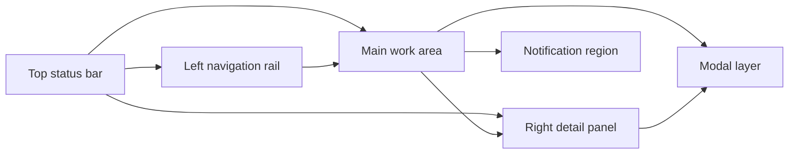

# SPEC-003: V2 Tailwind UI System and Application Rebuild

## Summary

This spec defines a complete V2 frontend rebuild for F1 Telemetry Charts using
React, TypeScript, Vite, Tailwind CSS, Radix primitives, `react-hook-form`, and
`zod`. It turns the current proof-oriented UI into a reusable component system
with clear page layouts, form interactions, chart viewing, observation review,
plugin inspection, run history, accessible dialogs, and verifiable UI behavior.

## Context

`SPEC-002` defines V2 backend/API/plugin/package-preview behavior and an initial
React UI shell. Early implementation feedback found that the UI still felt too
raw:

- The Workbench exposed raw JSON instead of clear configuration controls.
- Chart images needed a large overlay view.
- Canceling observation edits could still mark an observation as edited.
- The detail panel rendered crude JSON instead of readable domain information.
- Raw CSS was already becoming a maintenance burden for forms, tabs, dialogs,
  panels, validation, and reusable UI states.

The human owner approved these SPEC-003 decisions in chat on 2026-07-21:

- Create `SPEC-003` as a dedicated UI spec depending on `SPEC-002`.
- Use Tailwind CSS plus Radix primitives.
- Use `react-hook-form` and `zod` for frontend form state and validation, while
  keeping backend validation authoritative.

`SPEC-003` is the frontend/UI authority for V2. `SPEC-002` remains authoritative
for FastAPI endpoints, package preview data, plugin behavior, package integrity,
review updates, draft regeneration, workbench run behavior, and local-only
security.

## Problem statement

The V2 UI needs to feel like a real local analysis application, not a thin API
debug surface. Users should configure runs through controls, inspect charts at
useful sizes, review observations without accidental state changes, understand
details without reading JSON, and get consistent visual/interaction patterns
across pages. The frontend also needs reusable components so future UI changes
do not keep rebuilding the same buttons, panels, dialogs, forms, and tables.

## Goals

- Rebuild the V2 frontend with Tailwind CSS and reusable local components.
- Use Radix primitives for accessible tabs, dialogs, selects, checkboxes,
  popovers/tooltips, scroll areas, and toast/alert behavior where applicable.
- Use `react-hook-form` and `zod` for typed frontend forms.
- Keep backend validation authoritative for package/config/plugin correctness.
- Define every application page, page region, reusable component, and critical
  interaction clearly enough for implementation and review.
- Replace raw JSON presentation with readable domain-specific views.
- Add visual verification expectations for desktop and tablet widths.

## Non-goals

- SPEC-003 does not change the FastAPI API contract defined by `SPEC-002`
  except where a UI requirement reveals a missing endpoint that must be handled
  through a SPEC-002 amendment.
- SPEC-003 does not add hosted deployment, authentication, or collaboration.
- SPEC-003 does not introduce a design-system package published outside this
  repository.
- SPEC-003 does not require shadcn/ui CLI usage; local shadcn-style wrappers are
  acceptable when they use Tailwind and Radix primitives.
- SPEC-003 does not require editing Matplotlib chart internals visually.
- SPEC-003 does not require plugin authoring UI; plugin code remains trusted
  Python written outside the browser.

## Users or actors

- Human analyst: configures and runs analyses, inspects charts, validates
  packages, and checks package health.
- Human writer: reviews observations and Markdown drafts before writing.
- Project maintainer: validates plugin sources and plugin recipe metadata.
- Advanced analyst: tests local plugin paths and custom recipe output.
- Browser frontend: renders the Tailwind/Radix UI and calls SPEC-002 APIs.
- FastAPI backend: validates, reads, writes, and runs authoritative data.

## UI technology decisions

- Frontend must remain React, TypeScript, and Vite.
- Styling must use Tailwind CSS utilities and a small global Tailwind base file.
- Page-specific raw CSS must be avoided. Exceptions are limited to Tailwind base
  imports, CSS variables for tokens, and browser reset/accessibility helpers.
- Accessible behavior must use Radix primitives where the primitive exists and
  materially helps: dialog, tabs, select, checkbox, tooltip, popover, scroll
  area, and toast/alert patterns.
- Frontend form state must use `react-hook-form`.
- Frontend schema validation must use `zod`.
- Backend validation remains authoritative; frontend validation is for earlier
  user feedback and form ergonomics.
- Markdown rendering must continue to use `react-markdown` with `remark-gfm`,
  with raw HTML disabled or sanitized.

## Information architecture

The app has one persistent local application shell and four primary pages:

- Package Preview
- Workbench
- Plugins
- Run History

The first screen must be the active workspace. There must be no marketing or
landing page. If a package was supplied on CLI launch, the first screen is
Package Preview. Otherwise the first screen is Workbench.

### App Shell layout

The App Shell contains:

- Left navigation rail: primary page navigation and current route state.
- Top status bar: current package/config path, package health, run status,
  backend URL, and transient connection state.
- Main work area: active page content.
- Right detail panel: readable contextual details for selected item.
- Notification region: success/error/warning toasts for actions.
- Modal layer: chart lightbox, destructive confirmations, and focused edit
  flows.

Responsive behavior:

- Desktop width: left nav, main work area, and right detail panel are visible.
- Tablet width: nav remains visible or collapses to a compact rail; detail
  panel stacks below or opens as a drawer.
- Narrow unsupported widths must not overlap text, controls, chart thumbnails,
  or dialogs; controls may stack vertically.

Logical desktop layout:

The visual implementation does not need to literally draw this diagram, but the
relative positions must match it: navigation on the left, global status above,
primary work in the center, contextual details on the right, notifications
floating in a predictable corner, and dialogs/lightboxes above the workspace.

## Page definitions

### Package Preview page

Purpose: inspect one generated package, review chart artifacts and
observations, read the draft Markdown, and diagnose package integrity issues.

Default route: `/package` when the preview CLI was launched with a package
path.

Required regions:

- Top of main area: `PackageOpenPanel` for opening or switching package path.
- Main header: `PackageSummaryHeader` with package title/path, package health,
  artifact count, observation count, draft presence, and last modified time.
- Main body: `Tabs` with `Charts`, `Observations`, `Draft`, and `Integrity`.
- Right side: `DetailPanel`, populated by selected observation, draft section,
  integrity finding, plugin, recipe, or run history details. Package summary
  remains in the package header; chart details remain in the chart lightbox.

Charts tab:

- Uses `ChartGallery` as a responsive grid/list of chart artifacts.
- Each chart item shows thumbnail, artifact ID, recipe ID, title, and status.
- Selecting a chart image opens `ChartLightbox` without changing review state.
- Missing images render an error state with artifact metadata still visible.

Observations tab:

- Uses `ObservationList` grouped or sortable by status.
- Each row/card shows status, source artifact or recipe, short text, and action
  buttons.
- Selecting an observation updates `ObservationDetail`.
- Accept, Clear Review, and Edit are explicit actions. Accept is hidden when
  the observation is already accepted; Clear Review is hidden when the
  observation is already unreviewed.
- Edit opens `ObservationEditDialog`; Cancel closes without API calls; Save
  persists `edited` status and edited text.

Draft tab:

- Uses `DraftPreview` to render Markdown via `react-markdown` and `remark-gfm`.
- Raw HTML is disabled or sanitized.
- Regenerate Draft action calls the SPEC-002 backend endpoint and shows a toast.
- Draft metadata and source review-state summary appear in the detail panel.

Integrity tab:

- Uses `IntegrityFindingsTable` for package validation findings.
- Finding severity, code, affected file/path, and message are visible.
- Selecting a finding opens `IntegrityFindingDetail`.
- No integrity action may delete or mutate package files from this page.

### Workbench page

Purpose: create, edit, validate, save, and run package-generation
configuration without requiring raw JSON editing.

Default route: `/workbench` when no package path was supplied on CLI launch.

Required regions:

- Top of main area: current config path selector/status and primary actions.
- Main body: `ConfigWorkbenchForm` split into stable sections.
- Side/right area: validation summary, generated package/run status, and
  selected recipe/config help.

Form sections:

- Project: run name, output directory, overwrite behavior, package metadata.
- Session: season, event, session type, timing/cache settings.
- Drivers: one or more driver codes with add/remove/reorder controls.
- Recipes: `RecipeSelector` for core and valid plugin recipes with visible
  order and enabled state.
- Theme/export: output format, image options, report package options.
- Plugins: local plugin paths, entry-point discovery toggle, validation action.

Actions:

- Validate: sends normalized form payload to backend validation, maps errors to
  fields when possible, and global validation issues to a summary panel.
- Save: requires frontend form validity, then calls backend validation/save; it
  must not treat frontend success as authoritative.
- Run: requires backend validation, starts package generation, shows run status,
  and records run history through SPEC-002 behavior.
- Reset/Revert: restores last loaded config values after confirmation if the
  form is dirty.
- Advanced Raw Data: optional collapsed disclosure for generated payload only;
  editing the raw JSON is out of scope for normal V2 UI.

### Plugins page

Purpose: make plugin sources, loaded plugins, plugin recipe registrations, and
plugin failures visible and actionable.

Required regions:

- Top of main area: `PluginSourceControls` for enabling plugins, local path
  management, entry-point discovery toggle, and Validate Plugins action.
- Main body: `PluginStatusTable` with plugin identity, source, enabled state,
  validation status, recipe count, and error count.
- Secondary body or tab: `PluginRecipeTable` with recipe ID, plugin name,
  conflict status, and availability in Workbench.
- Right side: plugin or recipe detail panel.

Actions:

- Enable/disable plugin support for the local preview session.
- Add local plugin path.
- Remove local plugin path from the local preview session.
- Toggle Python entry-point discovery.
- Validate plugins and refresh tables.
- Select invalid plugin to see exact error details.
- Select valid recipe to see how it appears in Workbench.

Constraints:

- Plugins remain trusted local Python code and are disabled by default unless
  SPEC-002 configuration enables them.
- The page must not silently execute newly added plugin paths; validation must
  be explicit and visible.

### Run History page

Purpose: show recent preview/open/run activity and allow safe navigation back
to generated packages.

Required regions:

- Top of main area: history summary, refresh action, and Clear History action.
- Main body: `RunHistoryTable`.
- Right side: `RunDetail` for the selected row.

Table content:

- Timestamp.
- Action type, such as opened package, generated package, validated config, or
  failed run.
- Package path or config path.
- Status.
- Short error message when applicable.

Actions:

- Select row: updates `RunDetail`.
- Open package row: navigates to Package Preview for that package.
- Reopen config row: navigates to Workbench with that config when supported by
  SPEC-002 data.
- Clear History: opens confirmation dialog; confirmation clears local history
  metadata only and never deletes package/config files.

## Reusable component system

All reusable components must be implemented under a frontend component structure
such as `frontend/src/components/`. Components may be split by foundation,
layout, forms, data display, feedback, and domain.

### Foundation components

#### AppButton

- Purpose: standard command button.
- Variants: `primary`, `secondary`, `destructive`, `ghost`, `icon`.
- States: default, hover, focus-visible, disabled, loading.
- Interactions: Enter/Space activates; disabled state prevents action.
- Technology: Tailwind classes; optional loading spinner component.

#### IconButton

- Purpose: compact command button for toolbar actions.
- Required behavior: must have accessible label and tooltip for non-obvious
  icons.
- Interactions: hover/focus shows tooltip.
- Technology: Tailwind plus Radix Tooltip.

#### Field

- Purpose: label, control, description, error text, and dirty/required state.
- Supported controls: text, number, select, checkbox, textarea, path input.
- Interactions: error text is linked to the input for assistive technology.
- Technology: `react-hook-form` field registration; zod error mapping.

#### SelectField

- Purpose: option selection for mode/session/recipe/theme choices.
- Interactions: keyboard navigation, typeahead where Radix supports it.
- Technology: Radix Select wrapped in local Tailwind component.

#### CheckboxField

- Purpose: binary settings such as plugin enabled, entry-point discovery, grid,
  recipe enabled.
- Technology: Radix Checkbox wrapped in local Tailwind component.

#### Tabs

- Purpose: page-local tab sets such as Charts/Observations/Draft/Integrity.
- Interactions: keyboard navigation, visible selected state, no layout jump.
- Technology: Radix Tabs.

#### Dialog

- Purpose: modal flows such as chart lightbox, edit observation, confirm clear
  history.
- Interactions: Escape closes non-destructive dialogs; focus is trapped; close
  returns focus to the trigger.
- Technology: Radix Dialog.

#### Drawer

- Purpose: responsive right detail panel fallback on tablet/narrow widths.
- Interactions: same accessibility rules as Dialog.
- Technology: Radix Dialog or local wrapper.

#### Toast

- Purpose: transient action feedback.
- Types: success, error, warning, info.
- Interactions: auto-dismiss for success/info, persistent or manually
  dismissible for errors when action is needed.
- Technology: Radix Toast or local accessible live region wrapper.

#### DataTable

- Purpose: scan-friendly tabular data for plugins, run history, integrity
  findings, and observation lists when dense display is useful.
- Features: sortable columns where useful, selectable rows, empty state, row
  status badges, responsive horizontal scroll.
- Technology: Tailwind table layout or semantic table component.

#### Panel

- Purpose: bounded UI surfaces such as detail panel sections, form sections,
  validation panels, and repeated item cards.
- Constraint: no card-inside-card nesting.
- Style: compact border, 4-8px radius, neutral background.

#### StatusBadge

- Purpose: health, run, recipe, review, plugin, and validation statuses.
- Variants: success, warning, error, neutral, info.
- Text must use canonical status values unless a user-facing alias is explicitly
  documented.

#### EmptyState

- Purpose: first-use or no-data conditions.
- Constraint: no marketing copy; describe the missing state and available
  action in one compact block.

#### ErrorBanner

- Purpose: persistent actionable error display.
- Content: summary, path/code when available, suggested next action.

#### LoadingState

- Purpose: async package/config/plugin/run operations.
- Behavior: loading must not shift stable layout dimensions.

### Domain components

#### PackageOpenPanel

- Fields: package path input, recent package select, Open action.
- Behavior: invalid package shows actionable error and does not clear current
  package.

#### PackageSummaryHeader

- Fields: run ID, session, package path, created timestamp, chart count,
  observation count, warning count, error count, health status.
- Behavior: health badge reflects integrity findings from backend package view.

#### PackageHealthPanel

- Fields: grouped integrity counts and top findings.
- Behavior: selecting a finding opens readable detail.

#### ChartGallery

- Fields: chart thumbnail, artifact ID, recipe ID, warnings, selected state.
- Behavior: click image opens ChartLightbox.
- Constraint: thumbnails have stable aspect ratio and do not resize layout on
  load.

#### ChartLightbox

- Purpose: large overlay view for chart images.
- Behavior: opens from chart thumbnail; supports close via Escape and backdrop
  click; image fits viewport without cropping.
- Required metadata: artifact ID, recipe ID, image path, metadata path, and
  title remain visible in the overlay.

#### ChartDetail

- Fields: chart image preview, artifact ID, recipe ID, image path, metadata
  path, source session, selected drivers, warnings.
- Behavior: rendered inside `ChartLightbox`, not in the right detail panel. No
  raw JSON by default; optional advanced raw metadata disclosure is allowed
  behind a collapsed section.

#### ObservationList

- Fields: observation ID, review status, confidence, text excerpt, evidence
  count.
- Filters: review status, confidence.
- Behavior: selecting an observation opens ObservationDetail.

#### ObservationDetail

- Fields: status, confidence, original text, edited text, evidence artifacts,
  metrics, limitations, source fields.
- Actions: Accept, Edit, Reject, Clear Review.
- Visibility: Accept is hidden when already accepted. Clear Review is hidden
  when already unreviewed.
- Behavior: Edit opens an explicit edit form; Cancel must not call the backend
  and must not change review status.

#### ObservationEditDialog

- Fields: editable text, original text reference, save/cancel actions.
- Behavior: Save sends `edited`; Cancel closes without persistence.
- Validation: empty edited text is blocked by frontend and backend.

#### DraftPreview

- Views: rendered Markdown and raw Markdown toggle.
- Actions: Regenerate Draft.
- Behavior: rendered view uses `react-markdown` and `remark-gfm`; raw HTML is
  disabled or sanitized.

#### IntegrityFindingsTable

- Fields: severity, code, path, message.
- Behavior: selecting a finding opens IntegrityFindingDetail.

#### IntegrityFindingDetail

- Fields: severity, code, path, message, affected package area.
- Behavior: no raw JSON by default.

#### ConfigWorkbenchForm

- Purpose: edit analysis config through controls instead of raw JSON.
- Form sections: Project, Session, Drivers, Data Cache, Recipes, Theme, Export,
  Plugins.
- Technology: `react-hook-form` with zod schema; backend validate remains
  authoritative.

#### RecipeSelector

- Fields: core recipes, valid plugin recipes, enabled state, order, title
  override.
- Behavior: user can enable/disable recipes and reorder selected recipes.

#### PluginSourceControls

- Fields: plugins enabled, entry-point discovery enabled, local plugin paths.
- Behavior: local path additions update form state; validation/discovery is an
  explicit action.

#### PluginStatusTable

- Fields: plugin ID, display name, version, provider, source type, source
  location, status, warning count, error count.
- Behavior: invalid plugins remain visible and selectable for details.

#### PluginRecipeTable

- Fields: recipe ID, display name, required dataset fields, artifact types,
  conflict status.

#### RunHistoryTable

- Fields: action, package path, timestamp if available.
- Behavior: selecting row opens RunDetail; clear history requires confirmation
  and does not delete package files.

#### RunDetail

- Fields: package path, action, available Open Package action, filesystem safety
  note.

## Functional requirements

### REQ-001: Tailwind UI Foundation

- **Statement:** The frontend must replace page-specific raw CSS with Tailwind
  CSS utilities and reusable local components.
- **Rationale:** The V2 UI needs consistency and maintainability across forms,
  tables, dialogs, tabs, and panels.
- **Acceptance criteria:** Tailwind is configured; reusable component files
  exist; page-specific CSS is removed except for Tailwind base/imports and
  approved CSS variables/reset helpers.
- **Verification method:** Frontend build and code inspection.
- **Evidence location:** To be filled during implementation.

### REQ-002: Radix Primitive Wrappers

- **Statement:** Dialog, tabs, select, checkbox, tooltip, and toast-like
  feedback must use Radix primitives or documented local wrappers around them.
- **Rationale:** These controls have keyboard/focus/accessibility behavior that
  should not be hand-rolled.
- **Acceptance criteria:** Components use Radix primitives for modal, tab,
  select, checkbox, tooltip, and toast behavior; keyboard/focus behavior works
  in UI smoke tests.
- **Verification method:** Frontend test and browser smoke test.
- **Evidence location:** To be filled during implementation.

### REQ-003: Package Preview Page

- **Statement:** The Package Preview page must use reusable components for
  package opening, summary, health, tabs, charts, observations, draft, and
  integrity views.
- **Rationale:** Package review is the central V2 viewer workflow.
- **Acceptance criteria:** Page includes `PackageOpenPanel`,
  `PackageSummaryHeader`, `PackageHealthPanel`, `Tabs`, `ChartGallery`,
  `ObservationList`, `DraftPreview`, and `IntegrityFindingsTable`.
- **Verification method:** UI smoke test and component inspection.
- **Evidence location:** To be filled during implementation.

### REQ-004: Chart Lightbox

- **Statement:** Users must be able to open chart images in a large overlay.
- **Rationale:** Thumbnail-sized charts are not sufficient for analysis.
- **Acceptance criteria:** Each chart image opens the large overlay; overlay
  shows the chart fitted to viewport with artifact ID, recipe ID, image path,
  metadata path, and title; Escape and backdrop click dismiss without changing
  selection.
- **Verification method:** Browser interaction test.
- **Evidence location:** To be filled during implementation.

### REQ-005: Observation Review Without Accidental Persistence

- **Statement:** Observation editing must require explicit Save before
  persisting `edited` status.
- **Rationale:** Canceling an edit must not change review state.
- **Acceptance criteria:** Edit opens `ObservationEditDialog`; Cancel does not
  call review update API; Save sends `edited` with edited text; Accept/Reject/
  Clear Review call explicit actions. Accept and Clear Review are hidden when
  they do not apply to the current status.
- **Verification method:** UI interaction test and API request assertion.
- **Evidence location:** To be filled during implementation.

### REQ-006: Readable Detail Panel

- **Statement:** The right detail panel must render readable domain-specific
  detail components instead of raw JSON.
- **Rationale:** Analysts and writers need fast comprehension without parsing
  API payloads.
- **Acceptance criteria:** Chart, observation, integrity finding, plugin, and
  run detail views display labeled fields; raw JSON is hidden by default and, if
  retained, appears only in an advanced disclosure.
- **Verification method:** UI smoke test and visual inspection.
- **Evidence location:** To be filled during implementation.

### REQ-007: Workbench Form Controls

- **Statement:** The Workbench must allow editing standard configuration fields
  through UI controls rather than raw JSON.
- **Rationale:** Users should not need JSON syntax knowledge for common runs.
- **Acceptance criteria:** Project, session, drivers, data cache, recipes,
  theme, export, and plugin fields are editable through controls; validation
  errors map to fields; generated config payload validates against backend API.
- **Verification method:** UI form test and FastAPI validation test.
- **Evidence location:** To be filled during implementation.

### REQ-008: Recipe Selector

- **Statement:** Workbench recipe selection must support core recipes and valid
  plugin recipes.
- **Rationale:** SPEC-002 plugin support must be usable from the Workbench.
- **Acceptance criteria:** Core recipes are always listed; valid plugin recipes
  appear after plugin validation; invalid/conflicting plugin recipes cannot be
  selected; recipe order is visible and adjustable.
- **Verification method:** UI interaction test and plugin fixture test.
- **Evidence location:** To be filled during implementation.

### REQ-009: Plugins Page

- **Statement:** The Plugins page must expose plugin source controls, plugin
  status table, recipe table, and readable plugin detail.
- **Rationale:** Plugin failures must be visible and actionable.
- **Acceptance criteria:** User can enable plugins, add/remove local paths,
  validate plugins, inspect invalid plugins, and see duplicate/conflict errors.
- **Verification method:** UI/API plugin tests.
- **Evidence location:** To be filled during implementation.

### REQ-010: Run History Page

- **Statement:** Run History must display recently opened/generated packages
  with readable details and safe clear behavior.
- **Rationale:** Users need quick navigation without risking package deletion.
- **Acceptance criteria:** History table lists package path and action; selecting
  a row opens RunDetail; Clear History requires confirmation and does not delete
  files.
- **Verification method:** UI/API history tests.
- **Evidence location:** To be filled during implementation.

### REQ-011: Notification System

- **Statement:** User actions must report success, warnings, and errors through
  a consistent notification system.
- **Rationale:** Local operations can fail due to paths, package files, config
  validation, plugins, or run errors.
- **Acceptance criteria:** Open, validate, save, run, review, regenerate, plugin
  validation, and history clear actions show appropriate notifications.
- **Verification method:** UI interaction test.
- **Evidence location:** To be filled during implementation.

### REQ-012: Advanced Raw Data Disclosure

- **Statement:** Raw JSON may be available only as an optional advanced
  disclosure for debugging.
- **Rationale:** Raw data is useful for maintainers but should not be the main
  user interface.
- **Acceptance criteria:** No primary page or detail panel shows raw JSON by
  default; advanced disclosure is clearly secondary.
- **Verification method:** UI inspection.
- **Evidence location:** To be filled during implementation.

## Non-functional requirements

### NFR-001: Frontend Build Reproducibility

- **Statement:** The rebuilt UI must be reproducible from checked source and
  lockfile.
- **Rationale:** The FastAPI app serves built assets, so they must be rebuildable.
- **Acceptance criteria:** `package.json`, lockfile, Tailwind config, Vite
  config, and build command are checked in; `pnpm build` succeeds.
- **Verification method:** Frontend build command.
- **Evidence location:** To be filled during implementation.

### NFR-002: Layout Stability

- **Statement:** Fixed-format UI elements must have stable dimensions and must
  not shift layout when data loads.
- **Rationale:** Chart thumbnails, tables, tabs, buttons, and detail panels must
  remain usable during repeated analysis work.
- **Acceptance criteria:** Chart thumbnails use aspect ratio constraints;
  tables and panels have overflow behavior; buttons do not resize due to label
  changes; no incoherent overlap at desktop/tablet widths.
- **Verification method:** Browser screenshots and visual inspection.
- **Evidence location:** To be filled during implementation.

### NFR-003: Accessibility

- **Statement:** Interactive UI components must be keyboard navigable and expose
  accessible labels.
- **Rationale:** Radix primitives should be used to preserve baseline
  accessibility.
- **Acceptance criteria:** Dialogs trap focus; tabs/selects are keyboard
  navigable; icon buttons have labels/tooltips; form errors are associated with
  fields.
- **Verification method:** Browser smoke test and accessibility inspection.
- **Evidence location:** To be filled during implementation.

### NFR-004: Performance

- **Statement:** The UI must remain responsive for at least 20 charts and 50
  observations.
- **Rationale:** SPEC-002 package scale must remain usable in the rebuilt UI.
- **Acceptance criteria:** Package Preview renders representative data without
  visible lockups; long lists/tables scroll rather than breaking layout.
- **Verification method:** UI smoke test with fixture package.
- **Evidence location:** To be filled during implementation.

### NFR-005: Dependency Boundaries

- **Statement:** Frontend UI dependencies must not be imported by Python core
  package generation modules.
- **Rationale:** CLI/package generation must remain usable without frontend
  runtime imports.
- **Acceptance criteria:** Existing core import boundary tests still pass.
- **Verification method:** Python import boundary test.
- **Evidence location:** To be filled during implementation.

## Security and privacy considerations

### SEC-001: Local-only UI

- **Statement:** The rebuilt UI must preserve SPEC-002 loopback/local-only
  behavior.
- **Rationale:** Package paths and chart/report files must not be exposed to a
  hosted service.
- **Acceptance criteria:** UI only calls relative FastAPI endpoints served from
  the loopback app; no analytics, CDN, external asset, or hosted API calls are
  introduced.
- **Verification method:** Code inspection and browser network inspection.
- **Evidence location:** To be filled during implementation.

### SEC-002: Raw HTML Disabled In Markdown

- **Statement:** Draft Markdown rendering must keep raw HTML disabled or
  sanitized.
- **Rationale:** Package drafts are local files but should not execute arbitrary
  HTML/JS in the preview.
- **Acceptance criteria:** `react-markdown` raw HTML remains disabled or
  sanitized after the UI rebuild.
- **Verification method:** Frontend unit/smoke test.
- **Evidence location:** To be filled during implementation.

### SEC-003: Explicit Plugin Trust

- **Statement:** The UI must preserve explicit plugin enable/validate actions.
- **Rationale:** Trusted Python plugin loading must not occur implicitly from
  incidental page rendering.
- **Acceptance criteria:** Plugins remain disabled by default; adding local paths
  updates form state only; validation/discovery requires explicit action.
- **Verification method:** UI/API test and code inspection.
- **Evidence location:** To be filled during implementation.

## Data model impact

### DATA-001: Frontend Config Form Schema

- **Statement:** The frontend must define a zod schema for the standard
  Workbench config form.
- **Rationale:** The form needs local validation and typed field access.
- **Acceptance criteria:** Schema covers project, session, drivers, cache,
  recipes, theme, exports, and plugin settings; schema output maps to
  `ProjectConfig`; backend validation still runs before save/run.
- **Verification method:** Frontend schema tests and API validation tests.
- **Evidence location:** To be filled during implementation.

### DATA-002: UI View Models

- **Statement:** The frontend must use typed view models for package, chart,
  observation, integrity finding, plugin, and history data.
- **Rationale:** Readable detail views should not rely on untyped `any` payloads.
- **Acceptance criteria:** TypeScript types or zod schemas exist for each view
  model; component props use those types.
- **Verification method:** TypeScript build.
- **Evidence location:** To be filled during implementation.

### DATA-003: UI Selection State

- **Statement:** Selection state must distinguish chart, observation, finding,
  plugin, and run history selections.
- **Rationale:** Detail panel rendering must be deterministic and readable.
- **Acceptance criteria:** Selection state is a discriminated union or equivalent
  typed model; selecting rows/cards updates the correct detail component.
- **Verification method:** TypeScript build and UI interaction test.
- **Evidence location:** To be filled during implementation.

## API impact

### API-001: Backend Validation Authority

- **Statement:** Workbench save/run must call backend validation before
  persisting or running configuration.
- **Rationale:** Frontend zod validation is ergonomic, not authoritative.
- **Acceptance criteria:** Save and Run actions call SPEC-002 config endpoints;
  backend errors are mapped back to fields/global errors.
- **Verification method:** FastAPI test and UI interaction test.
- **Evidence location:** To be filled during implementation.

### API-002: API Error Mapping

- **Statement:** UI API clients must normalize backend errors into component
  error states and notifications.
- **Rationale:** Users need actionable errors tied to fields or package items.
- **Acceptance criteria:** Path-specific config errors map to fields; package,
  plugin, and run errors appear in relevant panels and toast/error banners.
- **Verification method:** UI/API tests.
- **Evidence location:** To be filled during implementation.

### API-003: No Breaking SPEC-002 API Changes

- **Statement:** SPEC-003 implementation must not break existing SPEC-002 API
  tests unless an approved SPEC-002 amendment is added.
- **Rationale:** SPEC-003 is a frontend rebuild, not a backend contract rewrite.
- **Acceptance criteria:** Existing SPEC-002 API tests continue to pass.
- **Verification method:** Python test suite.
- **Evidence location:** To be filled during implementation.

## UI or UX impact

### UX-001: Work-focused Visual System

- **Statement:** The UI must be dense, readable, restrained, and built for
  repeated analysis work.
- **Rationale:** This is an operational analysis tool, not a landing page.
- **Acceptance criteria:** First screen is a workspace; no hero/marketing
  content; panels, tables, and forms prioritize scanning and action.
- **Verification method:** Design inspection and browser screenshot review.
- **Evidence location:** To be filled during implementation.

### UX-002: Consistent Component Reuse

- **Statement:** Pages must reuse common components instead of recreating local
  button/form/panel/dialog styles.
- **Rationale:** Reuse is the main reason for SPEC-003.
- **Acceptance criteria:** Shared components cover app shell, buttons, fields,
  tabs, dialogs, tables, badges, toasts, panels, and empty/error/loading states.
- **Verification method:** Code inspection.
- **Evidence location:** To be filled during implementation.

### UX-003: Clear Review Workflow

- **Statement:** Observation review must make current status, available actions,
  edit mode, save, and cancel behavior clear.
- **Rationale:** Review state affects regenerated drafts and must not be
  accidental.
- **Acceptance criteria:** Review actions are visible; edit is modal or clearly
  bounded; cancel has no persistence side effect; regenerated draft reflects
  saved review state.
- **Verification method:** Browser interaction test.
- **Evidence location:** To be filled during implementation.

### UX-004: Chart Inspection

- **Statement:** Users must be able to inspect chart images beyond thumbnail
  size.
- **Rationale:** Chart details are central to analysis.
- **Acceptance criteria:** Chart lightbox is discoverable, responsive, and
  preserves chart aspect ratio.
- **Verification method:** Browser interaction and screenshot test.
- **Evidence location:** To be filled during implementation.

### UX-005: Detail Readability

- **Statement:** Detail panel content must use labeled domain fields and
  readable formatting.
- **Rationale:** Raw JSON blocks are not acceptable as primary UI.
- **Acceptance criteria:** Chart, observation, plugin, finding, and run details
  are readable without opening raw JSON.
- **Verification method:** Visual inspection and UI tests.
- **Evidence location:** To be filled during implementation.

### UX-006: Field-level Workbench Feedback

- **Statement:** Workbench validation must show field-level feedback for fields
  where the backend returns a path-specific issue.
- **Rationale:** Users should know exactly what to fix.
- **Acceptance criteria:** Field errors render near the field; global errors
  render in a validation panel; invalid fields have visible state.
- **Verification method:** UI/API test.
- **Evidence location:** To be filled during implementation.

### UX-007: Responsive Layout

- **Statement:** Desktop and tablet layouts must remain usable without
  overlapping controls, text, charts, or panels.
- **Rationale:** Analysts may use varied local devices.
- **Acceptance criteria:** Verified screenshots at desktop and tablet widths;
  right detail panel stacks/drawers at constrained widths.
- **Verification method:** Browser screenshot smoke test.
- **Evidence location:** `docs/reports/SPEC-003-UX-007-responsive-evidence.md`;
  `docs/reports/assets/SPEC-003/ux-007-desktop-1440x900.png`;
  `docs/reports/assets/SPEC-003/ux-007-tablet-768x1024.png`.

## Configuration impact

- Add Tailwind config under frontend source.
- Add PostCSS config if required by Tailwind tooling.
- Add Radix dependencies needed by selected primitives.
- Add `react-hook-form`, `zod`, and resolver dependency if needed.
- Keep Vite build output serving through FastAPI static assets.

## Error handling

- Frontend schema errors appear beside fields before API calls when possible.
- Backend config validation errors override or supplement frontend errors.
- Package open failures keep the previous package visible.
- Plugin validation failures remain visible in plugin tables.
- Observation edit save failures keep the edit dialog open with an error.
- Chart lightbox image failures show an error state without closing the dialog.
- Run failures show run status and backend error details in Workbench.

## Edge cases

- User cancels observation edit after changing text.
- User closes chart lightbox with Escape.
- User opens package with missing chart image.
- User opens package with 20 charts and 50 observations.
- Backend returns field path not represented by current Workbench controls.
- Plugin recipe disappears after it was selected in the Workbench.
- Plugin validation returns duplicate recipe IDs.
- Browser refresh occurs while a package is open.
- Form has unsaved changes and user runs validation.
- Tailwind build output hash changes and FastAPI asset serving must still work.

## Acceptance criteria

- SPEC-003 frontend rebuild uses Tailwind CSS and reusable components.
- Radix primitives power dialog/tabs/select/checkbox/tooltip/toast behavior.
- Workbench uses form controls and does not require raw JSON editing.
- Chart images can open in a large overlay.
- Observation edit cancel does not persist review status.
- Detail panel renders readable domain details.
- Package Preview, Workbench, Plugins, and Run History pages match this spec.
- Existing SPEC-002 backend/API tests pass.
- Frontend build passes.
- Browser visual verification passes for desktop and tablet widths.

## Verification matrix

| Requirement ID | Acceptance criterion | Verification method | Test / command / manual check | Evidence location | PR reference |
| -------------- | -------------------- | ------------------- | ----------------------------- | ----------------- | ------------ |
| REQ-001 | Tailwind replaces page-specific raw CSS. | Build and inspection | `pnpm typecheck`; `pnpm build` | `frontend/tailwind.config.js`; `frontend/src/styles.css`; `frontend/src/components/` | TBD |
| REQ-002 | Radix wrappers provide accessible primitives. | Build and code inspection | `pnpm typecheck`; code inspection | `frontend/src/components/ui/` | TBD |
| REQ-003 | Package inspection uses required components inside Analysis Export. | Build and code inspection | `pnpm typecheck`; `python -m unittest tests.test_preview tests.test_analysis_workspace -v` | `frontend/src/pages/AnalysisWorkbenchPage.tsx`; `tests/test_preview.py`; AMEND-003 | TBD |
| REQ-004 | Chart lightbox opens and closes correctly. | Build, code inspection, and browser interaction | `pnpm typecheck`; Chromium open/Escape/backdrop checks on 2026-08-04 | `frontend/src/components/ChartLightbox.tsx`; closeout evidence report | TBD |
| REQ-005 | Observation cancel does not persist edit. | Code inspection and API regression | `python -m unittest tests.test_preview tests.test_analysis_workspace -v`; `pnpm typecheck` | Analysis Review editor; review APIs; tests | TBD |
| REQ-006 | Detail panel is readable by domain type. | Build and code inspection | `pnpm typecheck` | `frontend/src/components/DetailPanel.tsx` | TBD |
| REQ-007 | Analysis Workbench uses form controls. | Build and API test | `pnpm typecheck`; `python -m unittest tests.test_analysis_workspace -v` | `frontend/src/pages/AnalysisWorkbenchPage.tsx`; `tests/test_analysis_workspace.py`; AMEND-003 | TBD |
| REQ-008 | Chart-template selector supports core/plugin recipes. | Build and plugin API test | `pnpm typecheck`; `python -m unittest tests.test_plugins tests.test_analysis_workspace -v` | `frontend/src/pages/AnalysisWorkbenchPage.tsx`; `tests/test_plugins.py` | TBD |
| REQ-009 | Plugins page shows source/status/recipes/details. | Build and plugin API test | `pnpm typecheck`; `python -m unittest tests.test_plugins -v` | `frontend/src/pages/PluginsPage.tsx`; `tests/test_plugins.py` | TBD |
| REQ-010 | Run History lists, selects, clears safely. | Build and API test | `pnpm typecheck`; `python -m unittest tests.test_workbench_api -v` | `frontend/src/pages/RunHistoryPage.tsx`; `tests/test_workbench_api.py` | TBD |
| REQ-011 | Notifications cover major actions. | Build and code inspection | `pnpm typecheck` | `frontend/src/App.tsx`; `frontend/src/components/ui/Toast.tsx` | TBD |
| REQ-012 | Raw JSON is secondary only. | Code inspection | `pnpm typecheck` | `frontend/src/pages/AnalysisWorkbenchPage.tsx`; `frontend/src/components/DetailPanel.tsx` | TBD |
| NFR-001 | Frontend build is reproducible. | Build command | `pnpm typecheck`; `pnpm build` | `frontend/package.json`; `frontend/pnpm-lock.yaml`; `src/f1_telemetry_charts/ui/static/` | TBD |
| NFR-002 | Layout remains stable. | Build/code inspection and screenshot smoke test | `pnpm build`; responsive browser verification at 1440x900, 768x1024, and 390x844 | `frontend/src/components/AppShell.tsx`; `frontend/src/pages/`; `docs/reports/SPEC-003-UX-007-responsive-evidence.md` | TBD |
| NFR-003 | Components are keyboard accessible. | Radix code inspection and targeted browser keyboard check | `pnpm typecheck`; keyboard navigation across Export tabs and uniquely labeled Review actions on 2026-08-04 | `frontend/src/components/ui/`; `AnalysisWorkbenchPage.tsx`; closeout evidence report | TBD |
| NFR-004 | Analysis Export inspection handles 20 charts and 50 observations. | Component structure and browser scale check | `pnpm typecheck`; generated representative fixture at desktop/mobile widths on 2026-08-04 | `frontend/src/pages/AnalysisWorkbenchPage.tsx`; benchmark fixture script; closeout evidence report; AMEND-003 | TBD |
| NFR-005 | Python core does not import frontend/UI deps. | Import boundary test | `python -m unittest tests.test_dependency_boundaries -v` | `tests/test_dependency_boundaries.py` | TBD |
| SEC-001 | UI remains local-only. | API/static inspection | `python -m unittest tests.test_preview -v` | `src/f1_telemetry_charts/ui/server.py`; `tests/test_preview.py` | TBD |
| SEC-002 | Markdown raw HTML remains disabled/sanitized when draft rendering is present. | Build/code inspection and browser injection check | `skipHtml` inspection; injected script/image-handler Markdown remained inert in rendered mode on 2026-08-04 | `frontend/package.json`; Analysis Export editor; closeout evidence report; AMEND-003 | TBD |
| SEC-003 | Plugin loading remains explicit. | Plugin API test and code inspection | `python -m unittest tests.test_plugins -v`; `pnpm typecheck` | `frontend/src/pages/PluginsPage.tsx`; `tests/test_plugins.py` | TBD |
| DATA-001 | zod config schema maps to backend config. | Frontend/API tests | `pnpm typecheck`; `python -m unittest tests.test_workbench_api -v` | `frontend/src/schemas.ts`; `tests/test_workbench_api.py` | TBD |
| DATA-002 | UI view models are typed. | TypeScript build | `pnpm typecheck` | `frontend/src/types.ts` | TBD |
| DATA-003 | Selection state is typed by domain. | TypeScript build | `pnpm typecheck` | `frontend/src/types.ts`; `frontend/src/App.tsx` | TBD |
| API-001 | Analysis save/generate uses backend validation. | API/build tests | `python -m unittest tests.test_analysis_workspace -v`; `pnpm typecheck` | `frontend/src/api.ts`; `frontend/src/pages/AnalysisWorkbenchPage.tsx` | TBD |
| API-002 | API errors map to fields/panels/toasts. | Build/code inspection | `pnpm typecheck` | `frontend/src/api.ts`; `frontend/src/App.tsx`; `frontend/src/pages/AnalysisWorkbenchPage.tsx` | TBD |
| API-003 | SPEC-002 API tests keep passing. | Python tests | `python -m unittest tests.test_preview tests.test_workbench_api tests.test_plugins tests.test_dependency_boundaries -v` | `tests/` | TBD |
| UX-001 | UI remains work-focused. | Code inspection and responsive screenshot evidence | `pnpm build`; browser check on 2026-08-03 | `frontend/src/components/AppShell.tsx`; `frontend/src/pages/`; responsive evidence report | TBD |
| UX-002 | Common components are reused. | Code inspection | `pnpm typecheck` | `frontend/src/components/ui/`; `frontend/src/pages/` | TBD |
| UX-003 | Analysis Review workflow is clear. | Code/API inspection and browser interaction | `pnpm typecheck`; preview/Analysis tests; Chromium save/cancel check on 2026-08-04 | `frontend/src/pages/AnalysisWorkbenchPage.tsx`; review APIs; closeout evidence report | TBD |
| UX-004 | Chart inspection supports large view. | Code inspection and browser interaction | `pnpm typecheck`; Chromium lightbox open/Escape/backdrop check on 2026-08-04 | `frontend/src/components/ChartLightbox.tsx`; closeout evidence report | TBD |
| UX-005 | Detail content is readable. | Code inspection | `pnpm typecheck` | `frontend/src/components/DetailPanel.tsx` | TBD |
| UX-006 | Analysis Workbench validation is field-level. | Build/API inspection | `pnpm typecheck`; `python -m unittest tests.test_analysis_workspace -v` | `frontend/src/pages/AnalysisWorkbenchPage.tsx`; `tests/test_analysis_workspace.py` | TBD |
| UX-007 | Desktop/tablet layouts do not overlap. | Browser screenshot smoke test | In-app browser at 1440x900 and 768x1024; supplemental 390x844 check | `docs/reports/SPEC-003-UX-007-responsive-evidence.md`; `docs/reports/assets/SPEC-003/` | TBD |

## Test plan

- Frontend build with `pnpm build`.
- TypeScript validation with `pnpm typecheck`.
- Component tests or browser smoke tests for App Shell, Package Preview,
  Workbench, Plugins, Run History, ChartLightbox, ObservationEditDialog, and
  DetailPanel.
- Existing FastAPI tests for package preview, plugin validation, workbench run,
  and history.
- Import boundary test to ensure Python core imports do not import UI server.
- Browser screenshot checks at desktop and tablet widths.
- Manual smoke of keyboard navigation for dialogs, tabs, selects, checkboxes,
  and tooltips.

## Rollback plan

- Revert SPEC-003 frontend files, Tailwind config, Radix dependencies,
  `react-hook-form`, and `zod` additions.
- Keep SPEC-002 backend/API implementation intact.
- Continue serving the prior built frontend assets if the rebuild fails late.
- If a specific reusable component causes regressions, replace that component
  while preserving API behavior and data models.

## Open questions

- None currently unresolved.

## Human decisions required

- [x] Approve SPEC-003 as dedicated UI spec depending on SPEC-002. Answer:
      approved in chat on 2026-07-21.
- [x] Approve Tailwind CSS plus Radix primitives. Answer: approved in chat on
      2026-07-21.
- [x] Approve `react-hook-form` plus `zod` for frontend forms with backend
      validation authoritative. Answer: approved in chat on 2026-07-21.
- [x] Approve or revise this full SPEC-003 draft before implementation starts.

## Conflict check

SPEC-003 depends on SPEC-002 and replaces the frontend implementation direction
for the V2 browser UI. It does not replace SPEC-002 backend/API/plugin/package
requirements. If SPEC-003 implementation requires changing a SPEC-002 API
contract, a SPEC-002 amendment must be created and approved before making that
backend behavior change.

## Traceability table

| Requirement ID | Design / component | Implementation (file/function) | Test | Status |
| -------------- | ------------------ | ------------------------------ | ---- | ------ |
| REQ-001 | Tailwind UI foundation | `frontend/tailwind.config.js`; `frontend/postcss.config.js`; `frontend/src/styles.css`; `frontend/src/components/` | `pnpm typecheck`; `pnpm build` | Implemented |
| REQ-002 | Radix primitive wrappers | `frontend/src/components/ui/` | `pnpm typecheck`; code inspection | Implemented |
| REQ-003 | Package inspection | Analysis Review and Export editors with overview, charts, draft, and integrity detail | `pnpm typecheck`; preview/Analysis tests; Chromium closeout check | Implemented and verified via SPEC-004 |
| REQ-004 | ChartLightbox | `frontend/src/components/ChartLightbox.tsx` | `pnpm typecheck`; Chromium interaction check | Implemented and verified |
| REQ-005 | Observation editing | Analysis Review editor; review APIs | `pnpm typecheck`; preview/Analysis tests | Implemented via SPEC-004 |
| REQ-006 | DetailPanel | `frontend/src/components/DetailPanel.tsx` | `pnpm typecheck` | Implemented |
| REQ-007 | Analysis Workbench forms | `AnalysisWorkbenchPage.tsx`; schema-driven controls | `pnpm typecheck`; Analysis tests | Superseded by SPEC-004 Analysis Workbench |
| REQ-008 | Chart-template selector | `AnalysisWorkbenchPage.tsx` Add Chart flow | `pnpm typecheck`; plugin/Analysis tests | Implemented via SPEC-004/SPEC-005 |
| REQ-009 | Plugins page | `frontend/src/pages/PluginsPage.tsx` | `pnpm typecheck`; `tests.test_plugins` | Implemented |
| REQ-010 | Run History page | `frontend/src/pages/RunHistoryPage.tsx` | `pnpm typecheck`; `tests.test_workbench_api` | Implemented |
| REQ-011 | Toast/notification system | `frontend/src/components/ui/Toast.tsx`; `frontend/src/App.tsx` | `pnpm typecheck` | Implemented |
| REQ-012 | Advanced raw data disclosure | `AnalysisWorkbenchPage.tsx`; `DetailPanel.tsx` | `pnpm typecheck`; code inspection | Implemented |
| NFR-001 | Build reproducibility | `frontend/package.json`; `frontend/pnpm-lock.yaml`; built static assets | `pnpm typecheck`; `pnpm build` | Implemented |
| NFR-002 | Layout stability | `frontend/src/components/AppShell.tsx`; `frontend/src/pages/` | `pnpm build`; responsive browser evidence at desktop, tablet, and mobile widths | Implemented, visual verified |
| NFR-003 | Accessibility | Radix wrappers and uniquely labeled Review actions | `pnpm typecheck`; targeted Chromium keyboard navigation | Implemented and verified for governed surfaces |
| NFR-004 | Package scale | Analysis Export inspection structures | `pnpm typecheck`; generated 20-chart/50-observation fixture | Implemented and verified |
| NFR-005 | Dependency boundaries | Python UI remains isolated from core imports | `tests.test_dependency_boundaries` | Implemented |
| SEC-001 | Local-only UI | Existing FastAPI local server/static serving | `tests.test_preview` | Implemented |
| SEC-002 | Markdown HTML safety | `ReactMarkdown` rendered mode with `skipHtml` | code inspection; inert raw-HTML browser injection check | Implemented and verified |
| SEC-003 | Explicit plugin trust | `PluginsPage`; explicit validate action | `tests.test_plugins`; `pnpm typecheck` | Implemented |
| DATA-001 | Frontend config schema | `frontend/src/schemas.ts` | `pnpm typecheck`; `tests.test_workbench_api` | Implemented |
| DATA-002 | UI view models | `frontend/src/types.ts` | `pnpm typecheck` | Implemented |
| DATA-003 | Selection state | `SelectedDetail` in `frontend/src/types.ts`; `App.tsx` | `pnpm typecheck` | Implemented |
| API-001 | Backend validation authority | `frontend/src/api.ts`; `AnalysisWorkbenchPage` actions | Analysis API tests; `pnpm typecheck` | Implemented via SPEC-004 |
| API-002 | API error mapping | `frontend/src/api.ts`; `App.tsx`; `AnalysisWorkbenchPage` | `pnpm typecheck`; Analysis API tests | Implemented via SPEC-004 |
| API-003 | SPEC-002 API compatibility | No API contract changes | Targeted Python tests | Implemented |
| UX-001 | Work-focused visual system | `AppShell`; page panels/tables/forms | `pnpm build`; responsive browser evidence dated 2026-08-03 | Implemented, visual verified |
| UX-002 | Component reuse | `frontend/src/components/ui/` reused by all pages | `pnpm typecheck`; code inspection | Implemented |
| UX-003 | Review workflow clarity | Analysis Review editor | preview/Analysis tests; Chromium save/cancel interaction | Implemented and verified |
| UX-004 | Chart inspection | `ChartLightbox` | `pnpm typecheck`; Chromium open/Escape/backdrop interaction | Implemented and verified |
| UX-005 | Detail readability | `DetailPanel` domain branches | `pnpm typecheck`; code inspection | Implemented |
| UX-006 | Field-level feedback | Analysis chart/session diagnostics and form rendering | Analysis tests; `pnpm typecheck` | Implemented via SPEC-004 |
| UX-007 | Responsive layout | `AppShell`; responsive Tailwind grids; stacked chart-options panel | `docs/reports/SPEC-003-UX-007-responsive-evidence.md`; desktop/tablet/mobile screenshots | Implemented and verified |

## Implementation notes

Human approval was recorded in chat on 2026-07-21. Implementation assumptions:

- Components should be local and domain-focused rather than adopting a large
  visual framework wholesale.
- Radix primitives should be wrapped once and reused consistently.
- Tailwind classes should live close to components; custom CSS should remain
  exceptional and documented.
- Browser verification should be retried after the prior Codex browser connector
  issue is resolved.

Implementation update 2026-07-21:

- Added Tailwind/PostCSS configuration, Radix primitive wrappers,
  `react-hook-form`, `zod`, and typed frontend API/view models.
- Rebuilt the UI into `AppShell`, Package Preview, Workbench, Plugins, Run
  History, ChartLightbox, DetailPanel, and reusable foundation components.
- Built updated static assets into `src/f1_telemetry_charts/ui/static/`.
- Verification passed for frontend typecheck/build, SPEC-002 API regression
  tests, governance validation, spec validation, and drift validation.
- Browser visual verification remains pending because the Codex in-app browser
  connector fails during setup with `Cannot redefine property: process`.

Responsive verification update 2026-08-03:

- UX-007 passed in the in-app browser with the 2023 Bahrain Grand Prix Race
  Analysis loaded and a generated Lap Time Delta chart open.
- At 1440x900, the application remained viewport-bound with a 360 px chart
  options panel beside the 700 px chart and no horizontal overflow.
- At 768x1024, the chart options panel stacked below the chart at full content
  width with no horizontal overflow or visible control overlap.
- A supplemental 390x844 check also stacked the panel, remained width-contained,
  and produced no browser console warnings or errors.
- Evidence is recorded in
  `docs/reports/SPEC-003-UX-007-responsive-evidence.md`. This closes UX-007;
  other requirement-specific interaction evidence remains tracked separately.

Closeout verification update 2026-08-04:

- The Analysis Export surface passed desktop and mobile checks with a generated
  20-chart/50-observation fixture and no document-level horizontal overflow.
- Export tabs support keyboard navigation; Review actions have observation-
  specific accessible names.
- Review cancel left `review.json` unchanged, while save persisted the edited
  state and regenerated the draft.
- `ChartLightbox` opened at viewport-fit size and closed with Escape or the
  backdrop.
- Rendered Markdown kept injected raw HTML, scripts, and event handlers inert;
  raw mode displayed the source literally.
- Evidence is recorded in
  `docs/reports/SPEC-002-003-004-closeout-evidence.md`.

## Spec amendments

> Required for any behavioral change after the spec is Approved.

### AMEND-001

- **Date:** 2026-07-21
- **Reason:** Human review found the initial SPEC-003 UI too explanatory and
  too dependent on the right detail panel for package and chart workflows.
- **Changed requirements:** REQ-004, REQ-006, UX-001, UX-003, UX-004, UX-005.
- **Behavioral impact:** Remove explanatory panel/helper copy from the working
  UI; remove package summary and chart detail actions from the right detail
  panel; show chart metadata inside the large image overlay; use icon-only
  chart enlargement controls; hide observation review actions that do not apply
  to the current status; remove idle/IP chips from the Workbench top bar.
- **Test impact:** Frontend typecheck/build and existing preview/workbench API
  tests must continue to pass. Browser visual verification remains pending
  until the browser connector is available.
- **Human approval reference:** Approved in chat on 2026-07-21.

### AMEND-002

- **Date:** 2026-07-21
- **Reason:** Human review found the icon-only chart large-view control
  redundant because clicking the chart image already opens the overlay.
- **Changed requirements:** REQ-004, UX-004.
- **Behavioral impact:** Remove the chart-card large-view button. The chart
  image itself is the only large-view control.
- **Test impact:** Frontend typecheck/build and existing preview tests must
  continue to pass.
- **Human approval reference:** Approved in chat on 2026-07-21.

### AMEND-003

- **Date:** 2026-08-03
- **Reason:** SPEC-004 established the Analysis Workbench as the primary V2
  product surface and embedded package inspection in Export, while SPEC-003
  still required standalone Package Preview and Configuration Workbench pages.
  Current implementation follows SPEC-004 and needed an explicit approved
  relationship to preserve authoritative traceability.
- **Changed requirements:** REQ-003, REQ-005, REQ-007, REQ-008, NFR-004,
  API-001, API-002, UX-001, UX-003, and UX-006. REQ-004 and UX-004 continue to
  apply to the shared `ChartLightbox` used by Analysis surfaces.
- **Behavioral impact:** The standalone Package Preview and Configuration
  Workbench pages are superseded. Their package inspection, observation review,
  validation, recipe-selection, and run behaviors map to the Analysis
  Workbench, Review, and Export surfaces. The Tailwind/Radix component system,
  Plugins page, Run History page, notifications, detail components, and
  responsive layout remain applicable.
- **Test impact:** Replace references to removed `PackagePreviewPage.tsx` and
  `WorkbenchPage.tsx` with `AnalysisWorkbenchPage.tsx` plus SPEC-004 Analysis
  tests. Preserve SPEC-002 API regression tests, frontend typecheck/build, and
  responsive browser evidence. Package-scale and requirement-specific dialog/
  lightbox interaction evidence remain explicit verification gaps.
- **Human approval reference:** Nelson Jeanrenaud approved amending SPEC-002
  and SPEC-003 in the Codex task conversation on 2026-08-03.

## Review checklist

- [x] spec_id is unique and follows the SPEC-XXX format.
- [x] Every requirement has an ID, statement, rationale, acceptance criteria,
      verification method, and evidence location.
- [x] Non-goals are listed.
- [x] Open questions are resolved or explicitly deferred.
- [x] Verification matrix covers every requirement.
- [x] Conflict check completed.
- [x] Human approval recorded before status set to Approved.
